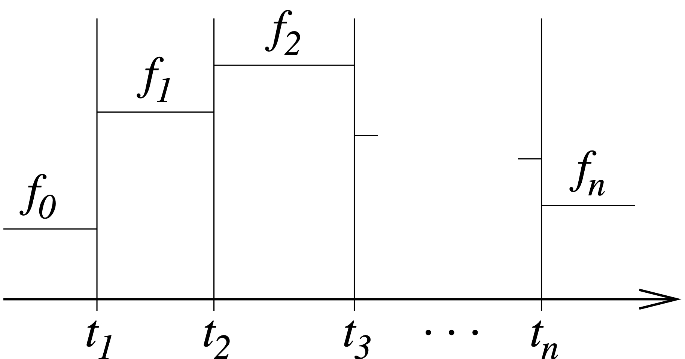

.. _ELECTROMAGNETICS_Namelist:

.. toctree::
   :maxdepth: 1

ELECTROMAGNETICS Namelist 
===========================

Overview
------------

The ELECTROMAGNETICS namelist sets most of the parameters used by the electromagnetic (EM) solver to calculate the Joule heat used in induction heating simulations. Exceptions are the electrical conductivity, electric susceptibility, and magnetic susceptibility which are defined for each material phase using the :ref:`MATERIAL <MATERIAL_and_PHASE_Namelists>` namelist, and the induction coils hat produce an external magnetic source field, which are specified in :ref:`INDUCTION_COIL<INDUCTION_COIL_Namelist>` namelists. The EM calculations are performed on a tetrahedral mesh specified by the :ref:`EM_MESH<EM_MESH_Namelist>` namelist, which is generally different than the main mesh used throughout the rest of Truchas.

**A Remark on Units:** The EM solver assumes SI units by default. In particular, the result of the Joule heat calculation is a power density :math:`W/m^3` in SI units. To use a different system of units, the user must supply appropriate values for the free-space constants :ref:`Vacuum_Permittivity<PhyCo_VPm>` and :ref:`Vacuum_Permeability<PhyCo_VPt>` in the :ref:`PHYSICAL_CONSTANTS<PHYSICAL_CONSTANTS_Namelist>`. In any case, the user must ensure that a consistent set of units is used throughout Truchas.

ELECTROMAGNETICS Namelist Features
-------------------------------------
| **Required/Optional        :** Optional
| **Single/Multiple Instances:** Single

Components
------------
* :ref:`CG_Stopping_Tolerance<EM_CST>`
* :ref:`EM_Domain_Type<EM_EDT>`
* :ref:`Material_Change_Threshold<EM_MCT>`
* :ref:`Maximum_CG_Iterations<EM_MCI>`
* :ref:`Maximum_Source_Cycles<EM_MSC>`
* :ref:`Num_Etasq<EM_NE>`
* :ref:`Output_Level<EM_OL>`
* :ref:`Source_Frequency<EM_SF>`
* :ref:`Source_Times<EM_ST>`
* :ref:`SS_Stopping_Tolerance<EM_SST>`
* :ref:`Steps_Per_Cycle<EM_SPC>`
* :ref:`Symmetry_Axis<EM_SA>`
* :ref:`Uniform_Source<EM_US>`

.. _EM_CST:

CG_Stopping_Tolerance
^^^^^^^^^^^^^^^^^^^^^^^^^^^^^^^^^

| **Description** : Tolerance used to determine when the conjugate gradient (CG) iteration has converged. The criterion used is that 

:math:`‖r‖/‖r_0‖ <` CG_Stopping_Tolerance. 

The electromagnetics solver uses its own special preconditioned CG linear solver.

| **Type**        : real
| **Default**     : :math:`10^{-5}`
| **Valid Values**: (0, 0.1)
| **Notes**       : The numerical characteristics of the electromagnetic system require that the linear systems be solved to significantly greater accuracy than would otherwise be required. Too loose a tolerance will manifest itself in a significant build-up of noise in the solution of the electric field over the course of the simulation. This input variable should not be greater than :math:`10^{−4}`.

.. _EM_EDT:

EM_Domain_Type
^^^^^^^^^^^^^^^^^^^^^^^^^^^^^^^^^

| **Description** : A flag specifying the type of domain geometry that is discretized by the computational mesh.
| **Type**        : string
| **Default**     : none
| **Valid Values**: ’Full_Cylinder’, ’Half_Cylinder’, ’Quarter_Cylinder’
| **Notes**       : At this time there is not yet a facility for specifying general boundary conditions for the electromagnetic simulation. Consequently, the computational domain :math:`\Omega` is limited to the following special cases when :ref:`Symmetry_Axis<EM_SA>` = z:

.. csv-table:: 
   :header: "Value", "Associated Function"
   :class: tight-table
   :widths: auto

   "Full_Cylinder", ":math:`\Omega = \{(x,y,z) | x^2+y^2 \leq r^2, z_1\leq z\leq z_2 \}`"
   "Half_Cylinder", ":math:`\Omega = \{(x,y,z) | x^2+y^2 \leq r^2, x\geq 0, z_1\leq z \leq z_2 \}`"
   "Quarter_Cylinder", ":math:`\Omega = \{(x,y,z) | x^2+y^2 \leq r^2, x, y\geq 0, z_1\leq z \leq z_2 \}`"

The values :math:`r \gt 0, z_1 \gt z_2` are inferred from the mesh and are not specified directly. Dirichlet source field conditions are imposed on the boundaries :math:`\{x_2+y_2=r_2\}` and :math:`\{z=z_1,z_2\}`, and symmetry conditions on the symmetry planes :math:`\{x= 0\}` and :math:`\{y= 0\}` if present. The analogous definitions for the other possible symmetry axes,’x’ and ’y’, are obtained by the appropriate cyclic permutation of the coordinates.

For the computational mesh used in the EM simulation, see the :ref:`EM_MESH<EM_MESH_Namelist>` namelist.

**Experimental Features**. The value ’Frustum’ specifies that the domain is a frustum of a right cone.

:math:`\Omega = \{(x,y,z) | x^2+y^2 \leq m^2{(z - z_0)}^2, z_1\leq z \leq z_2 \}`

or an angular wedge of a frustum. As with the other domain types the values :math:`m \gt 0` , :math:`z_0` and :math:`z_1 \lt z_2` are inferred from the mesh and are not specified directly. For wedges of a frustum, the wedge sidescan lie on any plane from the family of 30 degree increment planes that includes the :math:`x = 0` plane. The preceding description is for the z-axis symmetry case, but the analogous functionality for the other symmetry axes is also provided.

.. _EM_GO:

Graphics_Output
^^^^^^^^^^^^^^^^^^^^^^^^^^^^^^^^^

| **Description** : Controls the graphics output of the electromagnetic solver
| **Type**        : logical
| **Default**     : False
| **Valid Values**: True or False
| **Notes**       : If **True**, the electromagnetic solver will generate its own graphics data files in OpenDX format (see http://www.opendx.org). The files contain the material parameter fields, the averaged Joule heat field, and the time series of the electromagnetic fields. The files are identified by the suffixes **-EM.dx** and **-EM.bin**. The value of :ref:`Graphics_Output<EM_GO>` has no impact on the normal graphics output generated by Truchas, which is determined elsewhere, and the averaged Joule heat field used in heat transport will be output there in either case.

.. _EM_MCT:

Material_Change_Threshold
^^^^^^^^^^^^^^^^^^^^^^^^^^^^^^^^^

| **Description** : Controls, at each step, whether the Joule heat is recalculated in response to temperature-induced changes in the EM material parameter values. The Joule heat is recalculated whenever the difference between the current parameter values and those when the Joule heat was last computed exceeds this threshold value. Otherwise the previously calculated Joule heat is used. The maximum relative change is used as the difference measure.
| **Type**        : real
| **Default**     : 0.3
| **Valid Values**: :math:`(0.0, \infty)`
| **Notes**       : The electric conductivity and magnetic permeability are the only values whose changes are monitored. The electric permittivity only enters the equations through the displacement current term, which is exceedingly small in this quasi-magnetostatic regime and could be dropped entirely. Thus the Joule heat is essentially independent of the permittivity and so any changes in its value are ignored.

For electric conductivity, only the conducting region (where the value is positive) is considered when computing the difference. An underlying assumption is that this region remains fixed throughout the simulation.

.. _EM_MCI:

Maximum_CG_Iterations
^^^^^^^^^^^^^^^^^^^^^^^^^^^^^^^^^

| **Description** : Maximum number of conjugate gradient (CG) iterations allowed. The electromagnetics solver uses its own special preconditioned CG linear solver.
| **Type**        : integer
| **Default**     : 500
| **Valid Values**: :math:`(0.0, \infty)`

.. _EM_MSC:

Maximum_Source_Cycles
^^^^^^^^^^^^^^^^^^^^^^^^^^^^^^^^^

| **Description** : The electromagnetic field equations are integrated in time toward a periodic steady state. This input variable specifies the time limit, measured in cycles of the sinusoidal source field, for the Joule heat calculation.
| **Type**        : integer
| **Default**     : 10
| **Valid Values**: :math:`(0.0, \infty)`
| **Notes**       : To avoid ringing, the amplitude of the external source field is ramped and is not at full strength until after approximately two cycles have passed. Consequently this input variable should not normally be :math:`\lt 3`. Convergence to a periodic steady state is usually attained within 5 cycles; see :ref:`SS_Stopping_Tolerance<EM_SST>`. If convergence is not attained within the limit allowed by this input variable, the last result is returned and a warning issued, but execution continues with the rest of the physics simulation.

The electromagnetic field equations are solved on an innertime distinct from that of the rest of the physics; see :ref:`SS_Stopping_Tolerance<EM_SST>`.

.. _EM_NE:

Num_Etasq
^^^^^^^^^^^^^^^^^^^^^^^^^^^^^^^^^

| **Description** : This value is used for the displacement current coefficient :math:`\eta^2`, in the low-frequency, nondimensional scaling of Maxwell’s equations, when its value exceeds the physical value.
| **Physical dimension** : dimensionless
| **Type**        : real
| **Default**     : 0
| **Valid Values**: :math:`(0.0, \infty)`
| **Notes**       : The quasi-magnetostatic regime is characterized by :math:`\eta^2 \lt\lt 1`. Since this value can become exceedingly small (resulting in a difficult-to-solve, ill-conditioned system), it may be helpful to use anumerical value instead, say :math:`\eta^2=10^{-6}` or :math:`10^{-8}`, without having any discernable effect on the solution. However, it is generally safe to ignore this variable and let the solver use the physical value. See the Truchas Physics and Algorithms for more details.

.. _EM_OL:

Output_Level
^^^^^^^^^^^^^^^^^^^^^^^^^^^^^^^^^

| **Description** : Controls the verbosity of the electromagnetic solver.
| **Type**        : integer
| **Default**     : 1
| **Valid Values**: 1, 2, 3 or 4
| **Notes**       : At the default level, 1, a status message is output at the end of each source field cycle showing the progress toward steady state. Level 2 adds a summary of the CG iteration for each time step. Level 3 adds the norm of the difference between the solution and extrapolated predictor for each time step. This gives an indication of the (time) truncation error, and if noise is accumulating in the system it will be seen here; see :ref:`CG_Stopping_Tolerance<EM_CST>`. Level 4 adds convergence info for each CG iterate. Levels 1 and 2 are typical.

.. _EM_SF:

Source_Frequency
^^^^^^^^^^^^^^^^^^^^^^^^^^^^^^^^^

| **Description** : Frequency :math:`f` (cycles per unit time) of the sinusoidally-varying magnetic source fields that drive the Joule heat calculation.
| **Physical dimension** : :math:`T^{-1}`
| **Type**        : real
| **Default**     : none
| **Valid Values**: Any single positive value, or any sequence of positive values.
| **Notes**       : A sequence of up to 32 values may be assigned to this variable in order to specify a time-dependent frequency; see :ref:`Source_Times<EM_ST>` and :numref:`Figure %s<fig_rm_em_pc>`.

.. _fig_rm_em_pc:

   
   Piecewise constant function form showing the constant values :math:`f_0,f_1,...,f_n` in relation to the time partition :math:`t_1,t_2,...,t_n.`

.. _EM_ST:

Source_Times
^^^^^^^^^^^^^^^^^^^^^^^^^^^^^^^^^

| **Description** : A sequence of times that define the time partition of the piecewise-constant functional form used in the case of time-dependent source field parameters.
| **Physical dimension** : :math:`T`
| **Type**        : real
| **Default**     : none
| **Valid Values**: Any strictly increasing sequence of values.
| **Notes**       : If this variable is not specified, then the source field parameters are assumed to be constant in time, with a single value assigned to :ref:`Source_Frequency<EM_SF>`, :ref:`Uniform_Source<EM_US>`, and each :ref:`Current<IC_Cur>` variable in any :ref:`INDUCTION_COIL<INDUCTION_COIL_Namelist>` namelists. Otherwise, if :math:`n` values are assigned to :ref:`Source_Times<EM_ST>`, then :math:`n+ 1`  values must be assigned to each of those variables. See :numref:`Figure %s<fig_rm_em_pc>` for a description of the functional form described by these values.

At most 31 values may be specified for this variable.

.. _EM_SST:

SS_Stopping_Tolerance
^^^^^^^^^^^^^^^^^^^^^^^^^^^^^^^^^

| **Description** : The electromagnetic field equations are integrated in time toward a periodic steady state. Convergence to this steady state is measured by comparing the computed Joule heat field averaged over the last source field cycle, :math:`q_{last}`, with the result from the previous cycle, :math:`q_{prev}`. When :math:`‖q_{last}−q_{prev}‖max/‖q_{last}‖max` < SS_Stopping_Tolerance, the Joule heat calculation is considered converged and :math:`q_{last}` returned. 
| **Type**        : real
| **Default**     : :math:`10^{-2}`
| **Valid Values**: :math:`(0.0,\infty)`
| **Notes**       : Depending on the accuracy of the other physics, :math:`10^{−2}` or :math:`10^{−3}` are adequate values. If the value is taken too small (approaching machine epsilon) convergence cannot be attained. It is assumed that the time scale of the electromagnetic fields is much shorter than the time scale ofthe other physics; see :ref:`Source_Frequency<EM_SF>`. In this case it suffices to solve the electromagnetic field equations to a periodic steady state, while temporarily freezing the other physics, and averaging the rapid temporal variation in the Joule heat field over a cycle. In effect, the electromagnetic field equations are solved over an :math:`inner` time distinct from that of the rest of the physics.

.. _EM_SPC:

Steps_Per_Cycle
^^^^^^^^^^^^^^^^^^^^^^^^^^^^^^^^^

| **Description** : The number of time steps per cycle of the external source field used to integrate the electromagnetic field equations.
| **Type**        : integer
| **Default**     : 20
| **Valid Values**: :math:`(0.0,\infty)`
| **Notes**       : Increasing the number of time steps per cycle increases the accuracy of the Joule heat calculation, while generally increasing the execution time. A reasonable range of values is [10,40]; anything less than 10 is severely discouraged. The electromagnetic field equations are solved on an :math:`inner` time distinct from that of the rest of the physics; see :ref:`SS_Stopping_Tolerance<EM_SST>`.

.. _EM_SA:

Symmetry_Axis
^^^^^^^^^^^^^^^^^^^^^^^^^^^^^^^^^

| **Description** : A flag that specifies which axis is to be used as the problem symmetry axis for the Joule heat simulation.
| **Type**        : string
| **Default**     : `z`
| **Valid Values**: {`x, y, z`}
| **Notes**       : The value of this variable determines the orientation of the uniform magnetic source field specified by :ref:`Uniform_Source<EM_US>`, and the coils specified by the :ref:`INDUCTION_COIL<INDUCTION_COIL_Namelist>` namelists, if any. It also determines the assumed orientation of the computational domain; see :ref:`EM_Domain_Type<EM_EDT>`.

.. _EM_US:

Uniform_Source
^^^^^^^^^^^^^^^^^^^^^^^^^^^^^^^^^

| **Description** : Amplitude of a sinusoidally-varying, uniform magnetic source field that drives the Joule heat computation. The field is directed along the problem symmetry axis as specified by :ref:`Symmetry_Axis<EM_SA>`.
| **Physical dimension** ::math:`I/L`
| **Type**        : real
| **Default**     : 0
| **Valid Values**: Any single value, or any sequence of values.
| **Notes**       : A sequence of up to 32 values may be assigned to this variable in order to specify at ime-dependent amplitude; see :ref:`Source_Times<EM_ST>` and :numref:`Figure %s<fig_rm_em_pc>` If this variable is not specified, its value or values, as appropriate, are assumed to be zero. The total external magnetic source field that drives the Joule heat computation will be the superposition of this field and the fields due to the coils specified in the :ref:`INDUCTION_COIL<INDUCTION_COIL_Namelist>` namelists, if any. For reference, the magnitude of the magnetic field within an infinitely-long, finely-wound coil with current density :math:`I` is simply :math:`I`. The field magnitude at the center of a circular current loop of radius :math:`r` with current :math:`I` is :math:`I/{2r}`. In both cases the field is directed along the axis of the coil/loop.

data_mapper_kind (Experimental)
^^^^^^^^^^^^^^^^^^^^^^^^^^^^^^^^^
This specifies the tool that will be used to map fields between the primary
mesh used for heat transfer and this EM mesh. If "portage" is selected,
an experimental data mapper based on the Portage toolkit,
https://laristra.github.io/portage, will be used. Otherwise, the normal
data mapping tool will be used by default.

:Type: string
:Default: "default"
:Valid Values: "default", "portage"
