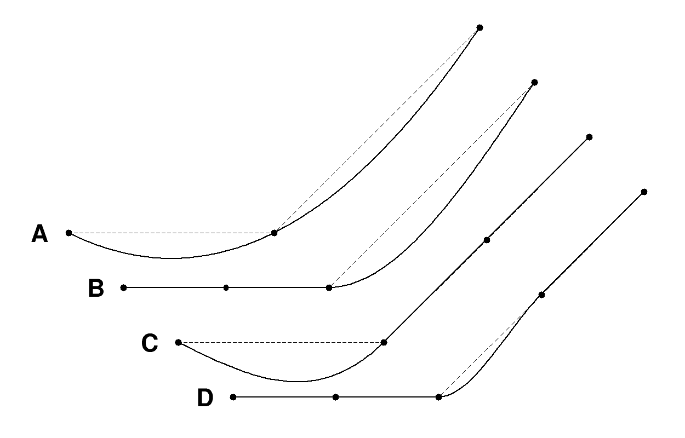

.. _FUNCTION_Namelist:

.. toctree::
   :maxdepth: 1

FUNCTION Namelist
====================

Overview
------------
There is often a need to specify phase properties, boundary condition data, source data, etc., as functions rather than constants. The :ref:`FUNCTION<FUNCTION_Namelist>` namelist provides a means for defining functions that can be used in many situations.

The namelist can define several types of functions: a multi-variable polynomial, a continuous piecewise linear function defined by a table of values, a smooth step function, and with certain Truchas build configurations, a general user-provided function from a shared object library that is dynamically loaded at runtime. The functions are functions of :math:`m` variables. The expected number of variables and what unknowns they represent (i.e., temperature, time, x-coordinate, etc.) depends on the context in which the function is used, and this will be detailed by the documentation of those namelists where these functions can be used.

**Polynomial Function** This function is a polynomial in the variables :math:`v = (v_1,.....,v_m)` of the form

.. math:: f(v) = \sum_{j=1}^{n} c_j \prod_{i=1}^{m}(v_i - a_i)^{(e_{ij})}
   :label: poly_func

with coefficients :math:`c_j`, integer-valued exponents :math:`e^{ij}`, and arbitrary reference point :math:`a= (a_1,...,a_m)`. The coefficients are specified by :ref:`Poly_Coefficients<FUNC_PC>`, the exponents by :ref:`Poly_Exponents<FUNC_PE>`, and the reference point by :ref:`Poly_Refvars<FUNC_PR>`.

**Tabular Function** This is a continuous, single-variable function :math:`y = f(x)` interpolated from a sequence of data points :math:`(x_i,y_i), i= 1,...,n,` with :math:`x_i < x_i+1`. A smooth interpolation method is available in addition to the standard linear interpolation; see :ref:`Tabular_Interp<FUNC_TI>`. There are also two different methods for extrapolating on :math:`x < x_1` and :math:`x > x_n`; see :ref:`Tabular_Extrap<FUNC_TE>`.

**Smooth Step Function** This function is a smoothed :math:`(C_1)` step function in a single variable :math:`v= (x)` of the form

.. math::
   :label: poly_multi
   :nowrap:

   \[
   f(x) =
   \left\{
   \begin{array}{
     @{}% no padding
     l@{\quad}% some padding
     r@{}% no padding
     >{{}}r@{}% no padding
     >{{}}l@{}% no padding
   }
     y_0,& if &x \leq x_0 \\
     y_0 + (y_1 - y_0) s^2 (3-2s), s \equiv (x - x_0)/(x_1 - x_0), & when  &x \in (x_0, x_1) \\
     y_1,& if &x \geq x_1,
   \end{array}
   \right.
   \]

with parameters :math:`x_0`, :math:`x_1`, :math:`y_0`, and :math:`y_1`

**Shared Library Function** This is a function from a shared object library having a simple Fortran 77 or C compatible interface. Written in Fortran 77 the function interface must look like

``double precision function myfun (v, p) bind(c)``

``double precision v(*), p(*)``

where **myfunc** can, of course, be any name. The equivalent C interface is 

``double myfun (double v[], double p[]);``

The vector of variables :math:`v= (v_1,...,v_m)` is passed in the argument :math:`v` and a vector of parameter values specified by :ref:`Parameters<FUNC_Param>` is passed in the argument :math:`p`. Instructions for compiling the code and creating a shared object library can be found in the Truchas Installation Guide. The path to the library is given by :ref:`Library_Path<FUNC_LP>` and the name of the function (myfun, e.g.) is given by :ref:`Library_Symbol<FUNC_LS>`. Note that the bind(c) attribute on the function declaration inhibits the Fortran compiler from mangling the function name (by appending an underscore, for example) as it normally would.

FUNCTION Namelist Features
---------------------------------------
| **Required/Optional        :** Optional
| **Single/Multiple Instances:** Multiple

Components
--------------

* :ref:`Name<FUNC_Name>`
* :ref:`Type<FUNC_Type>`
* :ref:`Library_Path<FUNC_LP>`
* :ref:`Library_Symbol<FUNC_LS>`
* :ref:`Parameters<FUNC_Param>`
* :ref:`Poly_Coefficients<FUNC_PC>`
* :ref:`Poly_Exponents<FUNC_PE>`
* :ref:`Poly_Refvars<FUNC_PR>`
* :ref:`Smooth_Step_X0<FUNC_SSX0>`
* :ref:`Smooth_Step_X1<FUNC_SSX1>`
* :ref:`Smooth_Step_Y0<FUNC_SSY0>`
* :ref:`Smooth_Step_Y1<FUNC_SSY1>`
* :ref:`Tabular_Data<FUNC_TD>`
* :ref:`Tabular_Dim<FUNC_TDim>`
* :ref:`Tabular_Extrap<FUNC_TE>`
* :ref:`Tabular_Interp<FUNC_TI>`

.. _FUNC_Name:

Name
^^^^^^^^^^^^^^^^^^^^^^^^^^^^^^^^^
| **Description** : A unique name by which this function can be referenced by other namelists.
| **Type**        : A case-sensitive string of up to 31 characters.
| **Default**     : None

.. _FUNC_Type:

Type
^^^^^^^^^^^^^^^^^^^^^^^^^^^^^^^^^
| **Description** : The type of function defined by the namelist.
| **Type**        : A case-sensitive string 
| **Default**     : None
| **Valid Values**: "polynomial" for a polynomial function,"tabular" for a tabular function,"smooth step" for a smooth step function, or "library" for a function from a shared object library. The "library" value is not available with a Truchas executable built with the “dynamic loading” option disabled.

.. _FUNC_LP:

Library_Path
^^^^^^^^^^^^^^^^^^^^^^^^^^^^^^^^^
| **Description** : The path to the shared object library that contains the function.
| **Type**        : A string of up to 128 characters.
| **Default**     : None

.. _FUNC_LS:

Library_Symbol
^^^^^^^^^^^^^^^^^^^^^^^^^^^^^^^^^
| **Description** : The symbol name of the function within the shared object file.
| **Type**        : A string of up to 128 characters.
| **Default**     : None
| **Notes**       : Unless the Fortran function is declared with the BIND(C) attribute, which is the recommended practice, a Fortran compiler will almost always mangle the name of the function so that the symbol name is not quite the same as the name in the source code. Use the UNIX/Linux command-line utility **nm** to list the symbol names in the library file to determine the correct name to use here.

.. _FUNC_Param:

Parameters
^^^^^^^^^^^^^^^^^^^^^^^^^^^^^^^^^
| **Description** : Optional parameter values to pass to the shared library function.
| **Type**        : real vector of up to 16 values
| **Default**     : None

.. _FUNC_PC:

Poly_Coefficients
^^^^^^^^^^^^^^^^^^^^^^^^^^^^^^^^^
| **Description** : The coefficients :math:`c_j` of the polynomial :eq:`poly_func`
| **Type**        : real vector of up to 64 values
| **Default**     : None

.. _FUNC_PE:

Poly_Exponents
^^^^^^^^^^^^^^^^^^^^^^^^^^^^^^^^^
| **Description** : The exponents :math:`e_{ij}` of the polynomial :eq:`poly_func`
| **Type**        : integer array
| **Default**     : None
| **Notes**       : Namelist array input is very flexible. The syntax 

``Poly_Exponents(i,j) = .....``

defines the value for exponent :math:`e_{ij}`. All the variable exponents for coefficient :math:`j` can be defined at once by listing their values with the syntax

``Poly_Exponents(:,j) = .....``

In some circumstances it is possible to omit providing 0-exponents for variables that are unused. For example, if the function is expected to be a function of (t,x,y,z), but a polynomial in only t is desired, one can just define a 1-variable polynomial and entirely ignore the remaining variables. On the other hand, if a polynomial in z is desired, one must specify 0-valued exponents for all the preceding variables.

.. _FUNC_PR:

Poly_Refvars
^^^^^^^^^^^^^^^^^^^^^^^^^^^^^^^^^
| **Description** : The optional reference point a of the polynomial :eq:`poly_func`
| **Type**        : real vector
| **Default**     : 0.0

.. _FUNC_TD:

Tabular_Data
^^^^^^^^^^^^^^^^^^^^^^^^^^^^^^^^^
| **Description** : The table of values :math:`(x_i,y_i)` defining a tabular function :math:`y=f(x)`. See also :ref:`Tabular_Dim<FUNC_TDim>`, :ref:`Tabular_Interp<FUNC_TI>`, and :ref:`Tabular_Extrap<FUNC_TE>` for additional variables that define the function.
| **Type**        : real array
| **Default**     : None
| **Notes**       : This is a :math:`2 × n` array with :math:`n \leq 100`. Namelist array input is very flexible and the values can be specified in several ways. For example, the syntax

.. code-block::

  Tabular_Data(1,:) = x_1, x_2, ......., x_n
  Tabular_Data(2,:) = y_1, y_2, ......., y_n

specifies the :math:`x_i` and :math:`y_i` values as separate lists. Or the values can be input naturally as a table

.. code-block::

  Tabular_Data = x_1, y_1
                 x_2, y_2
                 ...
                 x_n, y_n

The line breaks are unnecessary, of course, and are there only for readability as a table.

.. _FUNC_TDim:

Tabular_Dim
^^^^^^^^^^^^^^^^^^^^^^^^^^^^^^^^^
| **Description** : The dimension in the m-vector of independent variables that serves as the independent variable for the single-variable tabular function.
| **Type**        : integer
| **Default**     : 1
| **Notes**       : Functions defined by this namelist are generally functions of m variables :math:`(v_1,v_2,...,v_m)`. The number of variables and the unknowns to which they correspond depend on the context where the function is used. One of these variables needs to be selected to be the independent variable used for the tabular function. In typical use cases the desired tabular function will depend on time or temperature. Those unknowns are often the first variable, and the default value of :ref:`Tabular_Dim<FUNC_TDim>` is appropriate.

.. _FUNC_TE:

Tabular_Extrap
^^^^^^^^^^^^^^^^^^^^^^^^^^^^^^^^^
| **Description** : Specifies the method used for extrapolating outside the range of tabular function data points.
| **Type**        : case-insensitive string
| **Default**     : "nearest"
| **Valid values**: "nearest", "linear"
| **Notes**       : Nearest extrapolation continues the :math:`y` value at the first or last data point. Linear extrapolation uses the slope of the first or last data interval, or if Akima smoothing is used (see :ref:`Tabular_Interp<FUNC_TI>`) the computed slope at the first or last data point.

.. _FUNC_TI:

Tabular_Interp
^^^^^^^^^^^^^^^^^^^^^^^^^^^^^^^^^
| **Description** : Specifies the method used for interpolating between tabular function data points.
| **Type**        : case-insensitive string
| **Default**     : "linear"
| **Valid values**: "linear", "akima"
| **Notes**       : Akima interpolation :footcite:`akima1970new` uses Hermit cubic interpolation on each data interval, with the slope at each data point computed from the linear slopes on the neighboring four intervals. The resulting function is :math:`C^1` smooth. To determine the slope at the first two and last two data points, two virtual data intervals are generated at the beginning and at the end using quadratic extrapolation. The algorithm seeks to avoid undulations in the interpolated function where the data suggests a flat region though its choice of slopes at data points. :numref:`Figure %s A<fig_akima>` shows the typical smooth Akima interpolation. If the first interval was expected to be flat, the exhibited undulation would likely be unacceptable. By inserting an additional data point to create successive intervals with the same slope, as in :numref:`Figure %s BC<fig_akima>`, the algorithm identifies it as a flat region and preserves it in the interpolation. Where two flat regions with differing slopes meet, it is impossible to simultaneously retain smoothness and preserve flatness. In this case a modification to the Akima algorithm used by Matlab’s tablelookup function is adopted, which gives preference to the region with smaller slope as shown in :numref:`Figure %s D<fig_akima>` 

.. _fig_akima:

   Examples of smooth Akima interpolation.

.. _FUNC_SSX0:

Smooth_Step_X0
^^^^^^^^^^^^^^^^^^^^^^^^^^^^^^^^^
| **Description** : The parameter :math:`x_0` of the function :eq:`poly_multi`
| **Type**        : real
| **Default**     : none
| **Valid values**: Require only :math:`x_0 \leq x_1`.

.. _FUNC_SSX1:

Smooth_Step_X1
^^^^^^^^^^^^^^^^^^^^^^^^^^^^^^^^^
| **Description** : The parameter :math:`x_1` of the function :eq:`poly_multi`
| **Type**        : real
| **Default**     : none
| **Valid values**: Require only :math:`x_0 \leq x_1`.

.. _FUNC_SSY0:

Smooth_Step_Y0
^^^^^^^^^^^^^^^^^^^^^^^^^^^^^^^^^
| **Description** : The parameter :math:`y_0` of the function :eq:`poly_multi`
| **Type**        : real
| **Default**     : none

.. _FUNC_SSY1:

Smooth_Step_Y1
^^^^^^^^^^^^^^^^^^^^^^^^^^^^^^^^^
| **Description** : The parameter :math:`y_1` of the function :eq:`poly_multi`
| **Type**        : real
| **Default**     : none

.. footbibliography::
