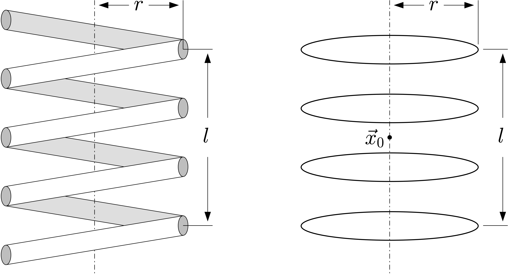

.. _INDUCTION_COIL_Namelist:

.. toctree::
   :maxdepth: 1

INDUCTION_COIL Namelist
============================
The variables in an INDUCTION_COIL namelist specify the physical
characteristics of an induction coil that is to produce an external
magnetic field to drive the electromagnetic Joule heat calculation.
:numref:`Figure %s<fig_induc_coil_schematic>` shows the idealized model
of a coil that is used to analytically evaluate the driving field.
The coil axis is assumed to be oriented with the problem
:ref:`symmetry axis<EM_SA>` as defined in the
:ref:`ELECTROMAGNETICS<ELECTROMAGNETICS_Namelist>` namelist.
Multiple coils may be specified; the net driving field is the superposition
of the fields due to the individual coils, and a spatially
:ref:`uniform field<EM_US>` that can be specified in the
:ref:`ELECTROMAGNETICS<ELECTROMAGNETICS_Namelist>` namelist.
The coils carry a sinusoidally-varying current with a common frequency and
phase. The :ref:`frequency<EM_SF>` is specified in the
:ref:`ELECTROMAGNETICS<ELECTROMAGNETICS_Namelist>` namelist, while the
phase value is irrelevant due to the time averaging of the calculated
Joule heat. Each coil, however, has an independent current amplitude which
is specified here. In addition, the current and frequency may be piecewise
constant functions of time.

.. _fig_induc_coil_schematic:

   Physical 4-loop helical coil with extended wire cross section (left),
   and its idealized model as a stacked array of circular current loops (right).

.. note::

   :Required/Optional: Optional
   :Single/Multiple Instances: Multiple

Namelist Variables
------------------

.. contents::
   :local:

.. _IC_NT:

num_loops
^^^^^^^^^^^^^^^^^^^^^^^^^^^^^^^^^
The number of loops or turns of the coil;
cf. :numref:`Figure %s<fig_induc_coil_schematic>`.

:Type: integer
:Default: none
:Valid Values: > 0

.. _IC_Rad:

radius
^^^^^^^^^^^^^^^^^^^^^^^^^^^^^^^^^
Radius :math:`r` of the coil; cf. :numref:`Figure %s<fig_induc_coil_schematic>`.

:Type: real
:Default: none
:Valid Values: > 0

.. _IC_Len:

length
^^^^^^^^^^^^^^^^^^^^^^^^^^^^^^^^^
The length :math:`l` of the coil;
cf. :numref:`Figure %s<fig_induc_coil_schematic>`.
This is only required when the number of coil loops is greater than 1.

:Type: real
:Default: none
:Valid Values: > 0

.. _IC_Cen:

center
^^^^^^^^^^^^^^^^^^^^^^^^^^^^^^^^^
A 3-vector :math:`x_0` giving the position of the center of the coil;
cf. :numref:`Figure %s<fig_induc_coil_schematic>`.

:Type: real
:Default: :math:`(0, 0, 0)`
:Valid Values: any 3-vector

.. _IC_Cur:

current
^^^^^^^^^^^^^^^^^^^^^^^^^^^^^^^^^
The amplitude of the sinusoidally-varying current in the coil. A negative
value effectively shifts the phase by 180 degrees.

:Physical dimension: I
:Type: real
:Default: none
:Valid Values: Any single value, or any sequence of values.
:Notes: A sequence of up to 32 values may be assigned to this variable in
        order to specify a time-dependent current amplitude;
        see :ref:`source_times<EM_ST>` in the
        :ref:`ELECTROMAGNETICS<ELECTROMAGNETICS_Namelist>` namelist and
        :numref:`Figure %s<fig_rm_em_pc>`.
