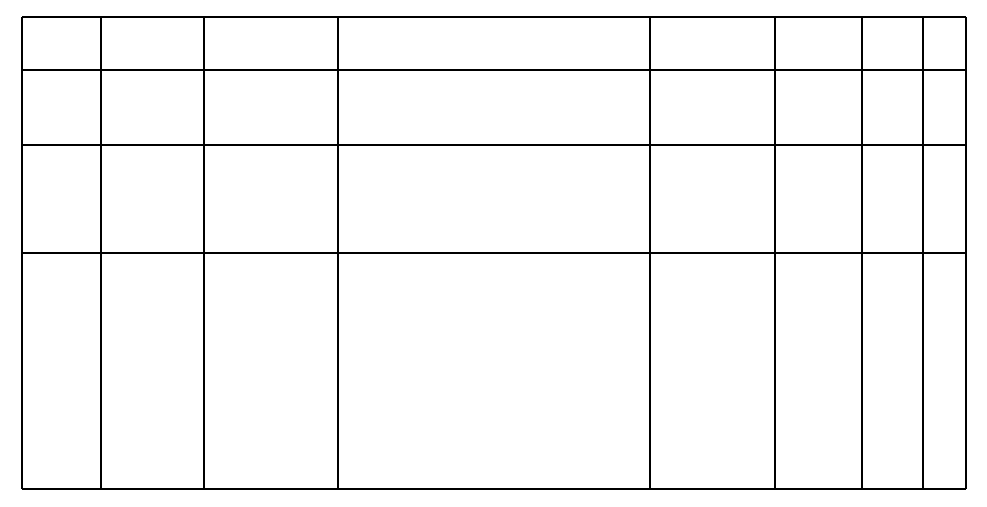

.. _MESH_Namelist:

.. toctree::
   :maxdepth: 1

MESH Namelist
===============
The MESH namelist specifies the mesh used by one or more physics models. All
physics models, other than the electromagnetic models, use a single common
mesh. This unstructured 3D mesh may be a general mixed-element mesh consisting
of non-degenerate hexehedral, tetrahedral, pyramid, and wedge/prism elements.
The electromagnetic models require a distinct 3D simplicial mesh composed
purely of tetrahedral elements. Truchas automatically handles the mapping of
field variables between meshes as needed. For simple demonstration problems,
a rectilinear hexahedral mesh of a brick domain can be defined (subdivided
into tetrahedra for a simplicial mesh), but for most applications the mesh
will need to be generated beforehand by some third party tool or tools and
saved as a file that Truchas will read. At this time ExodusII
:footcite:`sjaardema2006exodus` is the only supported mesh format (also
known as Genesis). This well-known format is used by some mesh generation
tools (`Cubit <https://cubit.sandia.gov/>`_, for example) and utilities exist
for translating from other formats to ExodusII. The ExodusII format supports
a partitioning of the elements into element blocks. It also supports the
definition of side sets, which are collections of oriented element faces that
describe mesh surfaces, either internal or boundary, and node sets which are
collections of mesh nodes. Extensive use is made of this additional mesh
metadata in assigning materials, initial conditions, boundary conditions,
etc., to the mesh.

.. note::

   :Required/Optional: Required
   :Single/Multiple Instances: Multiple

Namelist Variables
++++++++++++++++++

.. contents::
   :local:

Common variables
--------------------

The following variables apply to both externally provided and internally
generated meshes.

mesh_type
^^^^^^^^^^^^^^^^^^^^^^^^^^^^^^^^^
Specifies the internal representation of the mesh. If the mesh is to be used
by an electromagnetics model this must be set to "simplicial" (or equivalently
"electromagnetics"). Otherwise, the default is a general unstructured mesh
representation required by all other physics models.

:Default: "unstructured"
:Valid values: "unstructured", "simplicial" (equiv. "electromagnetics")

coord_scale_factor
^^^^^^^^^^^^^^^^^^^^^^^^^^^^^^^^^
An optional factor by which to scale all mesh node coordinates.

:Type: real
:Default: 1.0
:Valid Values: > 0

rotation_angles
^^^^^^^^^^^^^^^^^^^^^^^^^^^^^^^^^
An optional list of 3 angles, given in degrees, specifying a counter-clockwise
rotation about the x, y, and z-axes to apply to the mesh. The rotations are
done sequentially in that order. A negative angle is a clockwise rotation, and
a zero angle naturally implies no rotation.

:Type: real 3-vector
:Default: (0.0, 0.0, 0.0)

partitioner
^^^^^^^^^^^^^^^^^^^^^^^^^^^^^^^^^
The partitioning method used to generate the parallel decomposition of the mesh.

:Type: case-insensitive string
:Default: "metis"
:Valid Values: "metis", "file", "block"
:Notes:

.. _partitioner_options:
.. csv-table::
   :header: "Option", "Description"
   :class: tight-table
   :widths: 1 5

   "**metis**","uses the well-known METIS library :footcite:`karypis1998fast` \
   to partition the dual graph of the mesh at runtime. This method has a \
   number of options which are described below in
   `METIS Mesh Partitioning`_."
   "**file**","reads the partitioning of the mesh cells from a disk file; see \
   `partition_file`_."
   "**block**","partitions the mesh cells into nearly equal-sized blocks of \
   consecutively numbered cells according their numbering in the mesh file. \
   The quality of this naive decomposition entirely depends on the given \
   ordering of mesh cells, and thus this option is not generally recommended."

partition_file
^^^^^^^^^^^^^^^^^^^^^^^^^^^^^^^^^
Specifies the path to the mesh cell partition file, and is required when
`partitioner`_ is "file". If not an absolute path, it will be interpreted
as a path relative to the Truchas input file directory.

:Type: string
:Default: none
:Note: The format of this text file consists of a sequence of integer values,
       one value or multiple values per line. The first value is the partition
       number of the first cell, the second value the partition number of the
       second cell, and so forth. The number of values must equal the number of
       mesh cells. The file may use either a 0-based or 1-based numbering
       convention for the partitions. Popular mesh partitioning tools typically
       use 0-based partition numbering, and so the default is to assume 0-based
       numbering; use `first_partition`_ to specify 1-based numbering.

first_partition
^^^^^^^^^^^^^^^^^^^^^^^^^^^^^^^^^
Specifies the number given the first partition in the numbering convention
used in the partition file. Either 0-based (default) or 1-based numbering is
allowed.

External Mesh File
----------------------
In typical usage, the mesh will be read from a specified ExodusII mesh file.
Other input variables specify optional modifications that can be made to the
mesh after it is read.

mesh_file
^^^^^^^^^^^^^^^^^^^^^^^^^^^^^^^^^
Specifies the path to the ExodusII mesh file. If not an absolute path, it
will be interpreted as a path relative the the Truchas input file directory.

:Type: string
:Default: none

.. _M_ISS:

Interface_Side_Sets
^^^^^^^^^^^^^^^^^^^^^^^^^^^^^^^^^
A list of side set IDs from the ExodusII mesh identifying internal mesh
surfaces that will be treated specially by the heat/species transport solver.

:Type: integer list
:Default: An empty list of side set IDs.
:Valid Values: Any side set ID whose faces are internal to the mesh.
:Notes:
  The heat/species transport solver requires that boundary conditions are
  imposed along the specified surface. Typically these will be interface
  conditions defined by :ref:`THERMAL_BC<THERMAL_BC_Namelist>` namelists, but
  in unusual use cases they could also be external boundary conditions defined
  by the same namelists. In the latter case it is necessary to understand that
  the solver views the mesh as having been sliced open along the specified
  internal surfaces creating matching pairs of additional external boundary
  and, where interface conditions are not imposed, boundary conditions must
  be imposed on both sides of the interface.

exodus_block_modulus (expert)
^^^^^^^^^^^^^^^^^^^^^^^^^^^^^^^^^
When importing an Exodus II mesh, the element block IDs are replaced by their
value modulo this parameter. Set the parameter to 0 to disable this procedure.

:Type: integer
:Default: 10000
:Valid Values: :math:`\geq 0`
:Notes:
  This parameter helps solve a problem posed by mixed-element meshes created
  by Cubit and Trelis. In those tools a user may define an element block
  comprising multiple element types. But when exported in the ExodusII format,
  which doesn't support blocks with mixed element types, the element block will
  be written as multiple Exodus II blocks, one for each type of element. One of
  the blocks will retain the user-specified ID of the original block. The IDs
  of the others will be that ID plus an offset specific to the element type.
  For example, if the original block ID was 1, hexahedra in the block will be
  written to a block with ID 1, tetrahedra to a block with 10001, pyramids to
  a block with ID 100001, and wedges to a block with ID 200001. These are the
  default offset values, and they can be set in Cubit/Trelis; see their
  documentation for details on how the IDs are generated. It is important to
  note that this reorganization of element blocks occurs silently and so the
  user may be unaware that it has happened. In order to reduce the potential
  for input errors, Truchas will by default convert the block IDs to congruent
  values modulo :math:`N` in the interval :math:`[1,N-1]` where :math:`N` is
  the value of this parameter. The default value :math:`10000` is appropriate
  for the default configuration
  of Cubit/Trellis, and restores the original user-specified block IDs. Note
  that this effectively limits the range of element block IDs to
  :math:`[1,N-1]`.

  The element block IDs are modified immediately after reading the file. Any
  input parameters that refer to block IDs must refer to the modified IDs.

Internally Generated Mesh
----------------------------
A rectilinear hexahedral mesh for a brick domain
:math:`[x_0,x_1] \times [y_0,y_1] \times [z_0,z_1]` can be generated internally
as part of a Truchas simulation using the following input variables. The mesh
is the tensor product of 1D grids in each of the coordinate directions. Each
coordinate grid is defined by a coarse grid whose intervals are subdivided into
subintervals, optionally with biased sizes. The generated ExodusII mesh consists
of a single element block with ID 1, and a side set is defined for each of the
six sides of the domain with IDs 1 through 6 for the :math:`x=x_0`,
:math:`x=x_1`, :math:`y=y_0`, :math:`y=y_1`, :math:`z=z_0,` and :math:`z=z_1`
sides, respectively. In addition, a different node set is defined for each of
the 8 nodes at the corners of the domain, with IDs 1 through 8. The first node
set is the :math:`(x_0,y_0,z_0)` corner. It is followed by the remaining corners
on the :math:`z=z_0` side in a counter-clockwise order with respect to the
:math:`z` axis, and then the corners on the :math:`z=z_1` side in the analogous
manner. Note that while the mesh is formally structured, it is represented
internally as a general unstructured mesh. In the case of a simplicial mesh
(see `mesh_type`_), each hexahedral cell is subdivided into tetrahedral
elements.

x_axis, y_axis, z_axis
^^^^^^^^^^^^^^^^^^^^^^^
Data that describes the grid in each of the coordinate directions. The tensor
product of these grids define the nodes of the 3D mesh. The data for each
coordinate grid consists of these three component arrays:

.. _grid_mesh_options:
.. csv-table::
   :header: "Option", "Description"
   :class: tight-table
   :widths: 1 5

   "**%coarse_grid**","A strictly increasing list of two or more real values \
   that define the points of the coarse grid for the coordinate direction. \
   The first and last values define the extent of the domain in this direction."
   "**%intervals**","A list of postive integers defining the number of \
   subintervals into which each corresponding coarse grid interval should be \
   subdivided. The number of values must be one less than the number of coarse \
   grid points."
   "**%ratio**","An optional list of positive real values that define the \
   ratio of the lengths of successive subintervals for each coarse grid \
   interval. The default is to subdivide into equal length subintervals. If \
   specified, the number of values must be one less than the number of coarse \
   grid points."

See :numref:`Figure %s<fig_mesh_internal_schematic>` for an example. That is a
mesh generated by the following input.

.. _internal_mesh_example_script:

::

   x_axis%coarse_grid = 0.0, 0.67, 1.33, 2.0
   x_axis%intervals   = 3, 1, 4
   x_axis%ratio       = 1.3, 1.0, 0.7
   y_axis%coarse_grid = 0.0, 0.5, 1.0
   y_axis%intervals   = 1, 3
   y_axis%ratio       = 0.7
   z_axis%coarse_grid = 0.0, 1.0
   z_axis%intervals   = 1

.. _fig_mesh_internal_schematic:

   Top xy surface of the rectilinear mesh generated by the
   :ref:`example input<internal_mesh_example_script>` shown.

.. _M_NF:

noise_factor (expert)
^^^^^^^^^^^^^^^^^^^^^^^^^^^^^^^^^
If specified with a positive value, the coordinates of each mesh node will be
perturbed by uniformly distributed random amount whose magnitude will not exceed
this value times the local cell size at the node. Nodes on the boundary are not
perturbed in directions normal to the boundary. This is only useful for testing.

:Default: 0
:Valid Values: :math:`\in [0,0.3]`

METIS Mesh Partitioning
-------------------------
When "metis" is specified for `partitioner`_, a graph partitioning procedure
from the METIS library is used to partition the dual graph of the mesh. This
is the graph whose nodes are the mesh cells and edges are the faces shared by
cells. The partitioning procedures have the following integer-valued options
that may be specified, though all have reasonable defaults so that none must
be specified.

metis_major_partitions
^^^^^^^^^^^^^^^^^^^^^^
The number of major partitions in a 2-level partitioning strategy. For values
N > 1, the mesh is first partitioned into N major parts, and then each part
is further partitioned into NPROC/N or NPROC/N + 1 minor parts, such that the
total number of (minor) parts equals NPROC -- one part per MPI rank. The major
parts are weighted such that the minor parts have equal size, so it isn't
necessary that N divide NPROC evenly to obtain load balancing. The minor parts
are assigned to ranks in major order: all minor parts deriving from a major
part are assigned consecutively before moving to the next major part.
The default is 1, which reduces to the usual single-level partitioning.

The following options are provided by the METIS library; see its documentation
:footcite:`karypis1998fast` for more details.

metis_ptype
^^^^^^^^^^^^
Specifies the partitioning method. The possible values are: 0, for multilevel
recursive bisection (default); and 1, for multilevel :math:`k`-way partitioning.

metis_iptype
^^^^^^^^^^^^
Specifies the algorithm used during initial partitioning (recursive bisection
only). The possible values are: 0, to grows a bisection using a greedy strategy
(default); and 1, to compute a bisection at random followed by a refinement.

metis_ctype
^^^^^^^^^^^^
Specifies the matching scheme to be used during coarsening. The possible values
are: 0, for random matching; and 1, for sorted heavy-edge matching (default).

metis_ncuts
^^^^^^^^^^^^
specifies the number of different partitionings that will be computed.
The final partitioning will be the one that achieves the best edgecut.
The default is 1.

metis_niter
^^^^^^^^^^^^
Specifies the number of iterations of the refinement algorithm at each stage
of the uncoarsening process. The default is 10.

metis_ufactor
^^^^^^^^^^^^^^
Specifies the maximum allowed load imbalance among the partitions. A value of
:math:`n` indicates that the allowed load imbalance is :math:`(1+n)/1000`. The
default is 1 for recursive bisection (i.e., an imbalance of 1.001) and the
default value is 30 for :math:`k`-way partitioning (i.e., an imbalance of 1.03).

metis_minconn
^^^^^^^^^^^^^^
Specifies whether the partitioning procedure should seek to minimize the
maximum degree of the subdomain graph (1); or not (0, default). The subdomain
graph is the graph in which each partition is a node, and edges connect
subdomains with a shared interface.

metis_contig
^^^^^^^^^^^^^^
Specifies whether the partitioning procedure should produce partitions that
are contiguous (1); or not (0, default). If the dual graph of the mesh is not
connected this option is ignored.

metis_seed
^^^^^^^^^^^
Specifies the seed for the random number generator.

metis_dbglvl
^^^^^^^^^^^^^
Specifies the amount and type of diagnostic information that will be written to
stderr by the partitioning procedure. The default is 0, no output. Use 1 to
write some basic information. Refer to the METIS documentation for the many
other possible values and the output they generate.

.. footbibliography::
