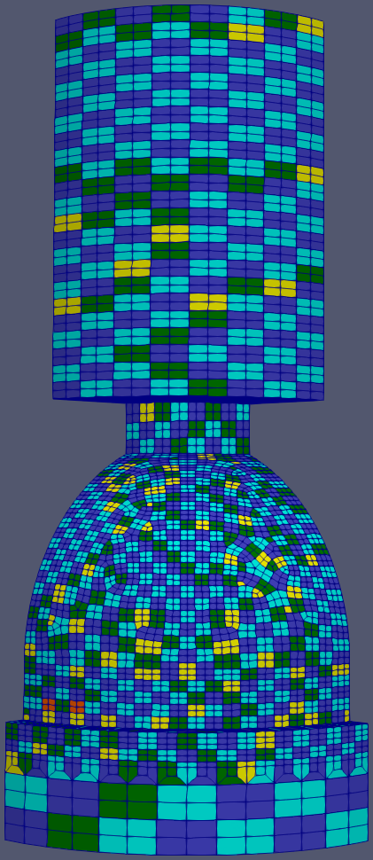
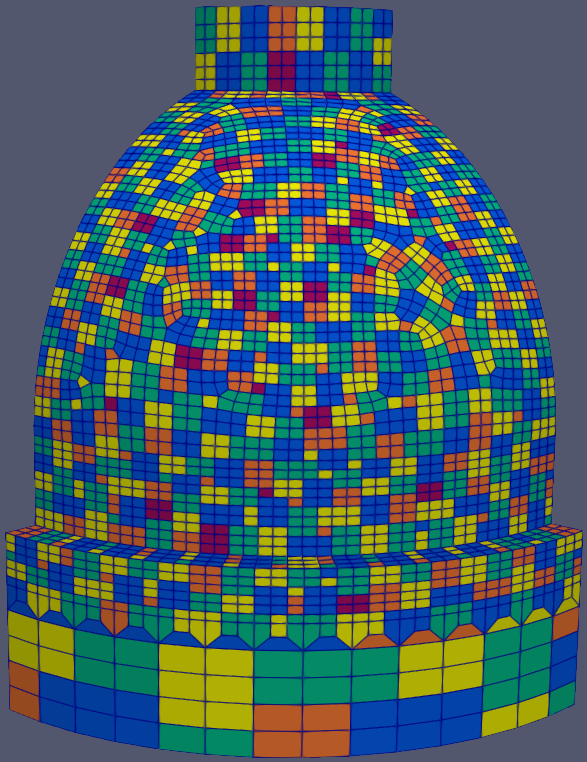

.. sectionauthor:: David Neill-Asanza <dhna@lanl.gov>

Enclosure Patches
=================

.. TODO:: finish RadE patches page

Patch Algorithms
----------------
:program:`genre` includes three patching algorithms.

.. toctree::
   :titlesonly:

   pave
   vac
   vsa

.. warning::
   The :doc:`VAC <vac>` and :doc:`VSA <vsa>` algorithms are experimental and not recommended for
   regular users. For best results, use the :doc:`PAVE <pave>` algorithm.

.. |vsa_patches| image:: images/basic_hemi_vsa_1.png
   :width: 100%
   :align: middle

.. table::
   :align: center
   :class: fig-table

   +----------------+----------------+----------------+
   | |pave_patches| | |vac_patches|  | |vsa_patches|  |
   +----------------+----------------+----------------+
   | Result of running **PAVE** (left), **VAC**       |
   | (center),and **VSA** (right) on the 'basic hemi' |
   | enclosure.                                       |
   +--------------------------------------------------+

PATCHES Namelist
----------------

.. toctree::
   :maxdepth: 3
   :hidden:

   patches_namelist

The `PATCHES` namelist defines the parameters used by the patching algorithms. The namelist supports
ten parameters, but not all parameters are used by all algorithms. Parameters only used by a
particular algorithm are prefixed with the algorithm's name.

.. code-block:: console

  &PATCHES
    patch_algorithm = 'PAVE'
    verbosity_level = 3
    max_angle = 30.0
    pave_split_patch_size = 4
  /

:superscript:`Example PATCHES namelist`

The `PATCHES` namelist parameters include:

#. :ref:`tools/RadE/patches/patches_namelist:PATCH_ALGORITHM`: Patch algorithm to execute.
#. :ref:`tools/RadE/patches/patches_namelist:VERBOSITY_LEVEL`: Verbosity level of the patch algorithm.
#. :ref:`tools/RadE/patches/patches_namelist:MAX_ANGLE`: Maximum angle between adjacent faces
#. :ref:`tools/RadE/patches/patches_namelist:PAVE_MERGE_LEVEL`: Controls the aggressiveness of patch merging
#. :ref:`tools/RadE/patches/patches_namelist:PAVE_SPLIT_PATCH_SIZE`: Split patches with up to this number of faces
#. :ref:`tools/RadE/patches/patches_namelist:VAC_MERGE_LEVEL`: Controls the aggressiveness of patch merging
#. :ref:`tools/RadE/patches/patches_namelist:VAC_SPLIT_PATCH_SIZE`: Split patches with up to this number of faces
#. :ref:`tools/RadE/patches/patches_namelist:VSA_MAX_ITER`: Maximum iterations for the VSA algorithm
#. :ref:`tools/RadE/patches/patches_namelist:VSA_MIN_DELTA`: Minimum change in patch proxies for the VSA algorithm
#. :ref:`tools/RadE/patches/patches_namelist:VSA_AVG_FACES_PER_PATCH`: Average faces per patch for the VSA algorithm

.. seealso::
  For detailed information on these parameters, refer to the :doc:`PATCES namelist
  documentation <patches_namelist>`.
