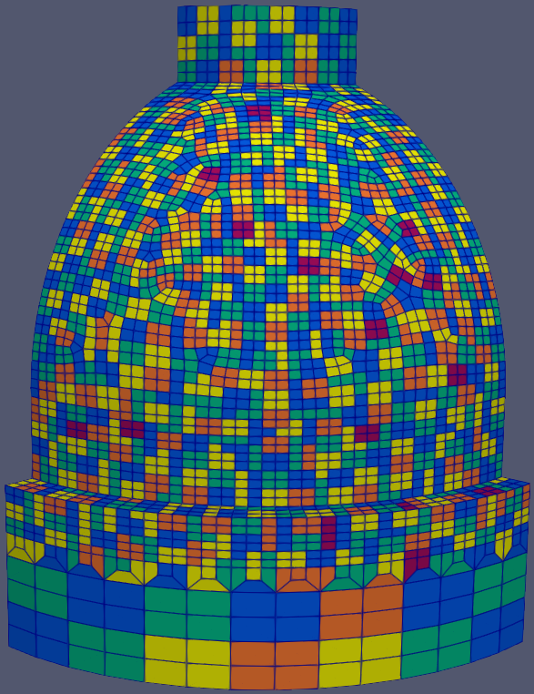

.. sectionauthor:: David Neill-Asanza <dhna@lanl.gov>

Enclosure Patches
=================

.. TODO:: finish RadE patches page

Patch Algorithms
----------------
:program:`genre` includes four patching algorithms.

.. toctree::
   :titlesonly:

   pave
   vac
   vsa
   metis

.. TODO:: necessary warning?
.. warning::
   The :doc:`VAC <vac>`, :doc:`VSA <vsa>`, and :doc:`METIS <metis>` algorithms are experimental and
   not recommended for regular users. For best results, use the :doc:`PAVE <pave>` algorithm.

.. |pave_patches| image:: images/basic_hemi_pave_1.png
   :width: 100%
   :align: middle

.. |vac_patches| image:: images/basic_hemi_vac_1.png
   :width: 100%
   :align: middle

.. |vsa_patches| image:: images/basic_hemi_vsa_1.png
   :width: 100%
   :align: middle

.. table::
   :align: center
   :width: 75%
   :class: fig-table

   +------------------------------+------------------------------+
   | |pave_patches|               | |vac_patches|                |
   +------------------------------+------------------------------+
   | |vsa_patches|                | |metis_patches|              |
   +------------------------------+------------------------------+
   | Result of running **PAVE** (top left), **VAC** (top right), |
   | and **VSA** (bottom left) and **METIS** (bottom right) on   |
   | the 'basic hemi' enclosure.                                 |
   +-------------------------------------------------------------+

PATCHES Namelist
----------------
.. toctree::
   :maxdepth: 2
   :hidden:

   patches_namelist

.. code-block:: console

  &PATCHES
    patch_algorithm = 'PAVE'
    verbosity_level = 3
    max_angle = 30.0
    pave_split_patch_size = 4
  /

:superscript:`Example PATCHES namelist`

The `PATCHES` namelist defines the parameters used by the patching algorithms. The namelist supports
many parameters, but not all parameters are used by all algorithms. Parameters only used by a
particular algorithm are prefixed with the algorithm's name.

Refer to the :doc:`PATCES namelist documentation <patches_namelist>` for detailed information on
these parameters.
