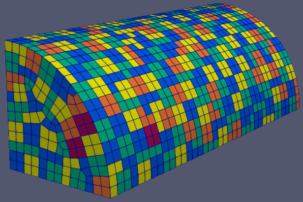

.. sectionauthor:: David Neill-Asanza <dhna@lanl.gov>

.. default-role:: math

METIS patching (METIS)
======================

   Result of METIS on a quarter cyclinder.

The METIS patching algorithm is based on the observation that clustering the enclosure faces is
equivalent to partitioning the enclosure's dual graph. This is the graph whose nodes are the
enclosure faces and edges are the enclosure edges shared by faces. The METIS patching algorithm
leverages the well-known METIS library :cite:`metis-Karypis:1998:METIS` to partition the dual graph.

Since the METIS graph partitioner minimizes the number of edges between partitions, the resulting
partitions naturally correspond to connected patches with roughly circular shapes. Moreover, by
appropriately weighting the vertices and edges of the dual graph, the generated patches can have
desirable properties, such as roughly constant areas or number of faces.

.. note::
  Throughout this document the terms 'METIS library' or 'METIS graph partitioner' refer to the
  external library and its routines. The terms 'METIS patching algorithm' or 'METIS algorithm' refer
  to the patching algorithm described in this document.

.. contents:: Contents
   :local:
   :backlinks: none

Algorithm
---------
The METIS algorithm begins by constructing the dual graph of the enclosure. By default, the face
areas and edge lengths of the enclosure are computed and assigned as weights to the corresponding
elements of the dual graph, respectively the vertices and edges. This weighted graph is passed to
the METIS library, which partitions the dual graph vertices and hence produces a patching of the
enclosure. Finally, a fix-up routine breaks up disconnected patches, ensuring that the final output
consists only of connected patches.

Outline
+++++++
The following is a high-level outline of the METIS algorithm.

#. **Initialization**

   #. Compute the area and normal of each face.
   #. Generate the dual graph of the mesh (i.e. face adjacency graph). Faces at angles greater than
      :ref:`MAX_ANGLE <tools/RadE/patches/patches_namelist:MAX_ANGLE>` are not adjacent.
   #. Let NPART = NFACE / METIS_FACE_PATCH_RATIO, where NFACE is the total number of faces
      in the enclosure.
   #. If :ref:`tools/RadE/patches/metis:METIS_FACE_WEIGHT` is true, generate the vertex weights of
      the dual graph. The vertex weights are the areas of the corresponding faces divided by the
      minimum face area.
   #. If :ref:`tools/RadE/patches/metis:METIS_EDGE_WEIGHT` is true, generate the edge weights of the
      dual graph. The edge weights are the Euclidean lengths of the corresponding mesh edges divided
      by the minimum edge length.
   #. Initialize :ref:`all other parameters <tools/RadE/patches/metis:METIS library parameters>` of
      the METIS graph partitioner.

#. **Graph Partition**

   #. Run the METIS graph partitioner on dual graph with the given weights and other parameters. Let
      each partition of the dual graph to be a new patch. Since METIS can produce less partitions
      than requested, we have NPATCH <= NPART.

#. **Split patches**

   #. Loop through the patches and check whether each patch is connected. If not, then create a new
      patch for each of its connected components. This step is needed because METIS is free to
      create disconnected partitions with the recommended default parameters.

Dual Graph
++++++++++
During initialization, the METIS algorithm constructs the face adjacency graph (i.e. dual graph) of
the enclosure. This graph is then partitioned by the METIS library to produce enclosure patches.

The face adjacency graph is defined by the topology of the mesh and the :ref:`MAX_ANGLE
<tools/RadE/patches/patches_namelist:MAX_ANGLE>` namelist parameter which controls the maximum
allowable angle between the (normals of) adjacent faces. Specifically, two topologically adjacent
faces at a angle greater than MAX_ANGLE will not share an edge in the adjacency graph. The
*connected components* of the face adjacency graph thus represent collections of faces that are
bounded by 'sharp' edges (angles greater than MAX_ANGLE) or the mesh boundary itself.

Partitioning objective
++++++++++++++++++++++
By default, the METIS algorithm uses the *edge-cut* partitioning objective (see :ref:`METIS_OBJTYPE
<tools/RadE/patches/metis:METIS_OBJTYPE>`). With this objective, the number of edges (or the sum of
their weights) that straddle the different partitions is minimized. Also, the number of vertices (or
the sum of their weights) assigned to each partition is constrained to be approximately the same
across the partitions.

The *communication volume* partitioning objective can also be used, but it is intended for
partitioning meshes among parallel processes. As such, the communication volume objective will not
be discussed in this document but is left as an option for interested users. See the METIS
documentation :cite:`metis-Karypis:1998:METIS` for more details on this objective type.

The :ref:`METIS_EDGE_WEIGHT <tools/RadE/patches/metis:METIS_EDGE_WEIGHT>` and
:ref:`METIS_FACE_WEIGHT <tools/RadE/patches/metis:METIS_FACE_WEIGHT>` parameters affect the weights
assigned to the edges and vertices of the dual graph, and thus affect the final patch configuration.
These parameters are discussed in detail below.

Edge Weight
^^^^^^^^^^^
When the :ref:`METIS_EDGE_WEIGHT <tools/RadE/patches/metis:METIS_EDGE_WEIGHT>` parameter is false,
the dual graph edges are assigned a weight of 1. In this case, the number of edges that straddle
different partitions is minimized. In other words, the resulting patches will tend have "smooth"
(locally convex) boundaries since complex boundaries have many dual edges between partitions.

When the parameter is true, the dual graph edges are assigned weights equal to the Euclidean length
of the corresponding edges of the enclosure. In this case, the edge-cut objective minimizes the
perimeter of the resulting patches. This further encourages patches with smooth boundaries, as well
as patches that are roughly circular since circles minimize perimeter for a fixed area
(see the `isoperimetric inequality <https://en.wikipedia.org/wiki/Isoperimetric_inequality>`_).

Face Weight
^^^^^^^^^^^
When the :ref:`METIS_FACE_WEIGHT <tools/RadE/patches/metis:METIS_FACE_WEIGHT>` parameter is false,
the dual graph vertices are assigned a weight of 1. In this case, the objective is constrained to
ensure the number of vertices in each partition is approximately the same across the partitions. In
other words, each patch will tend to have the same number of faces.

When the parameter is true, the dual graph vertices are assigned weights equal to the area of the
corresponding faces of the enclosure. In this case, the objective is constrained to ensure the sum
of the weights of the vertices assigned to each partition is the same across the partitions. In
other words, all patches will have roughly the same total area.

Load Imbalance
~~~~~~~~~~~~~~
The maximum allowed imbalance in the vertex weight constraint is controlled by the
:ref:`METIS_UFACTOR <tools/RadE/patches/metis:METIS_UFACTOR>` parameter. The load imbalance for this
constraint is defined to be `\max_i (w[i]/t[i])`, where `w[i]` is the fraction of the overall weight
that is assigned to the `i`\ th partition and `t[i]` is the desired target weight for the `i`\ th
partition. Since the METIS algorithm assigns the same target weight to each partition (i.e. the
METIS library parameter ``tpwgts`` is ``NULL``), we always have that `t[i] = 1/\text{NPART}`, where
NPART is the number of requested partitions.

In the case when METIS_FACE_WEIGHT is false, the load imbalance becomes

.. math::
  max_i \left( \frac{w[i]}{t[i]} \right)
  = max_i \left( f[i]\frac{\text{NPART}}{\text{NFACE}} \right)
  = max_i \left( \frac{f[i]}{\text{METIS_FACE_PATCH_RATIO}} \right)

where `f[i]` is the number of faces of the `i`\ th patch, NFACE is the total number of faces in the
enclosure, and :ref:`METIS_FACE_PATCH_RATIO <tools/RadE/patches/metis:METIS_FACE_PATCH_RATIO>` is a
parameter of the METIS algorithm. Note that the load imbalance is close to 1 when the `i`\ th patch
has roughly as many faces as the value of METIS_FACE_PATCH_RATIO.

In the case when METIS_FACE_WEIGHT is true, the load imbalance becomes

.. math::
  max_i \left( \frac{w[i]}{t[i]} \right)
  = max_i \left( A[i]\frac{\text{NPART}}{\text{AREA}} \right)

where `A[i]` is the area of the `i`\ th patch and AREA is the total surface area of the enclosure.
Note that if all patches have a load imbalance close to 1, then the total surface area is roughly
evenly distributed among the patches.

By default, :ref:`METIS_UFACTOR <tools/RadE/patches/metis:METIS_UFACTOR>` is 1, so the maximum
allowed load imbalance is 1.001. This means that the weight of each partition can have a relative
difference to the even distribution of the total weight of at most 0.001. Consider increasing
METIS_UFACTOR if a strictly even distribution of the total weight (faces or surface area) among
patches is not required.

Namelist Parameters
-------------------
The :doc:`PATCHES namelist <patches_namelist>` allows a user to configure the METIS algorithm
parameters. Although the PATCHES namelist supports many parameters, not all are used by METIS.
Specifically, METIS admits two general parameters, and three parameters used during initialization,
and 12 parameters passed directly to the graph partitioner.

The general parameters used by METIS are VERBOSITY_LEVEL and MAX_ANGLE. Refer to the :ref:`PATCHES
namelist documentation <tools/RadE/patches/patches_namelist:General Parameters>` for more
information on those parameters.

The 15 parameters unique to METIS are all prefixed with *METIS*. We first discuss the three
parameters used during initialization, and then briefly present the 12 METIS library parameters
passed to the graph partitioner.

Initialization Parameters
+++++++++++++++++++++++++

METIS_FACE_PATCH_RATIO
^^^^^^^^^^^^^^^^^^^^^^
Defines the ratio of total faces to total desired patches, and by extension the final number of
patches generated.

.. namelist_parameter::
   :type: REAL
   :domain: metis_face_patch_ratio >= 1.0
   :default: meti_face_patch_ratio = 4.0

This parameter determines the number of partitions NPART passed to the METIS graph partitioner:

.. math::
   \text{NPART} = \frac{\text{NFACE}}{\text{METIS_FACE_PATCH_RATIO}}

where NFACE is the total number of faces. Since the METIS library is free to produce less partitions
than requested, NPART is not necessarily the final number of patches.

The METIS library must ensure that the constraints on the objective function are satisfied (see
:ref:`partitioning objective <tools/RadE/patches/metis:Partitioning objective>`), and can thus
produce a drastically different number of partitions than requested. In particular, when
:ref:`METIS_FACE_WEIGHT <tools/RadE/patches/metis:METIS_FACE_WEIGHT>` is enabled for an enclosure
with faces of vastly different sizes, the requirement to evenly divide the total enclosure surface
area among the patches might produce significantly fewer partitions than requested.

Moreover, after the METIS library partitions the dual graph the patch splitting step breaks up
disconnected patches which may increase the final patch count. In short, NPART is only a suggestion
for the final patch count. Consider tweaking other parameters if an exact patch count is desired.

METIS_EDGE_WEIGHT
^^^^^^^^^^^^^^^^^
Determines whether to weight the edges of the dual graph by the corresponding enclosure edge lengths.

.. namelist_parameter::
   :type: LOGICAL
   :domain: Must be ``.true.`` or ``.false.``
   :default: metis_edge_weight = ``.true.``

This parameter determines whether the Euclidean length of the enclosure edges are assigned as edge
weights in the dual graph passed to the METIS library. If the parameter is false, then the dual
graph edges are assigned a weight of 1.

Refer to the :ref:`edge weight section <tools/RadE/patches/metis:Edge Weight>` of the METIS
algorithm documentation for more information on how the parameter affects the final patch
configuration.

METIS_FACE_WEIGHT
^^^^^^^^^^^^^^^^^
Determines whether to weight the vertices of the dual graph by the corresponding enclosure face
areas.

.. namelist_parameter::
   :type: LOGICAL
   :domain: Must be ``.true.`` or ``.false.``
   :default: metis_face_weight = ``.true.``

This parameter determines whether the area of the enclosure faces are assigned as vertex weights in
the dual graph passed to the METIS library. If the parameter is false, then the dual graph vertices
are assigned a weight of 1.

Refer to the :ref:`face weight section <tools/RadE/patches/metis:Face Weight>` of the METIS
algorithm documentation for more information on how the parameter affects the final patch
configuration.

METIS library parameters
++++++++++++++++++++++++
The METIS graph partitioning routine admits the following integer-valued options that may be
specified, though all have reasonable defaults so that none must be specified. See the METIS
documentation :cite:`metis-Karypis:1998:METIS` for more details on these options.

METIS_PTYPE
^^^^^^^^^^^
Specifies the partitioning method.

.. namelist_parameter::
   :type: INTEGER
   :domain: metis_ptype `\in` {0,1}
   :default: metis_ptype = 0

The partitioning methods are encoded as follows:

.. list-table::
   :widths: 15 30
   :header-rows: 1

   * - Value
     - Description
   * - metis_ptype = 0
     - Multilevel recursive bisection
   * - metis_ptype = 1
     - Multilevel `k`-way partitioning

METIS_OBJTYPE
^^^^^^^^^^^^^
Specifies the type of objective.

.. namelist_parameter::
   :type: INTEGER
   :domain: metis_objtype `\in` {0,1}
   :default: metis_objtype = 0

The objective types are encoded as follows:

.. list-table::
   :widths: 15 30
   :header-rows: 1

   * - Value
     - Description
   * - metis_objtype = 0
     - Edge-cut minimization.
   * - metis_objtype = 1
     - Total communication volume minimization.

METIS_CTYPE
^^^^^^^^^^^
Specifies the matching scheme to be used during coarsening.

.. namelist_parameter::
   :type: INTEGER
   :domain: metis_ctype `\in` {0,1}
   :default: metis_ctype = 1

The matching schemes are encoded as follows:

.. list-table::
   :widths: 15 30
   :header-rows: 1

   * - Value
     - Description
   * - metis_ctype = 0
     - Random matching
   * - metis_ctype = 1
     - Sorted heavy-edge matching

METIS_IPTYPE
^^^^^^^^^^^^
Specifies the algorithm used during initial partitioning (recursive bisection only).

.. namelist_parameter::
   :type: INTEGER
   :domain: metis_iptype `\in` {0,1,2,3}
   :default: metis_iptype = 0

The partitioning algorithms are encoded as follows:

.. list-table::
   :widths: 15 30
   :header-rows: 1

   * - Value
     - Description
   * - metis_iptype = 0
     - Grows a bisection using a greedy strategy
   * - metis_iptype = 1
     - Computes a bisection at random followed by a refinement
   * - metis_iptype = 2
     - Derives a separator from an edge cut.
   * - metis_iptype = 3
     - Grow a bisection using a greedy node-based strategy

METIS_NCUTS
^^^^^^^^^^^
Specifies the number of different partitionings that will be computed. The final partitioning will
be the one that achieves the best edgecut or communication volume.

.. namelist_parameter::
   :type: INTEGER
   :domain: metis_ncuts >= 1
   :default: metis_ncuts = 1

METIS_NITER
^^^^^^^^^^^
Specifies the number of iterations of the refinement algorithm at each stage of the uncoarsening
process.

.. namelist_parameter::
   :type: INTEGER
   :domain: metis_niter >= 1
   :default: metis_niter = 10

METIS_SEED
^^^^^^^^^^
Specifies the seed for the random number generator.

.. namelist_parameter::
   :type: INTEGER
   :domain: metis_seed `\in \mathbb{Z}`
   :default: metis_seed = -1

METIS_MINCONN
^^^^^^^^^^^^^
Specifies whether the partitioning procedure should seek to minimize the maximum degree of the
subdomain graph.

.. namelist_parameter::
   :type: INTEGER
   :domain: metis_minconn `\in` {0,1}
   :default: metis_minconn = 0

The subdomain graph is the graph in which each partition is a node, and edges connect subdomains
with a shared interface. This parameter is encoded as follows:

.. list-table::
   :widths: 15 30
   :header-rows: 1

   * - Value
     - Description
   * - metis_minconn = 0
     - Does not explicitly minimize the maximum connectivity.
   * - metis_minconn = 1
     - Explicitly minimize the maximum connectivity.

METIS_NO2HOP
^^^^^^^^^^^^
Specifies that the coarsening will not perform any 2–hop matchings when the standard matching
approach fails to sufficiently coarsen the graph.

.. namelist_parameter::
   :type: INTEGER
   :domain: metis_no2hop `\in` {0,1}
   :default: metis_no2hop = 1

The 2–hop matching is very effective for graphs with power-law degree distributions. This parameter
is encoded as follows:

.. list-table::
   :widths: 15 30
   :header-rows: 1

   * - Value
     - Description
   * - metis_no2hop = 0
     - Performs a 2–hop matching.
   * - metis_no2hop = 1
     - Does not perform a 2–hop matching.

METIS_CONTIG
^^^^^^^^^^^^
Specifies whether the partitioning procedure should produce partitions that are contiguous.

.. namelist_parameter::
   :type: INTEGER
   :domain: metis_contig `\in` {0,1}
   :default: metis_contig = 0

If the dual graph of the mesh is not connected this option is ignored. This parameter is encoded as
follows:

.. list-table::
   :widths: 15 30
   :header-rows: 1

   * - Value
     - Description
   * - metis_contig = 0
     - Does not force contiguous partitions.
   * - metis_contig = 1
     - Forces contiguous partitions.

METIS_UFACTOR
^^^^^^^^^^^^^
Specifies the maximum allowed load imbalance among the partitions.

.. namelist_parameter::
   :type: INTEGER
   :domain: metis_ufactor >= 1
   :default: metis_ufactor = 1

A value of `n` indicates that the allowed load imbalance is `(1+n)/1000`. The default is `1` for
recursive bisection (i.e., an imbalance of `1.001`) and the default value is `30` for `k`-way
partitioning (i.e., an imbalance of `1.03`).

METIS_DBGLVL
^^^^^^^^^^^^
Specifies the amount and type of diagnostic information that will be written to **stderr** by the
partitioning procedure.

.. namelist_parameter::
   :type: INTEGER
   :domain: metis_dbglvl >= 1
   :default: metis_dbglvl = 0

The default `0` means no output. Use `1` to write some basic information. Refer to the METIS
documentation :cite:`metis-Karypis:1998:METIS` for the many other possible values and the output
they generate.

References
----------
.. bibliography:: references.bib
   :style: unsrt
   :keyprefix: metis-
