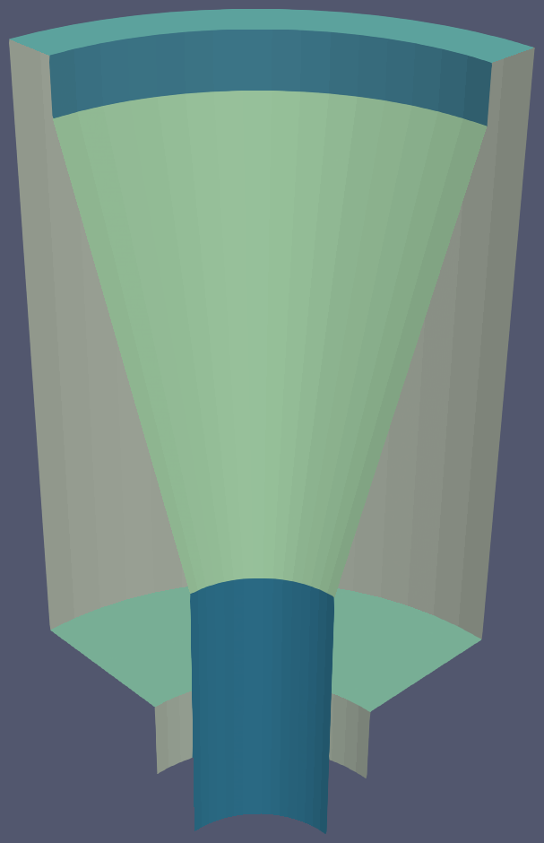

.. sectionauthor:: David Neill-Asanza <dhna@lanl.gov>

PATCHES Namelist
================

.. code-block:: console

  &PATCHES
    patch_algorithm = 'PAVE'
    verbosity_level = 3
    max_angle = 30.0
    pave_split_patch_size = 4
  /

:superscript:`Example PATCHES namelist`

The `PATCHES` namelist defines the parameters used by the patching algorithms. The namelist supports
many parameters, but not all parameters are used by all algorithms. Parameters only used by a
particular algorithm are prefixed with the algorithm's name.

These parameters are described in detail below.

.. contents:: PATCHES namelist parameters
   :local:
   :backlinks: none

General Parameters
------------------

PATCH_ALGORITHM
+++++++++++++++
Selects one of the three available algorithms, or disables patching.

.. namelist_parameter::
   :type: STRING
   :domain: Must be one of ``'NONE'``, ``'PAVE'``, ``'VAC'``, ``'VSA'``, or ``'FILE'``
   :default: patch_algorithm = ``'PAVE'``

Each option selects a different patch algorithm:

#. **NONE:** No patches will be generated. All other parameters are ignored. This is equivalent to
   an absent `PATCHES` namelist.
#. **PAVE:** Generate patches with the :doc:`PAVE algorithm <pave>`.
#. **VAC:** Generate patches with the :doc:`VAC algorithm <vac>`.
#. **VSA:** Generate patches with the :doc:`VSA algorithm <vsa>`.
#. **FILE:** Patches will be read from a file. Because the cost of computing
   patches can be quite substantial for very large enclosure meshes, this
   pseudo-algorithm is provided to enable the use of previously computed
   patches.

VERBOSITY_LEVEL
+++++++++++++++
Defines the verbosity level for all console output of the patch algorithm.

.. namelist_parameter::
   :type: INTEGER
   :domain: verbosity_level >= 0
   :default: verbosity_level = 1

The verbosity levels are defined as follows:

.. list-table::
   :widths: 15 30
   :header-rows: 1

   * - Value
     - Description
   * - verbosity_level = 0
     - Suppress all output.
   * - verbosity_level = 1
     - Print a summary of the run when algorithm finishes.
   * - verbosity_level > 1
     - Print detailed run information, used for debugging.

MAX_ANGLE
+++++++++
Defines the maximum allowable angle (in degrees) between adjacent faces.

.. namelist_parameter::
   :type: REAL
   :domain: 0.0 <= max_angle <= 180.0
   :default: max_angle = 20.0

All the patch algorithms construct the `adjacency matrix
<http://mathworld.wolfram.com/AdjacencyMatrix.html>`_ of the enclosure faces to efficiently
determine which faces are adjacent to others. If the normals of two 'topologically adjacent' faces
exceed *max_angle*, then the faces will not be neighbors in the internal adjacency matrix.

   The connected components of the outer surface of a furnace funnel. MAX_ANGLE is set to 20
   degrees. Each component is a different color. The face edges are omitted for clarity.

The patch algorithms guarantee that patches will be *connected sets* of faces. Therefore,
``max_angle`` divides the enclosure into connected components of faces wherever there are 'sharp'
edges whose angle exceeds the parameter. Patches will never span more than one component.

.. note::
  ``max_angle`` only applies to *pairs of adjacent faces*, so two faces within a patch may be at an
  angle greater than ``max_angle`` if the faces between them are at sufficiently large angles. This
  is unlikely in practice, given a reasonably smooth enclosure and small ``max_angle``.

.. seealso::
   The effects of ``max_angle`` vary by algorithm. Refer to the documentation of the :doc:`PAVE
   <pave>`, :doc:`VAC <vac>`, and :doc:`VSA <vsa>` algorithms for more details.

FILE Parameters
---------------
The following namelist parameter applies only to the FILE algorithm.

PATCH_FILE
++++++++++
The path to an existing radiation enclosure file containing patch information.
The enclosure defined by the file must be identical to current enclosure.
This may be an absolute path or a relative path.

PAVE Parameters
---------------
The following namelist parameters apply only to the PAVE algorithm. For more
information, refer to the :doc:`PAVE algorithm documentation <pave>`.

PAVE_MERGE_LEVEL
++++++++++++++++
Controls the aggressiveness of patch merging for the :doc:`PAVE algorithm <pave>`.

.. namelist_parameter::
   :type: INTEGER
   :domain: pave_merge_level >= 0
   :default: pave_merge_level = 3

After paving is complete, there will be a valid patching of the enclosure. The algorithm then
attempts to merge patches in order to reduce the patch count.

The merge levels are defined as follows:

.. list-table::
   :widths: 15 30
   :header-rows: 1

   * - Value
     - Description
   * - pave_merge_level = 0
     - No merging.
   * - pave_merge_level = 1
     - Merge patches that are within the faces of a vertex.
   * - pave_merge_level = 2
     - Same as 1. Additionally, merge patches that are within the faces of pairs
       of adjacent vertices. The old patches are requeued with their original
       weight so that a merge is only performed if the merge candidate has a
       lower weight than any of its consituent patches.
   * - pave_merge_level >= 3
     - Same as 2. Additionally, merge patches within the faces of pairs of
       adjacent vertices, but add a large weight to the requeued old patches.
       This ensures that the merge is always performed.

PAVE_SPLIT_PATCH_SIZE
+++++++++++++++++++++
Defines the maximum size of patches to be split during patch merging for the :doc:`PAVE algorithm <pave>`.

.. namelist_parameter::
   :type: INTEGER
   :domain: pave_split_patch_size > 1
   :default: pave_split_patch_size = 3

Before merging patches, all :ref:`merge methods
<tools/RadE/patches/patches_namelist:PAVE_MERGE_LEVEL>` find patches with less than
``pave_split_patch_size`` faces and 'split' them into 1-face patches. The original patches aren't
actually modified, rather they are re-queued along with their constituent faces. This allows the
algorithm to find more merge candidates and then 'fill in the gaps' with the 1-face patches.

The 1-face patches have a large weight, so they will only be used after all other patches are set.
Therefore, the enclosure will tend retain the same patches as before the split, unless this is not
possible due to a merge.

.. note::
   For best results, set ``pave_split_patch_size`` to 3 for quadrilateral meshes
   and to 5 for triangular meshes. This avoids splitting too many patches.

PAVE_RANDOM_SEED
++++++++++++++++
Defines the seed for the random number generator used to pick the initial seed patches for the
:doc:`PAVE algorithm <pave>`.

.. namelist_parameter::
   :type: INTEGER
   :domain: pave_random_seed > 0
   :default: ``NONE``, the seed is taken from the system clock.

The PAVE algorithm begins by creating a 'seed patch' in each connected component of the enclosure.
Each component is then 'paved' or 'tiled' with patches, starting from the seed patch. The seed
patches are chosen randomly from a set of patches determined to produce optimal results. Refer to
the :ref:`seed patches section <tools/RadE/patches/pave:Choosing Seed Patches>` of the PAVE
documentation for more information on how the seed patches are selected.

This parameter sets the seed for the random number generator used to pick the seed patches.
Therefore, runs with the same value for this parameter will produce identical results. If this
parameter is not specified, then the seed is taken from the system clock and results will likely
vary from run to run.

VAC Parameters
--------------
The following namelist parameters apply only to the VAC algorithm. For more
information, refer to the :doc:`VAC algorithm documentation <vac>`.

VAC_MERGE_LEVEL
+++++++++++++++
Controls the aggressiveness of patch merging for the :doc:`VAC algorithm <vac>`.

.. namelist_parameter::
   :type: INTEGER
   :domain: vac_merge_level >= 0
   :default: vac_merge_level = 3

After the main stage of the VAC algorithm, there will be a valid patching of the enclosure. The
algorithm then attempts to merge patches in order to reduce the patch count.

The merge levels are defined as follows:

.. list-table::
   :widths: 15 30
   :header-rows: 1

   * - Value
     - Description
   * - vac_merge_level = 0
     - No merging.
   * - vac_merge_level = 1
     - Merge patches that are within the faces of a vertex.
   * - vac_merge_level = 2
     - Same as 1. Additionally, merge patches that are within the faces of pairs
       of adjacent vertices. The old patches are requeued with their original
       weight so that a merge is only performed if the merge candidate has a
       lower weight than any of its consituent patches.
   * - vac_merge_level >= 3
     - Same as 2. Additionally, merge patches within the faces of pairs of
       adjacent vertices, but add a large weight to the requeued old patches.
       This ensures that the merge is always performed.

VAC_SPLIT_PATCH_SIZE
++++++++++++++++++++
Defines the maximum size of patches to be split during patch merging for the :doc:`VAC algorithm <vac>`.

.. namelist_parameter::
   :type: INTEGER
   :domain: vac_split_patch_size > 1
   :default: vac_split_patch_size = 3

Before merging patches, all :ref:`merge methods
<tools/RadE/patches/patches_namelist:VAC_MERGE_LEVEL>` find patches with less than
``vac_split_patch_size`` faces and 'split' them into 1-face patches. The original patches aren't
actually modified, rather they are re-queued along with their constituent faces. This allows the
algorithm to find more merge candidates and then 'fill in the gaps' with the 1-face patches.

The 1-face patches have a large weight, so they will only be used after all other patches are set.
Therefore, the enclosure will tend retain the same patches as before the split, unless this is not
possible due to a merge.

.. note::
   For best results, set ``vac_split_patch_size`` to 3 for quadrilateral meshes
   and to 5 for triangular meshes. This avoids splitting too many patches.

VSA Parameters
--------------
The following namelist parameters apply only to the VSA algorithm. For more
information, refer to the :doc:`VSA algorithm documentation <vsa>`.

VSA_MAX_ITER
++++++++++++
Defines the maximum number of iterations for the :doc:`VSA algorithm <vsa>`.

.. namelist_parameter::
   :type: Integer
   :domain: vsa_max_iter >= 1
   :default: vsa_max_iter = 1000

The algorithm stops when ``vsa_max_iter`` is reached, regardless of other
terminating conditions.

VSA_MIN_DELTA
+++++++++++++
Defines the minimum allowable change in patch proxies between successive iterations of the
:doc:`VSA algorithm <vsa>`.

.. namelist_parameter::
   :type: REAL
   :domain: vsa_min_delta >= 0.0
   :default: vsa_min_delta = 1.0E-6

At the end of each iteration, the new patch proxies for the next iteration are computed and compared
against the old proxies. The algorithm keeps track of the *minimum* change between the old and new
proxies. This change is computed as the sum of the squares of the difference between the old and new
proxy vectors. If the minimum change in patch proxies is less than ``vsa_min_delta``, the algorithm
stops at that iteration.

VSA_FACE_PATCH_RATIO
++++++++++++++++++++
Defines the ratio of total faces to total patches, and by extension the total number of patches, of
the :doc:`VSA algorithm <vsa>`.

.. namelist_parameter::
   :type: REAL
   :domain: vsa_face_patch_ratio >= 1.0
   :default: vsa_face_patch_ratio = 4.0

Since the number of faces is fixed, this parameter determines the total number of patches in the
final configuration:

.. math::
   \text{(Total Patches)} = \text{(Total Faces)}\ /\ \text{vsa_face_patch_ratio}

Rather than set the number of patches explicitly, which is mesh dependent, expressing this
parameter as a ratio allows the same value to apply to a variety of meshes.

VSA_MAX_PATCH_RADIUS
++++++++++++++++++++
Defines the desired maximum radius for a patch for the :doc:`VSA algorithm <vsa>`.

.. namelist_parameter::
   :type: REAL
   :domain: vsa_max_patch_radius > 0.0
   :default: vsa_max_patch_radius = sqrt(huge(0.0_r8))

This parameter is used to compute the *size bias* term of the weight of a face relative to
a patch proxy. Refer to the :ref:`size bias section <tools/RadE/patches/vsa:Size Bias>` of the
VSA documentation for more information on how the parameter affects the face weight computation.

Note that the default value of this parameter is :fortran:`sqrt(huge(0.0_r8))` because it is squared
in the face weight computation. By taking the root of :fortran:`huge(0.0_r8)` we prevent floating
point overflow errors. Numerically, the default value on the order of `1.34*10^{154}`.

VSA_NORMALIZE_DIST
++++++++++++++++++
Determines whether to normalize the distance bias for the :doc:`VSA algorithm <vsa>`.

.. namelist_parameter::
   :type: LOGICAL
   :domain: Must be ``.true.`` or ``.false.``
   :default: vsa_normalize_dist = ``.true.``

This parameter affects the computation of the *distance bias* term of the weight of a face relative
to a patch proxy. Broadly speaking, enabling normalization tends to produce patches with a similar
number of faces, regardless of the physical size of each patch. Conversely, disabling normalization
tends to make all patches about the same physical size, regardless of the number of faces in each
patch.

Refer to the :ref:`distance bias section <tools/RadE/patches/vsa:Distance Bias>`
of the VSA documentation for more information on how the parameter affects the face weight
computation.

VSA_RANDOM_SEED
+++++++++++++++
Defines the seed for the random number generator used to pick the initial seed patches for the
:doc:`VSA algorithm <vsa>`.

.. namelist_parameter::
   :type: INTEGER
   :domain: pave_random_seed > 0
   :default: ``NONE``, the seed is taken from the system clock.

The VSA algorithm uses a 'farthest-point' initialization method to choose the seed patches for the
first iteration. To start, a random face in each connected component of the enclosure is chosen as a
seed patch.  Then, seed patches are added one at a time by performing a :ref:`partitioning
<tools/RadE/patches/vsa:Geometry Partitioning>` and then choosing the face with highest total
distortion as the new seed patch.

This parameter sets the seed for the random number generator used to pick the first seed patch in
each connected component. Therefore, runs with the same value for this parameter will produce
identical results. If this parameter is not specified, then the seed is taken from the system clock
and results will likely vary from run to run.
