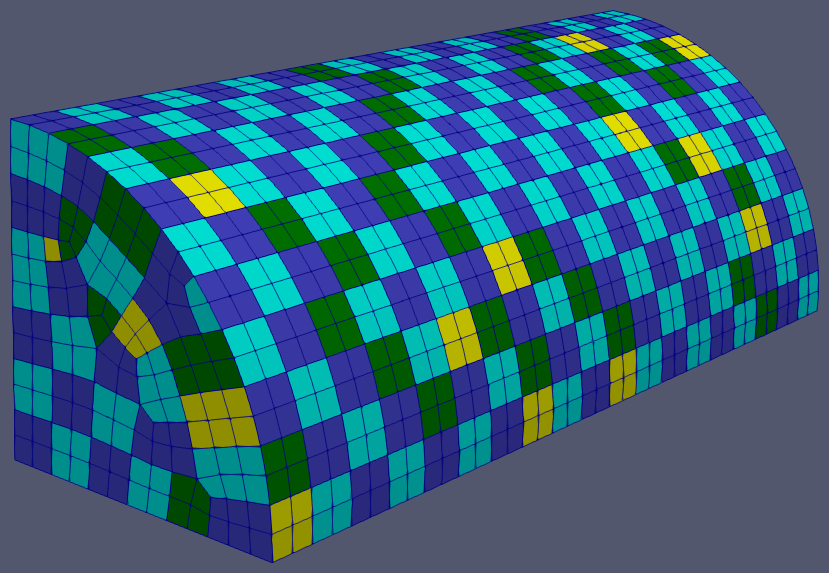
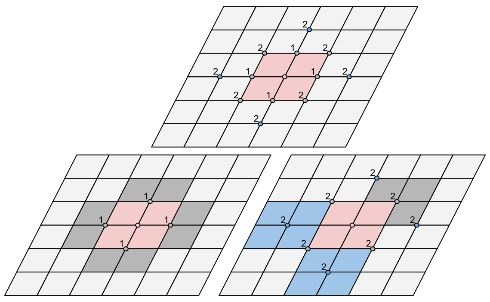

.. sectionauthor:: David Neill-Asanza <dhna@lanl.gov>

.. default-role:: math

Vertex Anchor Cluster Paving (PAVE)
===================================

   Result of PAVE on a quarter cyclinder.

The Vertex Anchor Cluster Paving (PAVE) patching algorithm, as it name suggests, is based on the
:doc:`Vertex Anchor Clustering (VAC) algorithm <vac>`. Like VAC, this algorithm is based on the
observation that the set of all faces sharing a particular vertex (the faces of a vertex) tend to
form patches with desirable properties. Such patches are connected, relatively small, and tend to be
roughly circular. These patches have an associated ':term:`vertex anchor`', namely the vertex shared
by all their faces. We use the term ':term:`full patch`' to refer to patches consisting of all the
faces of their vertex anchor. ':term:`Partial patches <partial patch>`', conversely, refers to
patches whose faces are a strict subset of the faces of their vertex anchor.

The PAVE algorithm attempts to maximize the number of full patches generated by 'paving' each
connected component of the enclosure's face adjacency graph. To ensure the best possible results,
paving starts at the edges or corners of each component with such features. If the component has no
edges or corners, a random vertex is chosen as the anchor for its first patch.

.. contents:: Contents
   :local:
   :backlinks: none

Algorithm
---------
The PAVE algorithm begins by finding the connected components of the *vertex graph* of the
enclosure, that is, the graph defined by the mesh vertices and the edges between them. For each
component, PAVE picks a vertex `V_j`, forms a 'seed patch' `P_i` from its faces, and adds the tuple
`(P_i, V_j)` to a global priority queue. These seed patches act as the starting points for the
paving process. Paving then proceeds by popping queue entries one by one until the queue is empty.
If all the faces of a queue entry are assigned, a new patch is created from the entry. Additionally,
we add new queue entries for each of the first and second degree neighbors of the popped entry's
:term:`vertex anchor`. If, on the other hand, some of the faces of the queue entry are already
assigned, PAVE makes a new entry for each connected subset of faces that are still unassigned.

In this way, each component is 'paved ' with :term:`full patches <full patch>`, starting from the
component seed patches. For better results, the component seeds are chosen to be a random patch
along the edges or corners of component with such features. If a component has no boundary, any one
of its vertices is chosen at random as the vertex anchor for the seed patch.

Once the queue is empty, all faces are assigned and we have a valid patching of the enclosure.
Finally, PAVE merges patches where possible, in accordance with the :ref:`PAVE_MERGE_LEVEL
<tools/RadE/patches/pave:PAVE_MERGE_LEVEL>` namelist parameter.

Outline
+++++++
The following is a high-level outline of the PAVE algorithm.

#. **Initialization**

   #. Generate the *vface* array that maps a vertex to the faces of that vertex.
   #. Generate the face adjacency matrix. Faces at angles greater than
      :ref:`MAX_ANGLE <tools/RadE/patches/patches_namelist:MAX_ANGLE>` are not adjacent.
   #. Generate the *boundary* boolean array that records whether a vertex is on the boundary of an
      enclosure component.
   #. Let `G` be the vertex adjacency graph of the enclosure, and let `C` be the subgraph of
      `G` induced by all the non-boundary vertices. Determine the connected components of `C`.

#. **Choose seed patches**

   #. For each connected component of the subgraph `C`, sort the vertices of `C` by the number of
      boundary vertices they neighbor. Choose a random vertex `V_j` among those with the highest
      boundary neighbors. Define a patch `P_i` that consists of all the faces of `V_j`. Add the
      tuple `(P_i, V_j)` to a global priority queue with weight `E(P_i, V_j)`.

#. **Pave components**

   #. While the priority queue is not empty:

      #. Pop the tuple `(P_i, V_j)` of least weight from the queue.
      #. If all of the faces `F_k` of `P_i` are *unassigned*, then assign all the faces to a new patch.

         #. For each vertex neighbor `V_{n1}` of `V_j`, let `F_{n1}` be the faces of `V_{n1}`.
            Call QUEUE_CONNECTED(`F_{n1}`, `V_{n1}`).

            #. For each vertex neighbor `V_{n2}` of `V_{n1}`, excluding `V_j` itself, let `F_{n2}` be
               the faces of `V_{n2}`. Let `V_x=V_{n1}` if `V_{n1}` is a boundary vertex, and
               `V_x=V_{n2}` otherwise. Call QUEUE_CONNECTED(`F_{n2}`, `V_x`).

      #. Otherwise:

         #. Call QUEUE_CONNECTED(`P_i`, `V_j`)

#. **Patch Merging**

   #. If PAVE_MERGE_LEVEL >= 1 then:

      #. Call SPLIT_PATCHES()
      #. For each vertex `V_j`, check if the faces `V_j` fully contain two or more patches. If so,
         unassign all the faces of `V_j`, re-queue all the enclosed patches with their original
         weight, and queue a new patch `P_i` consisting of the faces of `V_j` with weight
         `E(P_k,V_j)`.
      #. Call SET_PATCHES(TRUE)

   #. If PAVE_MERGE_LEVEL >= 2 then:

      #. Call SPLIT_PATCHES()
      #. For each vertex `V_j`, find its vertex neighbors. For each neighbor `V_n` of `V_j`, let `F`
         be the union of the faces of `V_j` and `V_n`. Check if `F` fully contains two or more
         patches. If so, unassign all faces in `F`, re-queue all the enclosed patches with their
         original weight, and queue a new patch consisting of `F` whose vertex anchor is `V_j` if
         it is not a boundary vertex, and `V_n` otherwise.
      #. Call SET_PATCHES(FALSE)

   #. If PAVE_MERGE_LEVEL >= 3 then:

      #. Repeat step 3.2, but add a large constant to the original weight of the enclosed patches
         before queueing them.

* **Subroutines**

  * QUEUE_CONNECTED(`F`, `V`)

    #. For each connected subset of faces `P_k \subseteq F` that are *unassigned*, create a
       new tuple `(P_k, V)` and add it to the queue with weight `E(P_k, V)`.

  * SET_PATCHES(re-queue)

    #. While the priority queue is not empty:

       #. Pop the tuple `(P_i, V_j)` of least weight from the queue.
       #. If all of the faces `F_k` of `P_i` are *unassigned*, then assign all the faces to a new patch.
       #. Otherwise, if re-queue is TRUE:

          #. For each connected subset of faces `P_k \subset P_i` that are *unassigned*, create a
             new tuple `(P_k, V_j)` and add it to the queue with weight `E(P_k, V_j)`.

  * SPLIT_PATCHES()

    #. For each patch `P_i` with less than VAC_SPLIT_PATCH_SIZE faces, unassign all the faces of
       `P_i`, queue these faces as 1-face patches, and re-queue `P_i` with its original weight.

Connected Components
++++++++++++++++++++
The PAVE algorithm constructs two graphs from the enclosure data: the face adjacency graph and the
vertex adjacency graph. PAVE then utilizes the connected components of each of these graphs during
its execution.

.. note::

  The connected components of the face adjacency graph are used throughout the algorithm, while the
  components of the vertex adjacency graph are only used when :ref:`choosing the seed patches
  <tools/RadE/patches/pave:Choosing Seed Patches>`.

  Therefore, throughout this document we use the terms 'enclosure components' or simply 'components'
  as a short-hand for refering to the connected components of the face adjacency graph. We'll be
  explicit when referring to the components of the vertex adjacency graph.

Face Adjacency Graph
^^^^^^^^^^^^^^^^^^^^
The face adjacency graph is defined by the topology of the mesh and the :ref:`MAX_ANGLE
<tools/RadE/patches/patches_namelist:MAX_ANGLE>` namelist parameter which controls the maximum
allowable angle between the (normals of) adjacent faces. Specifically, two topologically adjacent
faces at a angle greater than MAX_ANGLE will not share an edge in the adjacency graph. The
*connected components* of the face adjacency graph thus represent collections of faces that are
bounded by 'sharp' edges (angles greater than MAX_ANGLE) or the mesh boundary itself.

The face adjacency graph defines a set of :term:`boundary vertices <boundary vertex>`, namely the
vertices incident on edges along the boundary of a component. These boundary vertices play a role in
both computing the :ref:`weight of queue entries <tools/RadE/patches/vac:Position Bias>` as well as
in determining the connected components of the vertex adjacency graph.

Vertex Adjacency Graph
^^^^^^^^^^^^^^^^^^^^^^
The vertex adjacency graph is defined by the topology of the mesh. The vertices and edges of the
vertex graph correspond to the vertices and edges of the mesh. The vertex graph allows PAVE to
efficiently determine the neighbors of a particular vertex, an integral step in the paving process.

The vertex adjacency graph is also used to choose the :term:`vertex anchor` of the seed patch for
each connected component of the face adjacency graph. We do not want to choose a :term:`boundary
vertex` since such vertices are a :ref:`poor choice of vertex anchor<tools/RadE/patches/vac:Position
Bias>`. In other words, we want to choose a vertex in the interior of the component.

Given the vertex adjacency graph `G` we define `C` as the subgraph of `G` induced by all the
interior (non-boundary) vertices of `G`. The connected components of `C` correspond to the interior
vertices of the connected components of the face adjacency graph. In fact, `C` is the `dual
<https://en.wikipedia.org/wiki/Dual_graph>`_  of the face adjacency graph. `C` is only used during
seed patch selection, which is discussed in the following section.

Choosing Seed Patches
+++++++++++++++++++++
The paving process creates new patches from the faces of vertices neighboring the :term:`vertex
anchors <vertex anchor>` of existing patches. Therefore, each connected component (of the face
adjacency graph) must have at least one patch before paving begins. The PAVE algorithm begins by
choosing the one such 'seed patch', and its corresponding vertex anchor, in each connected component
of the enclosure.

PAVE attempts to choose the vertex anchor for the seed patch that maximizes the number of
:term:`full patches <full patch>` that will cover the component. The optimal choice of vertex cannot
generally be determined a priori, except for the simplest geometries (e.g. a rectangle). However,
given a connected component with corners or edges, an intuitively good choice is a vertex that forms
a patch at a corner or along the edge. Such a seed patch ensures that full patches form along the
edges of the enclosure, rather than one face from the edge, as shown in the graphic below. If the
component has no boundary, there is no evidently good choice, so we select a vertex at random.

.. list-table::
   :align: center
   :class: fig-table

   * - .. figure:: images/seed_patch_tri.svg
          :width: 100%
          :align: center

          Effect of seed patch placement on a *triangular* mesh. The seed patch is highlighted in
          red. Full patches are blue. Partial patches are gray.
          A seed on the corner produces six full patches, while a seed 'one face from the corner'
          only produces five full patches.

     - .. figure:: images/seed_patch_quad.svg
          :width: 100%
          :align: center

          Effect of seed patch placement on a *quadrilateral* mesh. The seed patch is highlighted in
          red. Full patches are blue. Partial patches are gray.
          A seed on the corner produces nine full patches, while a seed 'one face from the corner'
          only creates six full patches.

Notice that for quadrilateral meshes, interior (non-boundary) vertices neighboring only one
:term:`boundary vertex` form patches along the edge of the component, while interior vertices
neighboring two boundary vertices form patches on a corner. Similarly, for triangular meshes,
interior vertices neighboring two boundary vertices form patches along the edge, while those
neighboring three boundary vertices form patches on a corner. Thus, we want to select an interior
vertex that neighbors the most boundary vertices as the vertex anchor for the patch seed of each
component.

PAVE implements this idea by first sorting the interior vertices of each component by the number of
boundary vertices the neighbor, and a selecting a random vertex in the 'most neighbors bin'. This
vertex becomes the vertex anchor for the seed patch of that component. The patch gets added to the
global priority queue, and will be the first patch placed in that component. Note that since the
vertex anchor is an interior vertex, the seed patch must be a full patch. The seed patch
initializes the paving process on that component.

Component Paving
++++++++++++++++
Starting from the seed patches, each connected component of the enclosure is iteratively 'paved'
with patches that neighbor existing patches. When a patch is assigned, PAVE finds the first and
second degree vertex neighbors of the patch's vertex anchor. For each of the neighbors, PAVE forms a
new queue entry for each connected subset of the neighbor's faces that are still unassigned. This
process continues until the queue is empty, at which point all faces are assigned to a patch.

   **Top:** The red patch has just been assigned. The first and second degree neighbors of
   its vertex anchor are labeled.
   **Bottom left:** The patches formed by the first degree neighbors are colored gray. These
   are all partial patches.
   **Bottom right:** The patches formed by the second degree neighbors are colored blue and
   gray. Some are full patches (blue), and some are partial patches (gray).

Note that the vertex anchors of two adjacent :term:`full patches <full patch>` must be second degree
neighbors, since these vertices share no faces. This is the motivation for forming new patches from
the second degree neighbors of the vertex anchors of current patches.

Conversely, given two neighboring vertices and a full patch with the first vertex as anchor, the
patch formed by the second vertex must be a :term:`partial patch`. Despite this, we still consider
the first degree neighbors to make sure all faces are assigned once paving completes. Though
somewhat contrived, it's possible to create a situation where ignoring the first degree neighbors
leads to unassigned faces.

Note that it if a vertex is close to a component boundary, then its first or second degree neighbors
could be on the boundary, or even in another component. This means that patches close to the
boundary could in principle create unwanted patch seeds in an adjacent component. This will not
happen in practice because patches created on or across a boundary are given a boundary vertex as
their anchor (see step 3.1.2.1.1 of the :ref:`algorithm outline <tools/RadE/patches/pave:Outline>`).
The :ref:`position bias <tools/RadE/patches/vac:Position Bias>` term of the patch weight ensures
that such patches have a large constant added to their weight. Thus, these patches are pushed to the
back of the queue, and will not be used until all other patches have been considered. As discussed
in the :ref:`position bias <tools/RadE/patches/vac:Position Bias>` section, these queue entries must
be included to handle a corner case where a component is only one face wide.

Patch Weight
++++++++++++
Each entry of the global priority queue has an associated weight which determines their order in
the queue. The PAVE queue prioritizes entries with a lower weight, so the lowest weight patches are
assigned first.

Let the tuple `(P_i, V_j)` denote the patch `P_i` with vertex anchor `V_j`. The weight `E` of a
patch `(P_i, V_j)` is given by the error metric:

.. math::
   E(P_i, V_j) = E_{normal}(P_i) + E_{shape}(P_i) + E_{size}(P_i) + E_{full}(P_i, V_j) + E_{pos}(V_j)

Note that this error metric is identical to that of the VAC algorithm. For details on the terms of
`E(P_i,V_j)`, refer to the :ref:`patch weight section <tools/RadE/patches/vac:Patch Weight>` of the
VAC documentation.

Patch Merging
+++++++++++++
After the paving step of the PAVE algorithm, all faces are assigned to a patch. However, we may
still reduce the patch count by *merging* patches together. Therefore, PAVE implements several patch
merging subroutines of increasing aggressiveness. These merging subroutines are identical to those
used in the VAC algorithm. For a detailed discussion on patch merging, refer to the :ref:`patch
merging section <tools/RadE/patches/vac:Patch Merging>` of the VAC documentation.

In order to increase the number of merge candidates, all the merge subroutines begin by 'splitting'
small patches. The maximum size of patches to split is controlled by the :ref:`PAVE_SPLIT_PATCH_SIZE
<tools/RadE/patches/pave:PAVE_MERGE_LEVEL>` namelist parameter. The :ref:`patch splitting section
<tools/RadE/patches/vac:Patch Splitting>` of the VAC documentation provides more details on patch
splitting.

The :ref:`PAVE_MERGE_LEVEL <tools/RadE/patches/pave:PAVE_MERGE_LEVEL>` namelist parameter controls
the aggressiveness of patch merging. PAVE currently support four merge levels. Again, refer to the
:ref:`VAC documentation <tools/RadE/patches/vac:Merge Level 0>` for more information on each merge
level.

Namelist Parameters
-------------------
The :doc:`PATCHES namelist <patches_namelist>` allows a user to configure the PAVE algorithm
parameters. Although the PATCHES namelist supports nine parameters, only four are used by PAVE, and
only two of those are unique to PAVE.

The general parameters used by PAVE are VERBOSITY_LEVEL and MAX_ANGLE. Refer to the :ref:`PATCHES
namelist documentation <tools/RadE/patches/patches_namelist:General Parameters>` for more
information on those parameters.

The two parameters unique to PAVE are aptly named PAVE_MERGE_LEVEL and PAVE_SPLIT_PATCH_SIZE. These
have already been discussed, so we'll only touch on them briefly here and link to the previous
discussion.

PAVE_MERGE_LEVEL
++++++++++++++++
Controls the aggressiveness of patch merging.

   **Type:** ``INTEGER``

   **Domain:** pave_merge_level >= 0

   **Default:** pave_merge_level = 3

After the patch assignment stage, all faces are assigned to a patch. The algorithm then attempts to
merge patches in order to reduce the patch count.

The merge levels are defined as follows:

.. list-table::
   :widths: 15 30
   :header-rows: 1

   * - Value
     - Description
   * - pave_merge_level = 0
     - No merging.
   * - pave_merge_level = 1
     - Merge patches that are within the faces of a vertex.
   * - pave_merge_level = 2
     - Same as 1. Additionally, merge patches that are within the faces of pairs
       of adjacent vertices. The old patches are requeued with their original
       weight so that a merge is only performed if the merge candidate has a
       lower weight than any of its consituent patches.
   * - pave_merge_level >= 3
     - Same as 2. Additionally, merge patches within the faces of pairs of
       adjacent vertices, but add a large weight to the requeued old patches.
       This ensures that the merge is always performed.

For more details on each merge level, refer to the section on :ref:`patch merging
<tools/RadE/patches/vac:Patch Merging>` of the VAC documentation.

PAVE_SPLIT_PATCH_SIZE
+++++++++++++++++++++
Defines the maximum size of patches to be split during patch merging.

   **Type:** ``INTEGER``

   **Domain:** pave_split_patch_size > 1

   **Default:** pave_split_patch_size = 3

Before merging patches, all :ref:`merge subroutines <tools/RadE/patches/pave:Patch Merging>` find
patches with less than ``pave_split_patch_size`` faces and 'split' them into 1-face patches. The
original patches aren't actually modified, rather they are re-queued along with their constituent
faces. This allows the algorithm to find more merge candidates and then 'fill in the gaps' with the
1-face patches.

The 1-face patches have a large weight, so they will only be used after all other patches are
assigned. Therefore, the enclosure will tend retain the same patches as before the split, unless
this is not possible due to a merge.

For a more details on this parameter, refer to the section on :ref:`patch splitting
<tools/RadE/patches/vac:Patch Splitting>` of the VAC documentation.

.. note::
   For best results, set ``pave_split_patch_size`` to 3 for quadrilateral meshes and to 5 for
   triangular meshes. This avoids splitting too many patches.
