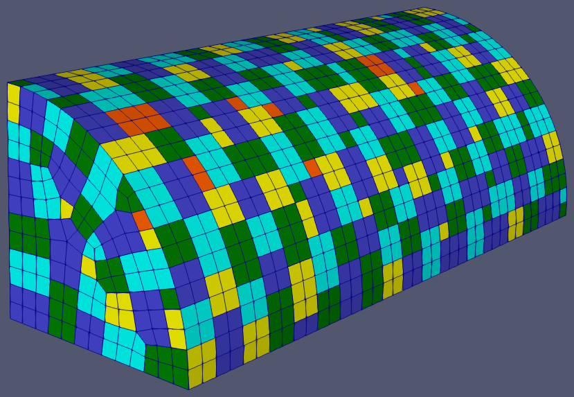
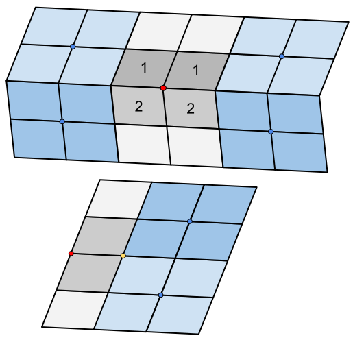

.. sectionauthor:: David Neill-Asanza <dhna@lanl.gov>

.. default-role:: math

.. |L21| replace:: :math:`\mathcal{L}^{2,1}`
.. |L2| replace:: :math:`\mathcal{L}^2`

Vertex Anchor Cluster (VAC)
===========================
.. warning::
   The VAC algorithm is experimental and not recommended for regular users. For best results, use
   the :doc:`PAVE patching algorithm <pave>`.

   Result of VAC on a quarter cyclinder.

The Vertex Anchor Cluster (VAC) patching algorithm is based on the observation that the set of all
faces sharing a particular vertex (the faces of a vertex) tend to form patches with desirable
properties. Such patches are connected, relatively small, and tend to be roughly circular. These
patches have an associated ':term:`vertex anchor`', namely the vertex shared by all their faces. We
use the term ':term:`full patch`' to refer to patches consisting of all the faces of their vertex
anchor. ':term:`Partial patches <partial patch>`', conversely, refers to patches whose faces are a
strict subset of the faces of their vertex anchor. The VAC algorithm attempts to maximize the number
of full patches generated.

.. contents:: Contents
   :local:
   :backlinks: none

Algorithm
---------
The VAC algorithm begins by iterating through each vertex and adding its corresponding :term:`full
patch` to a global priority queue. The queue entries are then popped one by one until the queue is
empty. If all the faces of a queue entry are unassigned, a new patch is created from the entry.
Otherwise, VAC makes a new entry from the subset of faces of the original entry that are still
unassigned, and adds that entry to the queue. Once the queue is empty, we have a valid patching of
the enclosure. Finally, VAC merges patches where possible, in accordance with the
:ref:`VAC_MERGE_LEVEL <tools/RadE/patches/vac:VAC_MERGE_LEVEL>` namelist parameter.

Outline
+++++++
The following is a high-level outline of the VAC algorithm.

#. **Initialization**

   #. Generate the *vface* array that maps a vertex to the faces of that vertex.
   #. Generate the face adjacency matrix. Faces at angles greater than
      :ref:`MAX_ANGLE <tools/RadE/patches/patches_namelist:MAX_ANGLE>` are not adjacent.
   #. Generate the *boundary* boolean array that records whether a vertex is on the boundary of an
      enclosure component.

#. **Patch Assignment**

   #. For each vertex `V_j` of the enclosure, define a patch `P_i` that consists of all the faces
      of `V_j`. Add the tuple `(P_i, V_j)` to a global priority queue with weight `E(P_i, V_j)`.

   #. Call SET_PATCHES(TRUE)

#. **Patch Merging**

   #. If VAC_MERGE_LEVEL >= 1 then:

      #. Call SPLIT_PATCHES()
      #. For each vertex `V_j`, check if the faces `V_j` fully contain two or more patches. If so,
         unassign all the faces of `V_j`, re-queue all the enclosed patches with their original
         weight, and queue a new patch `P_i` consisting of the faces of `V_j` with weight
         `E(P_k,V_j)`.
      #. Call SET_PATCHES(TRUE)

   #. If VAC_MERGE_LEVEL >= 2 then:

      #. Call SPLIT_PATCHES()
      #. For each vertex `V_j`, find its neighboring vertices (those connected to `V_j` by an edge).
         For each neighbor `V_n` of `V_j`, let `F` be the union of the faces of `V_j` and `V_n`.
         Check if `F` fully contains two or more patches. If so, unassign all faces in `F`, re-queue
         all the enclosed patches with their original weight, and queue a new patch consisting of
         `F` whose vertex anchor is `V_j` if it is not a boundary vertex, and `V_n` otherwise.
      #. Call SET_PATCHES(FALSE)

   #. If VAC_MERGE_LEVEL >= 3 then:

      #. Repeat step 3.2, but add a large constant to the original weight of the enclosed patches
         before queueing them.

* **Subroutines**

  * SET_PATCHES(re-queue)

    #. While the priority queue is not empty:

       #. Pop the tuple `(P_i, V_j)` of least weight from the queue.
       #. If all of the faces `F_k` of `P_i` are *unassigned*, then assign all the faces to a new patch.
       #. Otherwise:

          #. If re-queue is TRUE, then for each connected subset of faces `P_k \subset P_i` that are
             *unassigned*, create a new tuple `(P_k, V_j)` and add it to the queue with weight
             `E(P_k, V_j)`.

  * SPLIT_PATCHES()

    #. For each patch `P_i` with less than VAC_SPLIT_PATCH_SIZE faces, unassign all the faces of
       `P_i`, queue these faces as 1-face patches, and re-queue `P_i` with its original weight.

Connected Components
++++++++++++++++++++
During initialization, the VAC algorithm constructs the face adjacency graph of the enclosure. This
graph defines the connected components of the enclosure, and is used to quickly determine connected
subsets of queue entry faces.

The face adjacency graph is defined by the topology of the mesh and the :ref:`MAX_ANGLE
<tools/RadE/patches/patches_namelist:MAX_ANGLE>` namelist parameter which controls the maximum
allowable angle between the (normals of) adjacent faces. Specifically, two topologically adjacent
faces at a angle greater than MAX_ANGLE will not share an edge in the adjacency graph. The
*connected components* of the face adjacency graph thus represent collections of faces that are
bounded by 'sharp' edges (angles greater than MAX_ANGLE) or the mesh boundary itself.

The face adjacency graph defines a set of :term:`boundary vertices <boundary vertex>`, namely the
vertices incident on edges along the boundary of a component. These boundary vertices play a role in
both computing the :ref:`weight of queue entries <tools/RadE/patches/vac:Position Bias>`.

.. note::

  Throughout this document we use the terms 'enclosure components' or simply 'components' as a
  short-hand for refering to the connected components of the face adjacency graph.

Patch Weight
++++++++++++
Each entry of the global priority queue has an associated weight which determines their order in
the queue. The VAC queue prioritizes entries with a lower weight, so the lowest weight patches are
assigned first.

Let the tuple `(P_i, V_j)` denote the patch `P_i` with vertex anchor `V_j`. The weight `E` of a
patch `(P_i, V_j)` is given by the error metric:

.. math::
   E(P_i, V_j) = E_{normal}(P_i) + E_{shape}(P_i) + E_{size}(P_i) + E_{full}(P_i, V_j) + E_{pos}(V_j)

The terms of `E(P_i,V_j)` are discussed in detail below.

Normal Bias
^^^^^^^^^^^
We want patches to be roughly planar so that all their faces have similar views of the rest of the
enclosure. This ensures that the patch view factor is a reasonable approximation of the view factors
of its faces.

We use the |L21| metric defined by Cohen-Steiner et al. :cite:`vac-Cohen-Steiner:2004:VSA` to
measure the planarity of a patch. The |L21| metric is based on an |L2| measure of the normal field
over the patch. Given a patch `P_i` with normal `\vec{n}_i` we define

.. math::
   \mathcal{L}^{2,1}(P_i) = \iint\limits_{x \in P_i} \lVert \vec{n}(x)  - \vec{n}_i \rVert^2 \,dx

where `\vec{n}_i(x)` is the normal at the point `x \in P_i`.

Given that `P_i` is a set of faces, we discretize the |L21| metric of `P_i` as

.. math::
   \mathcal{L}^{2,1}(P_i) = \frac{\sum_{F_k \in P_i} \lVert \vec{n}_k - \vec{n}_i \rVert^2}{\lvert P_i \rvert}

where `\vec{n}_k` is the normal of face `F_k \in P_i` and `\vec{n}_i` is the normalized area-weighted
average of the face normals. In other words, `\vec{n}_i` is the normalized vector

.. math::
   \vec{n}_i = \sum_{F_k \in P_i} \vec{n}_k \cdot w_k

where `w_k` is the area of face `F_k \in P_i`.

Notice that in our discretization of the |L21| metric we omit multiplication by the face areas, so
its not a true approximation of the integral. We do this to give equal weighting to all faces in a
patch. Without this correction, small (in area) faces could be at large angles to the other faces
in the patch, but the patch might still have a low |L21| metric. Moreover, we normalize by the
number of faces `\lvert P_i \rvert` to give all patches a similar weight. Without this
normalization, patches with more faces tend to have a greater weight than smaller patches,
regardless of their planarity.

We define the *normal bias* of patch `P_i` as its discretized |L21| metric:

.. math::
   E_{normal}(P_i) =
   \mathcal{L}^{2,1}(P_i) = \frac{\sum_{F_k \in P_i} \lVert \vec{n}_k - \vec{n}_i \rVert^2}{\lvert P_i \rvert}

Since the largest deviation between the patch normal `\vec{n}_i` and a face normal `\vec{n}_k` is
when these vectors are
`antiparallel <https://en.wikipedia.org/wiki/Antiparallel_(mathematics)#Antiparallel_vectors>`_
it follows that `0 \le E_{normal}(P_i) \le 4` for any patch `P_i`.

Shape Bias
^^^^^^^^^^
We want to prioritize patches that are as circular as possible to ensure that all their faces have
similar views of the rest of the enclosure. In particular, long skinny patches are more likely to
have shadow discontinuities fall across them.

We use the *irregularity metric* defined by Garland et al. :cite:`vac-Garland:2001:HFC` to measure
the compactness of a patch. Given a patch `P_i` with area `w` and perimeter `\rho`, the
*irregularity* `\gamma` of the patch is defined as

.. math::
   \gamma = \frac{\rho^2}{4\pi w}

A circle has irregularity `\gamma=1` and larger values of `\gamma` correspond to more irregular
(less compact) regions. It is possible to have patches with `\gamma < 1` if the patches have large
internal curvature (e.g. patches spanning a corner). This does not occur in practice because VAC
avoids disconnected patches and the maximum angle between connected faces tends to be small (see the
:ref:`MAX_ANGLE namelist parameter reference <tools/RadE/patches/patches_namelist:MAX_ANGLE>`).

We define the *shape bias* of patch `P_i` as its irregularity:

.. math::
   E_{shape}(P_i) = \frac{\rho^2}{4\pi w}

Size Bias
^^^^^^^^^
We want to maximize the number of patches generated, and therefore must discourage 1-face patches as
much as possible. However, 1-face patches tend to have a low weight in the above metrics, since
individual faces are fairly compact (low `E_{shape}`) and their `E_{normal}` bias is 0.

We define a *size bias* for a patch `P_i` as:

.. math::
   E_{size}(P_i) =
   \begin{cases}
      0 & \text{if } \lvert P_i \rvert > 1 \\
      4 & \text{if } \lvert P_i \rvert = 1
   \end{cases} \\

We set `E_{size}(P_i)=4` for 1-face patches because `E_{normal}(P_i) \le 4`. In effect, this means
that VAC considers a 1-face patch to be as bad as a highly distorted patch.

Full Patch Bias
^^^^^^^^^^^^^^^
We want to maximize the number of :term:`full patches <full patch>` generated, because such patches
tend to have desirable properties. Moreover, we want to discourage :term:`partial patches <partial
patch>`, as they can have arbitrarily bad shapes and prevent full patches from being formed
elsewhere.

Thus, we define a *full patch bias* for a patch `P_i` with vertex anchor `V_j` as follows:

.. math::
   E_{full}(P_i, V_j) =
   \begin{cases}
      0 & \text{if } P_i \text{ includes all faces of } V_j \\
      1 & \text{Otherwise}
   \end{cases} \\

Position Bias
^^^^^^^^^^^^^
Vertices on the boundary of enclosure components are poor vertex anchor candidates. The faces of
boundary vertices can span more than one component, and connected subsets of such faces tend to form
badly shaped patches. For example, the faces of a vertex on the boundary between two enclosure
components will form two patches, one in each component, and these patches will likely have a
suboptimal shape, since they are essentially :term:`partial patches <partial patch>` relative to a
vertex in the component interior. Moreover, the faces of a vertex on the mesh boundary form a
:term:`full patch` with `E_{size} = 0`, despite their suboptimal shape.

   **Top:** Two enclosure components meet at a boundary. A vertex on that boundary is labeled in
   red. The faces of the red vertex form two patches, colored grey and numbered. These grey patches
   are poorly shaped. Conversely, the blue patches formed by the blue vertices in the interior of
   each component are full patches with a desirable shape.
   **Bottom:** The red vertex is on the mesh boundary, and its faces are colored gray. These faces
   form a poorly shaped patch, despite it being a full patch (it includes all the faces of its
   vertex anchor). Note that the grey patch is a partial patch relative to the yellow vertex. The
   blue vertices in the interior of the component form full patches with a desirable shape.

Therefore, we want to heavily bias against patches with a boundary vertex as their anchor. We define
a *position bias* for a patch `P_i` with vertex anchor `V_j` as follows:

.. math::
   E_{pos}(V_j) =
   \begin{cases}
      100   & \text{if } V_j \text{ is a boundary vertex}\\
      0 & \text{Otherwise}
   \end{cases} \\

We set `E_{pos}` to such a high value for boundary vertices because, as discussed above, the faces
of such vertices tend to form suboptimally shaped patches. So why not avoid boundary vertices
altogether?  We need to queue boundary vertices to handle the corner case where an enclosure
component is only one face wide. Such a component has no interior vertices! Thus, ignoring boundary
vertices would leaves those faces without a patch assignment. Our definition of `E_{pos}` allows us
to cleanly handle the corner case, while making sure that boundary vertices are not used unless
absolutely necessary.

Patch Merging
+++++++++++++
After the patch assignment step of the VAC algorithm, all faces are assigned to a patch. However, we
may still reduce the patch count by *merging* patches together. Therefore, VAC implements several
patch merging subroutines of increasing aggressiveness. To ensure the resulting merged patches are
well-formed, the merge subroutines will only create :term:`full patches <full patch>`.

In order to increase the number of merge candidates, all the merge subroutines begin by 'splitting'
small patches. The effects of patch splitting are discussed briefly below.

The :ref:`VAC_MERGE_LEVEL <tools/RadE/patches/vac:VAC_MERGE_LEVEL>` namelist parameter controls the
aggressiveness of patch merging. VAC currently support four merge levels. They are described in
detail below.

Patch Splitting
^^^^^^^^^^^^^^^
All the merge subroutines begin by 'splitting' small patches. The idea here is to increase the
number of merge candidates by providing more 1-face patches. The small patches aren't technically
split, rather they are deleted and added back to the queue with their original weight. Each patch's
constituent faces are also added to the queue as 1-face patches.

The small patches are re-queued so that they will be reassigned if none of their faces are used.
This makes sure that splitting does not produce unnecessary 1-face patches. If no merges occur, then
the enclosure is left in the same patch configuration as before the split.

Note that the 1-face patches will have a large weight and thus are only used to 'fill-in the gaps'
between the newly merged patches. The 1-face patches are needed because some of the merge
subroutines do not re-queue connected subsets of a queue entry's faces (see the :ref:`VAC outline
<tools/RadE/patches/vac:Outline>` section ). The 1-face patches ensure that all faces are assigned
to a patch at the end of the merge procedure.

The :ref:`VAC_SPLIT_PATCH_SIZE <tools/RadE/patches/vac:VAC_SPLIT_PATCH_SIZE>` namelist parameter
determines the maximum size of patches to be split. Patches with up to VAC_SPLIT_PATCH_SIZE faces
are split.

Merge Level 0
^^^^^^^^^^^^^
No merging is performed. The algorithm terminates immediately after the patch assignment stage.

Merge Level 1
^^^^^^^^^^^^^
Merge patches that are within the faces of a vertex.

For each vertex `V_j`, let `F_j` be the faces of `V_j` and check whether `F_j` fully encloses two or
more patches. If so, then the enclosed patches can be safely merged into a new :term:`full patch`
with `V_j` as a vertex anchor. Thus, we delete the enclosed patches and add the `(F_j, V_j)` to the
queue with weight `E(F_j, V_j)`.

Although unlikely, it is possible for some of the enclosed patches to have a lower weight than
`F_j`. Thus we also add the enclosed patches back to the queue with their original weight. The merge
will only happen if `F_j` has a lower weight than all of the enclosed patches.

Merge Level 2
^^^^^^^^^^^^^
Same as Merge Level 1. Additionally, merge patches that are within the faces of pairs of adjacent
vertices.

For each vertex `V_j`, find all its vertex neighbors, i.e. those vertices connected to `V_j` by an
edge. For each neighbor `V_n` of `V_j`, let `F` be the union of the faces of `V_j` and `V_n`. Check
whether `F` fully encloses two or more patches. If so, then the enclosed patches can be safely
merged into a new patch. To avoid an unnecessarily high weight, we choose as vertex anchor whichever
of `V_j` or `V_n` is not a boundary vertex. If neither is on the boundary, we chose `V_n` as anchor.
Finally, we delete the enclosed patches and add `(F, V_k)` to the queue with weight `E(F, V_k)`,
where `V_k` is the previously determined vertex anchor.

Note that the patch `F` is different from all other patches discussed so far in that `F` consists of
the faces of two vertices. Such patches have similar properties to :term:`full patches <full
patch>`, but are larger and may not be as circular. Despite their less desirable shape, such
patches are still admissible for the purposes of solving the radiosity problem.

Since full patches are generally preferred, we also add the enclosed patches back to the queue with
their original weight. Thus, the merge will only happen if `F` has a lower weight than all of the
enclosed patches. Note that `F` will tend to have a low weight, since `E_{size}(F) = 0` and
`E_{full}(F,V_k)=0` regardless of the choice of vertex anchor `V_k`. Therefore `F` will not tend to
replace full patches that are fairly planar and compact, but will tend to replace incomplete patches
patches and irregular full patches.

Merge Level 3
^^^^^^^^^^^^^
Same as Merge Level 2. Additionally, merge patches that are within the faces of pairs of adjacent
vertices, but add a large constant to the weight of the enclosed patches.

We repeat the same procedure as for Merge Level 2, but in this case we add a large constant `c=100`
to the original weight of the enclosed patches before adding them back to the queue. The idea here
is that we want to always replace the enclosed patches with the merge candidate `F`.

So why add the enclosed patches to the queue in the first place? It's possible for two merge
candidates to have some faces in common. When one of the candidates is assigned, its faces are no
longer available for the second candidate. If we did not re-queue the enclosed patches of the second
candidate, then some of its faces would remain unassigned.

Note that Merge Level 3 implies Merge Level 2. Thus the 'faces of vertex neighbors' merge is
executed twice, once with and once without the added constant to the enclosed patch weight. We do
this so that the merge candidates with a lower weight than their enclosed patches are assigned
before all other candidates.

Namelist Parameters
-------------------
The :doc:`PATCHES namelist <patches_namelist>` allows a user to configure the VAC algorithm
parameters. Although the PATCHES namelist supports many parameters, only four are used by VAC, and
only two of those are unique to VAC.

The general parameters used by VAC are VERBOSITY_LEVEL and MAX_ANGLE. Refer to the :ref:`PATCHES
namelist documentation <tools/RadE/patches/patches_namelist:General Parameters>` for more
information on those parameters.

The four parameters unique to VAC are all prefixed with *VAC*. These have already been discussed, so
we'll only touch on them briefly here and link to the previous discussion.

VAC_MERGE_LEVEL
+++++++++++++++
Controls the aggressiveness of patch merging.

.. namelist_parameter::
   :type: INTEGER
   :domain: vac_merge_level >= 0
   :default: vac_merge_level = 3

After the patch assignment stage, all faces are assigned to a patch. The algorithm then attempts to
merge patches in order to reduce the patch count.

The merge levels are defined as follows:

.. list-table::
   :widths: 15 30
   :header-rows: 1

   * - Value
     - Description
   * - vac_merge_level = 0
     - No merging.
   * - vac_merge_level = 1
     - Merge patches that are within the faces of a vertex.
   * - vac_merge_level = 2
     - Same as 1. Additionally, merge patches that are within the faces of pairs
       of adjacent vertices. The old patches are requeued with their original
       weight so that a merge is only performed if the merge candidate has a
       lower weight than any of its consituent patches.
   * - vac_merge_level >= 3
     - Same as 2. Additionally, merge patches within the faces of pairs of
       adjacent vertices, but add a large weight to the requeued old patches.
       This ensures that the merge is always performed.

For a more details on each merge level, refer to the section on :ref:`patch merging
<tools/RadE/patches/vac:Patch Merging>`.

VAC_SPLIT_PATCH_SIZE
++++++++++++++++++++
Defines the maximum size of patches to be split during patch merging.

.. namelist_parameter::
   :type: INTEGER
   :domain: vac_split_patch_size > 1
   :default: vac_split_patch_size = 3

Before merging patches, all :ref:`merge subroutines <tools/RadE/patches/vac:Patch Merging>` find
patches with less than ``vac_split_patch_size`` faces and 'split' them into 1-face patches. The
original patches aren't actually modified, rather they are re-queued along with their constituent
faces. This allows the algorithm to find more merge candidates and then 'fill in the gaps' with the
1-face patches.

The 1-face patches have a large weight, so they will only be used after all other patches are
assigned. Therefore, the enclosure will tend retain the same patches as before the split, unless
this is not possible due to a merge.

For a more details on this parameter, refer to the section on :ref:`patch splitting
<tools/RadE/patches/vac:Patch Splitting>`.

.. note::
   For best results, set ``vac_split_patch_size`` to 3 for quadrilateral meshes and to 5 for
   triangular meshes. This avoids splitting too many patches.

Glossary
--------
.. glossary::
   :sorted:

   vertex anchor : VAC Patch Algorithm
      A special vertex that defines a patch. A patch with a given vertex anchor consists of a subset
      of the faces of that vertex.

   full patch : VAC Patch Algorithm
      A patch consisting of all the faces of its vertex anchor. Such patches tend to have desirable
      properties such as connectedness, a small (topological) size, and a roughly circular shape.
      VAC attempts to maximize the number of full patches generated.

   partial patch : VAC Patch Algorithm
      A patch whose faces are a strict subset of the faces of its vertex anchor.

   faces of a vertex : VAC Patch Algorithm
      The set of all faces that have a particular vertex of the enclosure mesh as one of their
      vertices.

   boundary vertex : VAC Patch Algorithm
      A vertex incident on an edge located along the boundary of a connected component of the face
      adjacency graph. Such an edge is either on the mesh boundary, or between two faces at an angle
      greater than :ref:`MAX_ANGLE <tools/RadE/patches/patches_namelist:MAX_ANGLE>`.

References
----------
.. bibliography:: references.bib
   :style: unsrt
   :keyprefix: vac-
