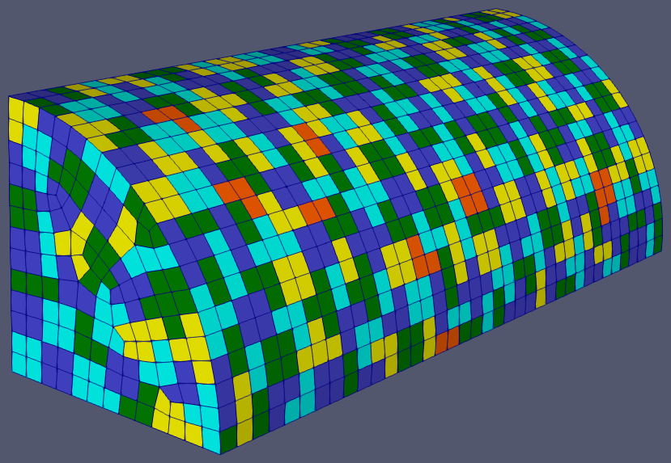

.. sectionauthor:: David Neill-Asanza <dhna@lanl.gov>

.. default-role:: math

.. |L21| replace:: :math:`\mathcal{L}^{2,1}`
.. |L2| replace:: :math:`\mathcal{L}^2`

Variational Shape Approximation (VSA)
=====================================

   Result of VSA on a quarter cylinder.

The Variational Shape Approximation (VSA) patching algorithm is based on the face clustering
algorithm presented by Cohen-Steiner et al. in their paper by the same name
:cite:`vsa-Cohen-Steiner:2004:VSA`. VSA is a modification of `Lloyd's algorithm
<https://en.wikipedia.org/wiki/Lloyd%27s_algorithm>`_ for approximating `centroidal Voronoi
tessellations <https://en.wikipedia.org/wiki/Centroidal_Voronoi_tessellation>`_. Instead of
approximating compact regions of the plane, VSA attempts to minimize the total distortion or error
of all patches in the enclosure. VSA alternates between two phases of *geometry partitioning* and
*proxy fitting* to drive the total error down. The two phases are run iteratively until a
convergence criterion is met.

.. contents:: Contents
   :local:
   :backlinks: none

Algorithm
---------
The VSA algorithm continuously alternates between two phases of *geometry partitioning* and *proxy
fitting* until a convergence criterion is met. Each phase attempts to reduce the total distortion
across all patches. Once the algorithm converges, we have found a patch configuration that minimizes
the total error.

The *geometry partitioning* phase starts from a set of `k` *seed patches*. These seed patches are
grown by adding adjacent faces with the least distortion to the patch. At the end of this phase,
every face is assigned to a patch, so the enclosure has been partitioned into `k` non-overlapping
connected regions (the patches).

Once a partition is found, the *proxy fitting* phase computes an 'optimal representative' of each
patch, called the patch proxy. These patch proxies correspond to the centroids of Lloyd's algorithm
:cite:`vsa-Cohen-Steiner:2004:VSA`. In the partition phase, the face distortion is measured relative
to these proxies. At the end of the proxy fitting phase, the face with least distortion relative to
the new proxy is selected as a seed patch for the next iteration.

The seed patches for the first iteration are chosen with a 'farthest-point' initialization method.
To start, a random seed is chosen in each connected component of the enclosure. Then, seed patches
are added one at a time by performing a partitioning and then choosing the face with highest total
distortion as the new seed patch.

VSA also sparingly performs a 'patch teleportation' operation which moves a patch from a region with
low distortion to one with high distortion. These operations help reduce total distortion by moving
patches to where they are needed most.

Outline
+++++++

#. **Initialization**

   #. Compute the area, centroid, radius, and normal of each face.

      #. The radius of a face is the radius of the smallest circle, centered at the centroid,
         that encloses the whole face. Thus the radius is the largest distance between the centroid
         and any of the face vertices.

   #. Generate the face adjacency matrix. Faces at angles greater than
      :ref:`MAX_ANGLE <tools/RadE/patches/patches_namelist:MAX_ANGLE>` are not adjacent.
   #. Let NPATCH_MIN = NFACE / VSA_FACE_PATCH_RATIO, where NFACE is the total number of faces
      in the enclosure.
   #. Let NPATCH=0. This variable tracks the current number of patches.
   #. If provided, use :ref:`tools/RadE/patches/vsa:VSA_RANDOM_SEED` to initialize the
      random number generator. Otherwise, take the seed from the system clock.

#. **Pick initial seeds**

   #. Let `G` be the face adjacency graph of the enclosure defined by the face adjacency matrix. For
      each connected component of `G`, choose a random face in the component and make it a new seed
      patch.
   #. While NPATCH < NPATCH_MIN:

      #. Call PARTITION()
      #. Reset all patches to their seed faces.
      #. Create a new seed at the face with the highest weight (distortion).

#. **Error minimization**

   #. Let `t` be the current iteration number and set `t=1`.
   #. While `t` <= VSA_MAX_ITER and ITER_DELTA > VSA_MIN_DELTA:

      #. **Pick Seeds**

         #. For each patch `P_i` of the previous partition, find the face `F_k` with least
            weight relative to `P_i`'s proxy `\rho_i = (X_i, \vec{n}_i)`, where `X_i` and
            `\vec{n}_i` are the centroid and unit normal of `P_i`, respectively.

      #. **Geometry partitioning**

         #. Call PARTITION()

      #. **Teleport patches**

         #. If `t \bmod 5 \equiv 0`, call PATCH_DELETE() followed by PATCH_INSERT(). This
            effectively 'teleports' a patch with low distortion to a region with high distortion.

      #. **Proxy fitting**

         #. For each patch `P_i` with proxy `\rho_i^t = (X_i^t,\vec{n}_i^t)`, compute their new
            proxy `\rho_i^{t+1}=(X_i^{t+1},\vec{n}_i^{t+1})`. Compute the change `\delta_i` between
            the old and new proxies:

            .. math::
               \delta_i = \lVert X_i^{t+1} - X_i^t \rVert^2 + \lVert \vec{n}_i^{t+1} - \vec{n}_i^t \rVert^2

         #. Let ITER_DELTA be the minimum change `\delta_i` between the old and new proxies across
            all patches.

* **Subroutines**

  * PARTITION()

    #. For each seed face `F_i` of a patch `P_i` with proxy `\rho_i`, insert the each face `F_n`
       adjacent to `F_k` into a global priority queue with weight `E(F_n, \rho_i)`. The queue entry
       includes a tag `i` denoting the proxy they are being compared against.

    #. While the priority queue is not empty:

       #. Pop the face `F_k` with least weight from the queue. If it's already assigned to
          a patch, continue. If not, assign `F_k` to the patch indicated by the tag and add
          each unassigned face `F_n` adjacent to `F_k` to the queue with the same tag as `F_k`.

  * PATCH_DELETE()

    #. For each pair of adjacent patches `P_i` and `P_j` with respective proxies
       `\rho_i=(X_i,\vec{n}_i)` and `\rho_j=(X_j,\vec{n}_j)`, compute the proxy
       `\rho_T=(X_T,\vec{n}_T)` of the patch `P_T = P_i \cap P_j` resulting from merging the two
       patches. Compute the change between `\rho_T` and the original proxies as

       .. math::
         \delta_T = \lVert X_T - X_i \rVert^2 + \lVert \vec{n}_T - \vec{n}_i \rVert^2
                  + \lVert X_T - X_j \rVert^2 + \lVert \vec{n}_T - \vec{n}_j \rVert^2

       Keep track of of the pair of patches with minimal `\delta_T`.
    #. Delete the pair of patches `P_i` and `P_j` with minimal `\delta_T`, and insert a new patch
       `P_T = P_i \cap P_j` with the appropriate proxy `\rho_T`.

  * PATCH_INSERT()

    #. Find the face `F_k` with the highest weight relative to the proxy of its patch `P_i`. Remove
       `F_k` from `P_i` and insert a new one-face patch at face `F_k`. Note that since patches with
       one face have a weight of 0, `P_i` must have at least two faces.

Error Minimization
++++++++++++++++++
Given a partition of a mesh into a collection of patches `\mathcal{R}` and the corresponding
collection of patch proxies `\mathcal{P}`, the VSA algorithm attempts to minimize the total
distortion error `E(\mathcal{R}, \mathcal{P})`.

The partitioning phase finds the set of patches `\mathcal{R}` with minimal error relative to the
proxies `\mathcal{P}`. Similarly, the proxy fitting phase computes the proxies `\mathcal{P}` that
minimize the distortion of each patch in the new partition `\mathcal{R}`. By alternating these
stages, VSA drives down the total distortion error `E(\mathcal{R}, \mathcal{P})`.

The error functional `E(\mathcal{R}, \mathcal{P})` of a mesh with `k` patches is given by:

.. math::
   E(\mathcal{R}, \mathcal{P})
   = \sum_{i=1 .. k} E(P_i, \rho_i)

where `P_i \in \mathcal{R}` is a patch with corresponding proxy `\rho_i \in \mathcal{P}`. The proxy
`\rho_i = (X_i, \vec{n}_i)` *represents* the patch `P_i` with the coordinate `X_i` and normal vector
`\vec{n}_i`. The distortion error `E(P_i, \rho_i)` of a patch-proxy pair is in turn given by:

.. math::
   E(P_i, \rho_i) = \mathcal{L}^{2,1}(P_i, \rho_i) + \mathcal{L}^2(P_i, \rho_i)

The terms of `E(P_i, \rho_i)` are defined below.

|L21| metric
^^^^^^^^^^^^
Cohen-Steiner et al. :cite:`vsa-Cohen-Steiner:2004:VSA` define the so-called |L21| metric to measure
the planarity of a patch. The |L21| metric is based on an |L2| measure of the normal field over the
patch. Given a patch `P_i` and proxy `\rho_i = (X_i, \vec{n}_i)` we define

.. math::
   \mathcal{L}^{2,1}(P_i) = \iint\limits_{x \in P_i} \lVert \vec{n}(x)  - \vec{n}_i \rVert^2 \,dx

where `\vec{n}(x)` is the normal at the point `x \in P_i`.

|L2| metric
^^^^^^^^^^^^
To measure the compactness of a patch, we use a simple Euclidean distance or |L2| metric. Given a
patch `P_i` with centroid `X_i` we define

.. math::
   \mathcal{L}^2(P_i) = \iint\limits_{x \in P_i} \lVert x  - X_i \rVert^2 \,dx

Note that this is the same metric used by Lloyd's algorithm to generate centroidal Voronoi
tessellations.

Geometry Partitioning
+++++++++++++++++++++
The partitioning phase 'grows' a collection of seed faces into connected patches by successively
adding adjacent faces to a patch. In order to construct a partition that minimizes total distortion,
we cluster faces that are 'close together' in the error metric `E(P_i, \rho_i)`.

Thus, for each patch `P_i` with proxy `/rho_i` and seed face `F_k`, we add each face `F_n` adjacent
to `F_k` to a global priority queue with an weight equal to their distortion error `E(F_n ,\rho_i)`
relative to the proxy.

The partitioning phase then proceeds by repeatedly popping the lowest weight face `F_k` until the
queue is empty. If the popped face was already assigned, we simply skip to the next face.
Otherwise, we assign each popped face to the patch indicated by the tag `i`. We then add all the
unassigned face neighbors `F_n` of `F_k` to the queue, with weight `E(F_n, \rho_i)` and tag `i`.
Once the queue is emptied, every face has been assigned to a patch and we have a new partition
`\mathcal{R}` of the mesh.

Note that each face can only be added to the queue once by each of its neighbors. Since the mesh is
assumed to be a manifold, each face can only as many neighbors as its number of edges. Thus, since
we are only working with triangular or quadrilateral meshes, each face can be queued at most 4
times. Note also that the partitioning phase runs in time `N\log(N)`
:cite:`vsa-Cohen-Steiner:2004:VSA`. Therefore, VSA is able to perform partitions very quickly,
reducing overall computation time.

Face Weight
^^^^^^^^^^^
Each entry of the global priority queue has an associated weight which determines their order in the
queue. The VSA queue prioritizes entries with a lower weight, so the faces with least distortion
relative to a patch will get added to that patch first.

Let the tuple `(F_k, \rho_i)` denote the queue entry that tests face `F_k` against the patch proxy
`\rho_i=(X_i, \vec{n}_i)` of patch `P_i`, where `X_i` and `\vec{n}_i` are respectively the centroid
and unit normal of `P_i`. The weight `E` of a queue entry `(F_k, \rho_i)` is given by the error
metric:

.. math::
  E(F_k, \rho_i) = E_{normal}(F_k, \rho_i) + E_{dist}(F_k, \rho_i) + E_{size}(F_k, \rho_i)

The terms of `E(F_k, \rho_i)` are discussed below.

Normal Bias
~~~~~~~~~~~
We define the *normal bias* of a face `F_k` relative to a patch `P_i` with proxy `\rho_i=(X_i,
\vec{n}_i)` as the |L21| metric of the face normal `\vec{n}_k` relative to the proxy normal
`\vec{n}_i`:

.. math::
   E_{normal}(F_k, \rho_i) = \lVert \vec{n}_k - \vec{n}_i \rVert^2

Since the largest deviation between the proxy normal `\vec{n}_i` and a face normal `\vec{n}_k` is
when these vectors are `antiparallel
<https://en.wikipedia.org/wiki/Antiparallel_(mathematics)#Antiparallel_vectors>`_ it follows that `0
\le E_{normal}(F_k, \rho_i) \le 4` for any tuple `(F_k, \rho_i)`.

Distance Bias
~~~~~~~~~~~~~
We define the *distance bias* of a face `F_k` relative to a patch `P_i` with proxy `\rho_i=(X_i,
\vec{n}_i)` as the square of the |L2| distance between the face centroid `X_k` and the proxy centroid
`X_i`, normalized by the face radius `r_k`.

.. math::
   E_{dist}(F_k, \rho_i) =
   \begin{cases}
      \left(\lVert X_k - X_i \rVert^2 + r_k^2\right) /\ r_k^2 & \text{if distance normalization is enabled} \\
      \lVert X_k - X_i \rVert^2 + r_k^2 & \text{otherwise}
   \end{cases} \\

The :ref:`tools/RadE/patches/vsa:VSA_NORMALIZE_DIST` parameter controls whether the distance is
normalized by the face radius `r_k`. With normalization, `E_{dist}` roughly measures how many "faces
away" the patch center is (assuming the surrounding faces are of similar size). Therefore, enabling
normalization tends to produce patches wit a similar number of faces, regardless of the physical
size of each patch. Conversely, disabling normalization tends to make all patches about the same
physical size, regardless of the number of faces in each patch.

Normalization is enabled by default. This makes `E_{dist}` less dependent on the size of the face.
Without normalization, larger faces tend to have a larger weight than smaller faces since their
centroids are further from the nodes of the face. In particular, this causes large faces to get
preferentially selected as initial seeds, resulting in components covered with one face patches.

Size Bias
~~~~~~~~~
We define the *size bias* of a face `F_k` relative to a patch `P_i` with proxy `\rho_i=(X_i,
\vec{n}_i)` as

.. math::
   E_{size}(F_k, \rho_i) =
   \begin{cases}
      0 & \text{if } \lVert X_k - X_i \rVert \le r_{max} \\
      100 * \lVert X_k - X_i \rVert^2\ /\ r_{max}^2  & \text{otherwise}
   \end{cases} \\

where `r_k` is the face radius and `r_{max}` is the maximum patch radius defined by the
:ref:`tools/RadE/patches/vsa:VSA_MAX_PATCH_RADIUS` parameter. The size bias heavily penalizes faces
that are outside the maximum patch radius. This discourages the formation of patches that are
significantly larger than the specified radius. We use this "strong suggestion" approach because
outright preventing faces from being added to a patch might result in faces with no patch assignment.

By default, `r_{max}` is set to a very large positive real number. Thus, the size bias has no effect
unless it is explicitly set to a value comparable to the mesh size.

Proxy Fitting
+++++++++++++
Each patch `P_i` has an associated proxy `\rho_i = (X_i, \vec{n}_i)` that represents the patch with
two quantities, namely the coordinate `X_i` and the normal vector `\vec{n}_i`.

Once a partition of the enclosure `\mathcal{R}` is found, we wish to update the patch proxies to
minimize the distortion error

.. math::
   \begin{align*}
     E(P_i, \rho_i)
     &= \mathcal{L}^{2,1}(P_i, \rho_i) + \mathcal{L}^2(P_i, \rho_i) \\
     &= \iint\limits_{x \in P_i} \lVert \vec{n}(x)  - \vec{n}_i \rVert^2 \,dx
      + \iint\limits_{x \in P_i} \lVert x  - X_i \rVert^2 \,dx
   \end{align*}

of each patch. It can be shown that the choice of proxy that minimizes `E(P_i, \rho_i)` is when
`X_i` is the centroid of the patch and `\vec{n}_i` is the average normal over the patch. Thus, we
compute the new proxy `\rho_i=(X_i, \vec{n}_i)` as the area-weighted average of the face centroids
and face normals

.. math::
   \begin{align*}
     X_i       &= \frac{\sum_{F_k \in P_i} w_k \cdot X_k}{W_i} \\
     \vec{n}_i &= \frac{\sum_{F_k \in P_i} w_k \cdot \vec{n}_k}{W_i}
   \end{align*}

where `X_k`, `\vec{n}_k`, and `w_k` are respectively the centroid, unit normal, and area of `F_k`,
and `W_i = \sum_{F_k \in P_i} w_k` is the area of `P_i`.

By choosing proxies that minimize the distortion error of each patch, VSA reduces the total error
`E(\mathcal{R}, \mathcal{P})`.

Namelist Parameters
-------------------
The :doc:`PATCHES namelist <patches_namelist>` allows a user to configure the VSA algorithm
parameters. Although the PATCHES namelist supports many parameters, only eight are used by VSA, and
only six of those are unique to VSA.

The general parameters used by VSA are VERBOSITY_LEVEL and MAX_ANGLE. Refer to the :ref:`PATCHES
namelist documentation <tools/RadE/patches/patches_namelist:General Parameters>` for more
information on those parameters.

The six parameters unique to VSA are all prefixed with *VSA*. We discuss these parameters
briefly below.

VSA_MAX_ITER
++++++++++++
Defines the maximum number of iterations for the :ref:`error minimization
<tools/RadE/patches/vsa:Outline>` step of the algorithm.

.. namelist_parameter::
   :type: INTEGER
   :domain: vsa_max_iter >= 1
   :default: vsa_max_iter = 1000

The algorithm stops when ``vsa_max_iter`` is reached, regardless of other
terminating conditions.

VSA_MIN_DELTA
+++++++++++++
Defines the minimum allowable change in patch proxies between successive iterations.

.. namelist_parameter::
   :type: REAL
   :domain: vsa_min_delta >= 0.0
   :default: vsa_min_delta = 1.0E-6

At the end of each iteration, the new patch proxies for the next iteration are computed and compared
against the old proxies. VSA keeps track of the *minimum* change between the old and new proxies.
This change is computed as the sum of the squares of the difference between the old and new proxy
vectors. If the minimum change in patch proxies is less than ``vsa_min_delta``, the algorithm is
said to converge and will terminate at that iteration.

For more details on how the change between old and new proxies is computed, refer to step 3.2.4 of
the :ref:`algorithm outline <tools/RadE/patches/vsa:Outline>`.

VSA_FACE_PATCH_RATIO
++++++++++++++++++++
Defines the ratio of total faces to total patches, and by extension the total number of patches.

.. namelist_parameter::
   :type: REAL
   :domain: vsa_face_patch_ratio >= 1.0
   :default: vsa_face_patch_ratio = 4.0

Since the number of faces is fixed, this parameter determines the total number of patches in the
final configuration:

.. math::
   \text{(Total Patches)} = \text{(Total Faces)}\ /\ \text{vsa_face_patch_ratio}

Rather than set the number of patches explicitly, which is mesh dependent, expressing this
parameter as a ratio allows the same value to apply to a variety of meshes.

VSA_MAX_PATCH_RADIUS
++++++++++++++++++++
Defines the desired maximum radius for a patch.

.. namelist_parameter::
   :type: REAL
   :domain: vsa_max_patch_radius > 0.0
   :default: vsa_max_patch_radius = sqrt(huge(0.0_r8))

This parameter is used to compute the *size bias* term of the weight of a face relative to
a patch proxy. Refer to the :ref:`size bias section <tools/RadE/patches/vsa:Size Bias>` of the
VSA documentation for more information on how the parameter affects the face weight computation.

Note that the default value of this parameter is :fortran:`sqrt(huge(0.0_r8))` because it is squared
in the face weight computation. By taking the root of :fortran:`huge(0.0_r8)` we prevent floating
point overflow errors. Numerically, the default value on the order of `1.34*10^{154}`.

VSA_NORMALIZE_DIST
++++++++++++++++++
Determines whether to normalize the distance bias.

.. namelist_parameter::
   :type: LOGICAL
   :domain: Must be ``.true.`` or ``.false.``
   :default: vsa_normalize_dist = ``.true.``

This parameter affects the computation of the *distance bias* term of the weight of a face relative
to a patch proxy. Broadly speaking, enabling normalization tends to produce patches with a similar
number of faces, regardless of the physical size of each patch. Conversely, disabling normalization
tends to make all patches about the same physical size, regardless of the number of faces in each
patch.

Refer to the :ref:`distance bias section <tools/RadE/patches/vsa:Distance Bias>`
of the VSA documentation for more information on how the parameter affects the face weight
computation.

VSA_RANDOM_SEED
+++++++++++++++
Defines the seed for the random number generator used to pick the initial seed patches.

.. namelist_parameter::
   :type: INTEGER
   :domain: pave_random_seed > 0
   :default: ``NONE``, the seed is taken from the system clock.

The VSA algorithm uses a 'farthest-point' initialization method to choose the seed patches for the
first iteration. To start, a random face in each connected component is chosen as a seed patch.
Then, seed patches are added one at a time by performing a :ref:`partitioning
<tools/RadE/patches/vsa:Geometry Partitioning>` and then choosing the face with highest total
distortion as the new seed patch.

This parameter sets the seed for the random number generator used to pick the first seed patch in
each connected component. Therefore, runs with the same value for this parameter will produce
identical results. If this parameter is not specified, then the seed is taken from the system clock
and results will likely vary from run to run.

References
----------
.. bibliography:: references.bib
   :style: unsrt
   :keyprefix: vsa-
