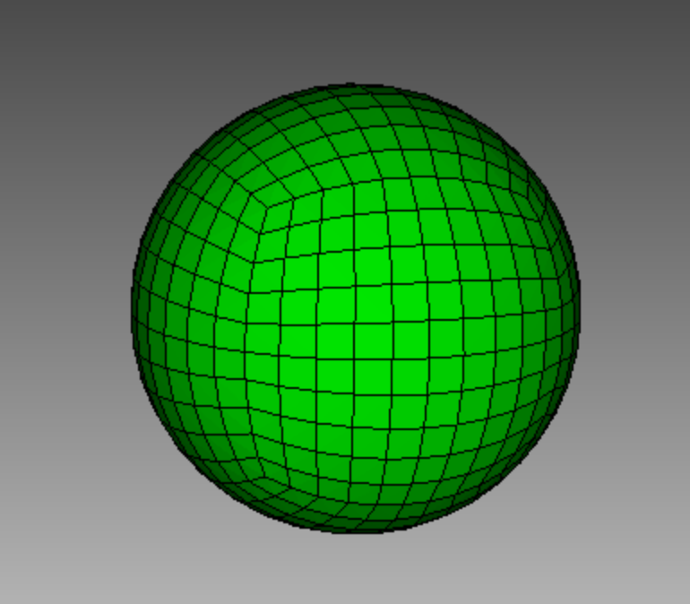
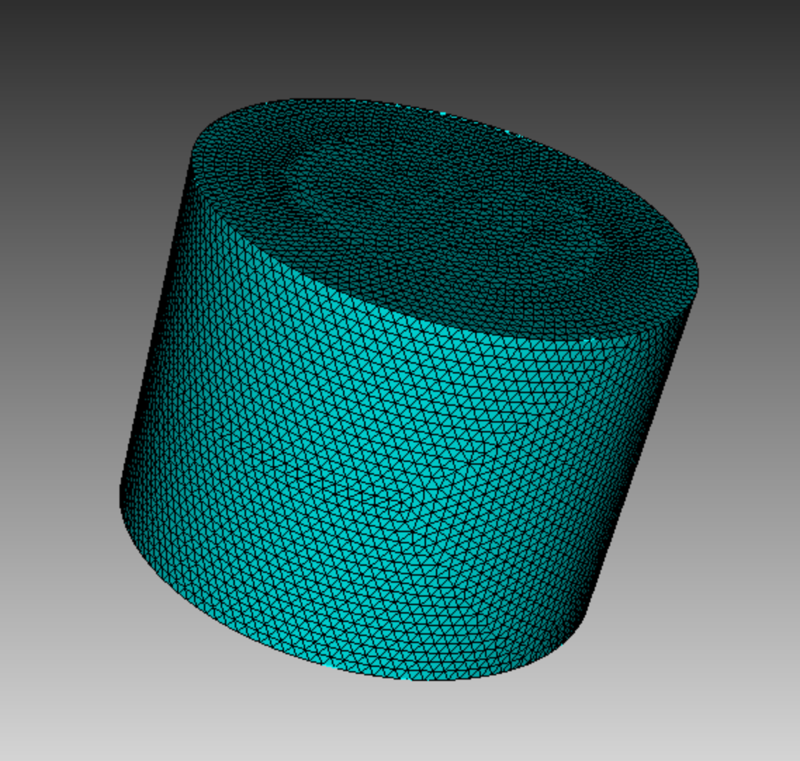
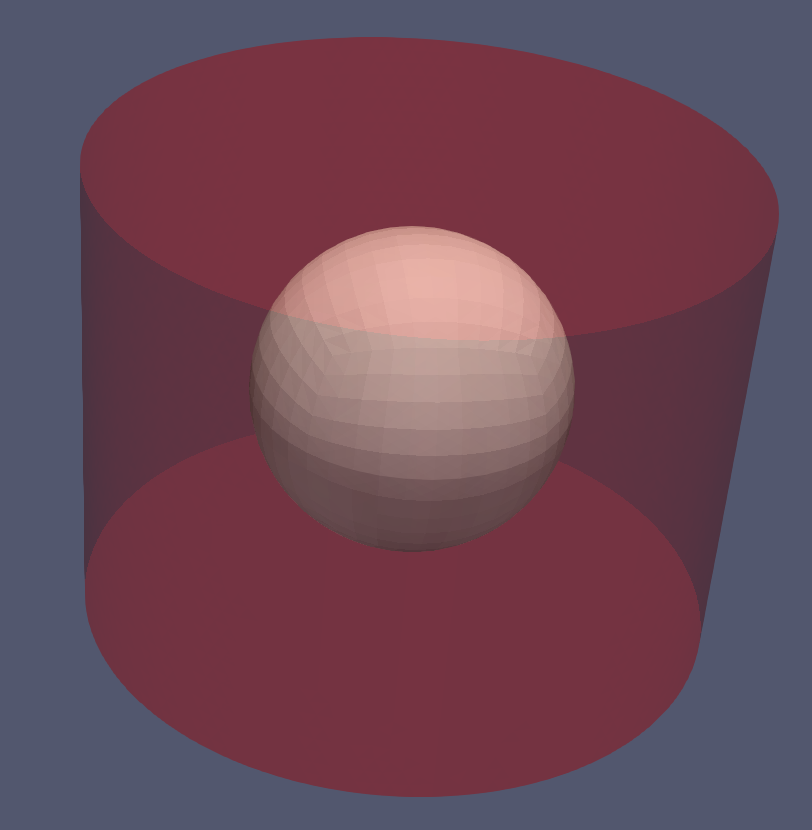
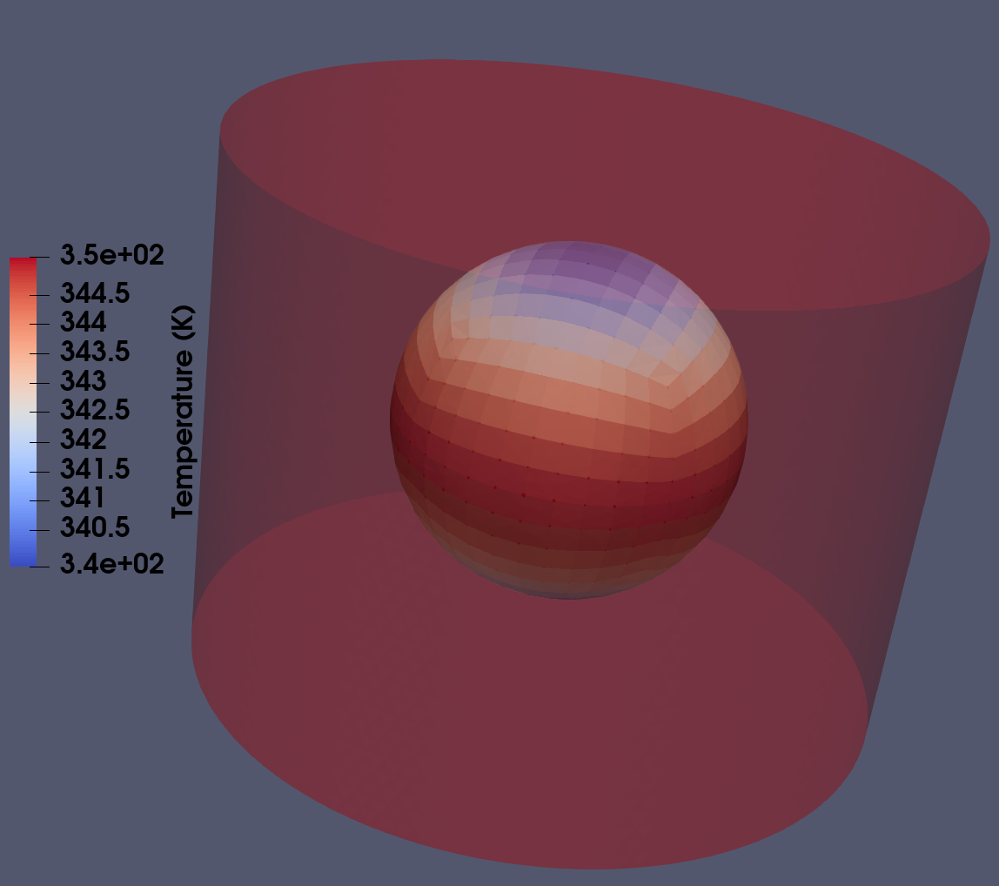
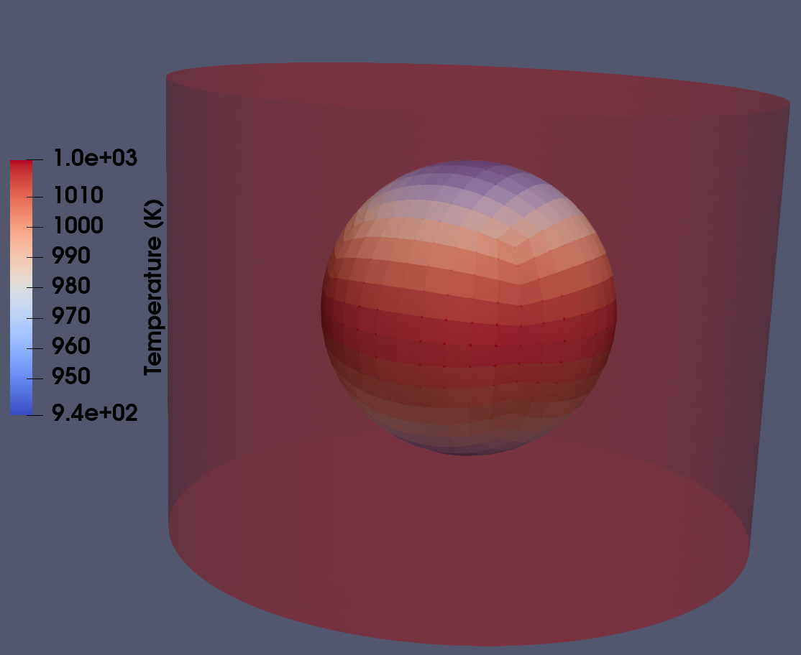
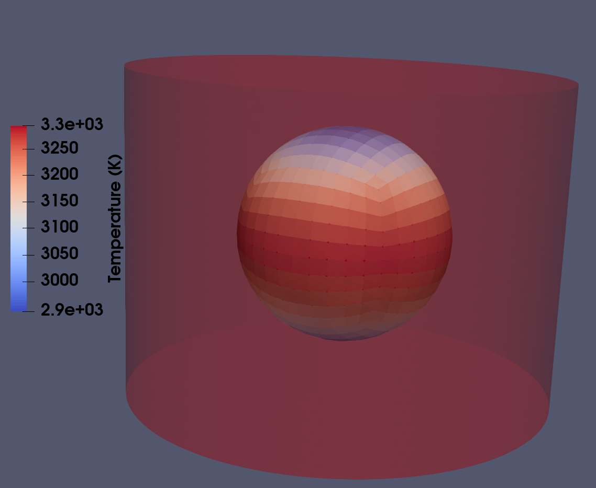
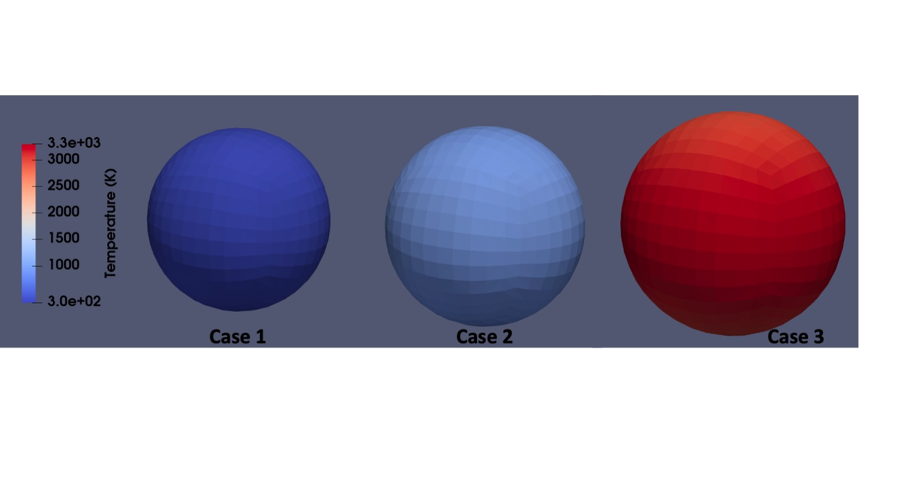

.. _electromagnetic_induction_heating:

.. :toctree::
   :maxdepth:1

Electromagnetic Induction Heating
=====================================

In this section, heating using electromagnetic induction will be discussed. Heating of the mold and crucible is achieved through resistive heating of electric currents (eddy currents) induced by an alternating magnetic field generated by large induction coils that surround the workpiece. Maxwell's equations for the electric and magnetic  fields are
the governing equations for computing the induced eddy currents. Time-dependent Maxwell's equations, but configured
specifically for the induction heating problem. The computational domain for EM differs from that for heat conduction. The time scale for EM is much shorter than that for heat conduction: :math:`10^{-4}` vs :math:`1` for :math:`10 kHz` coil frequency. Basic inputs of induction heating model, compatibility between the heat transfer mesh and electromegantic induction mesh will be explained.

.. _2_em_prob_description:

Problem Description
--------------------

In this example, a sphere made of graphite is heated using an electromagtic induction coil. Induction coil idealized as a set of circular current loops. Computational domain is a cylinder contained within the coil. EM field boundary conditions are automatically defined. Correspond to the magnetic field generated by imposed alternating current in the loops. The coils are not part of the EM problem. But are often included in the heat transfer simulation (with actual geometry).

.. _2_em_mesh:

Mesh 
-------
* The EM and heat transfer simulations use different meshes of different domains. 
* The EM mesh must be a pure tetrahedral mesh.
* Temperature/materials mapped from HT to EM mesh.
* Computed Joule heat mapped from EM to HT mesh.
* Mapping done according to matching element block IDs

The `CUBIT <https://cubit.sandia.gov/>`_ script to generate the heat transfer mesh in this problem can be found :download:`here <HT_mesh.jou>`. The script to generate the electromagnetic induction space mesh where the sphere will be enclosed can be found :download:`here <EM_mesh.jou>`. :numref:`Figure %s <fig_2_HT_mesh>` shows the generated mesh of the sphere. :numref:`Figure %s <fig_2_EM_mesh>` shows the mesh of the electromagnetic space used in this problem.

.. _fig_2_HT_mesh:

   
   Heat Transfer mesh of a sphere to be heated. 

.. _fig_2_EM_mesh:

   
   Mesh of the EM space where the sphere will be enclosed. 

The coupled blocks of HT and EM spatial domains are shown by :numref:`Figure %s <fig_2_enclosed>`.

.. _fig_2_enclosed:

   
   Coupled spatial domains of EM and HT. 

.. _2_em_joule_heat_sol:

Joule Heat Solution Procedure
---------------------------------
* The output of the EM simulation is the Joule heat. This is a volumetric heat source used for heat transfer.
* At some instant of heat transfer problem time a side EM problem is solved. 
* Maxwell equations are solved for several cycles of the applied alternating magnetic field until a periodic steady state solution is attained.
* The heat generated by the eddy currents (Joule heat) is averaged over one cycle of the periodic steady state solution.
* This Joule heat computation only needs to be done periodically.

.. _2_em_input_file_description:

Input File Description
-------------------------

The input file for this problem can be found :download:`here <input_file_EM.inp>`.

The heat transfer mesh is placed within the `MESH <https://www.truchas.org/docs/reference-manual/MESH_Namelist/index.html>`_ namelist and the mesh for electromagnetic physics is placed within the `ALTMESH <https://www.truchas.org/docs/reference-manual/ALTMESH_Namelist/index.html>`_ as shown below. 

::

   &MESH
      Mesh_File                   = 'HT.gen'
   /

   &ALTMESH
      Altmesh_File                = 'EM.gen'
   /

In the `PHYSICS <https://www.truchas.org/docs/reference-manual/PHYSICS_Namelist/index.html>`_ namelist, **Electromagnetics** is toggled to `True` in addition to the **Heat_Transport**.

::

   &PHYSICS
      Heat_Transport              = True
      Electromagnetics            = True
      Materials		      = 'graphite'
   /

The material thermophysical properties including the electromagnetic properties are mentioned in the **MATERIAL** namelist which is shown below.

::

   &MATERIAL
      Name                        = 'graphite'
      Density                     = 1750.0
      specific_heat               = 895.0
      conductivity                = 7.80
      electrical_conductivity     = 5.6e4
   /

The EM simulation is driven by applying magnetic field BC. That magnetic field is the superposition of the fields generated by ideal circular current loops. We assume a sinusoidal current in each loop, with the same phase and frequency, but with varying amplitudes. Following block describes the properties of the EM physics.

::

   &ELECTROMAGNETICS
      EM_Domain_Type              = 'Full_cylinder'
      Source_Frequency            = 2000.0
      Steps_Per_Cycle             = 20
      Maximum_Source_Cycles       = 5
      SS_Stopping_Tolerance       = 0.01
      Maximum_CG_Iterations       = 500
      Output_Level                = 2
      CG_Stopping_Tolerance       = 1.0e-8
      !Num_Etasq                  = 1.0e-6
   /

The current loops are given with one or more `INDUCTION_COIL <https://www.truchas.org/docs/reference-manual/INDUCTION_COIL_Namelist/index.html>`_ namelist. It has to be noted that the **Radius** and the **Length** specified in the INDUCTION_COIL namelist should be smaller than the dimensions of the cylindrical EM mesh generated using :download:`this <EM_mesh.jou>`.

Multiple namelist instances are allowed. 

::

   &INDUCTION_COIL
      Center  = 3*0.0
      Radius  = 0.04
      Length  = 0.02
      NTurns  = 3
      Current = 5000.0
   /

.. _2_em_results:

Results
----------
* Case 1: Since the EM space is cylindrical, the sphere will be heated radially inside. The result from the following coil specifications is shown in :numref:`Figure %s <fig_2_result_1>`. The temperature scale has to noted in this case in order to appreciate the difference in heating in the next cases.

::

   &INDUCTION_COIL
      Center  = 3*0.0
      Radius  = 0.04
      Length  = 0.02
      NTurns  = 3
      Current = 5000.0
   /

.. _fig_2_result_1:

   
   Case 1: Temperature field of the sphere at the end of the simulation. 

* Case 2: For the following case, the **current** was increased fourfold to 20000. The **INDUCTION_COIL** block used in the simulation is as follows with rest of the nameslist remaining the same compared to the initial input :download:`file<input_file_EM.inp>`. The temperature profile of the spherical domain at the final time step of the simulation is shown in :numref:`Figure %s <fig_2_result_2>`. The temperature scale is different compared to :numref:`Figure %s <fig_2_result_1>`

::

   &INDUCTION_COIL
      Center  = 3*0.0
      Radius  = 0.04
      Length  = 0.02
      NTurns  = 3
      Current = 20000.0
   /

.. _fig_2_result_2:

   
   Case 2: Temperature field of the sphere at the end of the simulation. 

* Case 3: For this case, in addition to **current**, the number of turns of the coil **NTurns** is doubled to 6. The **INDUCTION_COIL** block used in the simulation is as follows with rest of the nameslist remaining the same compared to the initial input :download:`file<input_file_EM.inp>`. The temperature profile of the spherical domain at the final time step of the simulation is shown in :numref:`Figure %s <fig_2_result_3>`. The temperature scale is different compared to :numref:`Figure %s <fig_2_result_1>` and :numref:`Figure %s <fig_2_result_2>`.

::

   &INDUCTION_COIL
      Center  = 3*0.0
      Radius  = 0.04
      Length  = 0.02
      NTurns  = 6
      Current = 20000.0
   /

.. _fig_2_result_3:

   
   Case 3: Temperature field of the sphere at the end of the simulation. 

The combined images with same temperature scale is shown in :numref:`Figure %s <fig_2_result_combined>`.

.. _fig_2_result_combined:

   
   Comparison of Temperature field of the sphere at the end of the simulation for all 3 cases. 