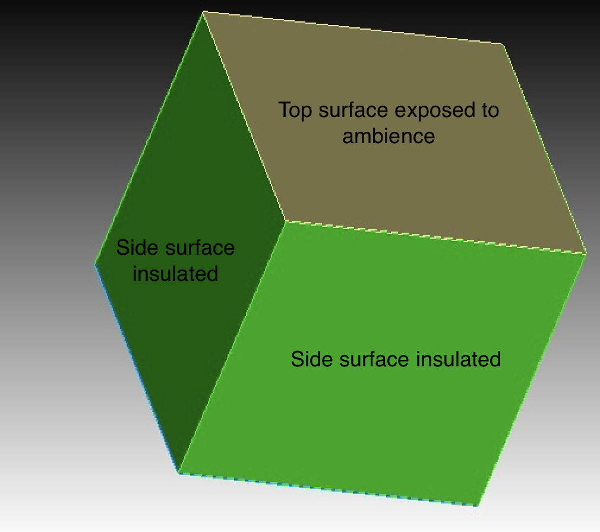
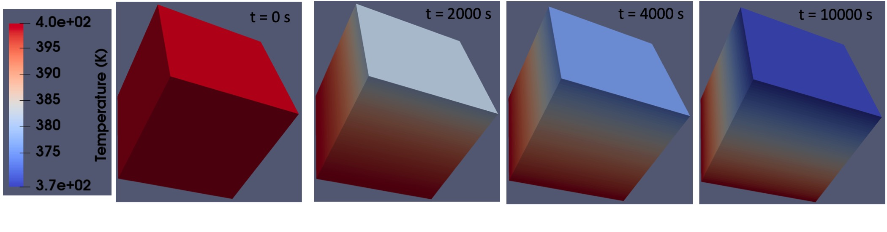
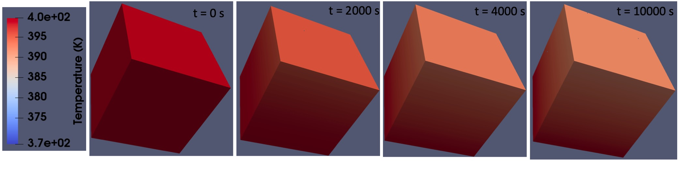
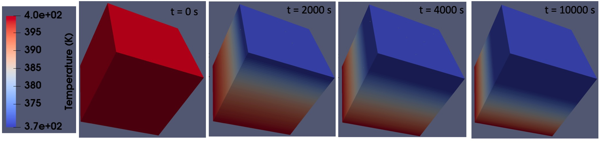

.. _um_1_1_simple_heat_transfer:

.. toctree::
   :maxdepth: 1

Simple Heat Transfer With No Phase Change
==========================================

This section describes a simple heat transfer problem in TRUCHAS. The unit system in TRUCHAS is agnostic. More details about the unit system can be found :ref:`here <physcial_units>`. In this case, S.I. unit system is assumed. 

.. _1_heat_prob_description:

Problem Description
--------------------

A three-dimensional cubic domain is used in this example. The entire domain is assigned an uniform initial thermal condition (temperature: 400 K). Four sides of the domain are insulated. The bottom surface of the domain is assigned a Dirichlet boundary condition with a fixed temperature (400 K). The top surface was exposed to ambient temperature (300 K) with a heat transfer co-efficient of :math:`100  W/(m^2.K)` (forced convection). The end time of the simulation is 10,000 seconds. 

Input file Description
------------------------

The mesh was generated using `CUBIT <https://cubit.sandia.gov/>`_. The CUBIT script used generate the mesh file for this example can be found :download:`here <1_1_cubit.jou>`. X, Y, Z dimensions are :math:`1 m` each. The edges are uniformly discretized at :math:`0.02 m` (50 discretizations along X, Y, and Z axis respectively resulting in 125,000 elements). If no mesh file is available, TRUCHAS can generate a block mesh internally, using the information presented in a namelist for the number of cells in each of three directions and the coordinate limits. Refer to :ref:`MESH<MESH_Namelist>` namelist for more information. The input file for this simulation is given in :download:`here <1_1_input_simple_heat_transfer.inp>`.  :numref:`Figure %s <fig_1_1_geometry>` shows the geometry used in this simulation.

.. _fig_1_1_geometry:

   
   Geometry of the domain
   

The path for the generated mesh is given in the input file using the :ref:`MESH<MESH_Namelist>` namelist. 
::

   &MESH
      mesh_file = '1_mesh_heat_transfer.exo'
   /

The :ref:`OUTPUTS<OUTPUTS_Namelist>` namelist is used to specify the time variables in the simulation. The simulation was run for 10,000 seconds. The output was saved for every 1000 seconds. The OUTPUTS namelist for this example is listed in here.
::

   &OUTPUTS
      output_t          = 0.0, 10000.0
      output_dt         = 1000.0
   /

The :ref:`MATERIAL<MATERIAL_and_PHASE_Namelists>` namelist is used to name the material and assign thermophysical properties for the material. In this case, only one material is used and is arbitarily named as **aluminum**. Temperature independent thermophysical properties (density, specific heat, thermal conductivity) for the material are assigned to the appropriate variables in the :ref:`MATERIAL<MATERIAL_and_PHASE_Namelists>` namelist. The values for the thermophysical properties can be input as a function of temperature (refer to :ref:`MATERIAL<MATERIAL_and_PHASE_Namelists>` namelist and :ref:`FUNCTION<FUNCTION_Namelist>` namelist).
::

   &MATERIAL
      name             = 'aluminum'
      density          = 2700
      specific_heat    = 887
      conductivity     = 200 
   /

The :ref:`BODY<BODY_Namelist>` namelist is used to assign the initial conditions of the materials used in the simulaiton. Number of ``BODY`` namelist depends on the number of materials used. ``material_name`` variable must be assigned appropriate Please refer to the :ref:`BODY<BODY_Namelist>` regarding the description about ``surface_name``. In a simulation, only one material can be assigned as **background**. The initial temperature of the material is assigned to be :math:`400 K`.
::

   &BODY
      material_name   = 'aluminum'
      surface_name    = 'background'
      temperature     =  400.0 
   /

The :ref:`PHYSICS<PHYSICS_Namelist>` namelist is used to turn on/off the physics in the simulation. The PHYSICS namelist for this example is listed in here. In this example, all the physics are turned off except for the Heat Transfer. The name of all the materials used in the simulation is specified in the `materials` variable. 
::
   
   &PHYSICS
      heat_transport    = True 
      flow              = False
      species_transport = False
      electromagnetics  = False
      materials         = 'aluminum'
   /

The :ref:`THERMAL_BC<THERMAL_BC_Namelist>` namelist is used to specify the boundary conditions for the heat transfer physics. TRUCHAS analyzes the problem geometry and detects all ‘external’ faces of bodies, i.e. those that do not have a neighboring cell on the other side. All external faces in a mesh must be contained in a surface that has a temperature boundary condition defined in a THERMAL_BC namelist. If at the end of initialization there are external faces without a defined temperature boundary condition, TRUCHAS will exit with a fatal error. In the following block, the thermal boundary condition for the top surface is specified. ``name`` is an arbitary name for the surface. The value for ``face_set_ids`` is taken from the mesh file. In this example, it correspond to the ``sideset`` specified in the CUBIT mesh generation :download:`script <1_1_cubit.jou>`. In the script, we have specified 6 sidesets for the 6 sides. Refer to the :ref:`THERMAL_BC<THERMAL_BC_Namelist>` namelist for available options for the variable ``type``. External heat transfer condition is used by choosing **htc** for the type. The value for the heat transfer co-efficient is given by the variable ``htc``. The ambient temperature in the external heat transfer condition is spceified by the variable ``ambient_temp``. 

.. _1_initial_thermal_bc:

::

   &THERMAL_BC
      name = 'top'
      face_set_ids = 1 
      type = 'htc'
      htc = 100.0
      ambient_temp = 300.0
   / 

As explained :ref:`earlier<1_heat_prob_description>`, the bottom surface is assigned a Dirichlet boundary condition with a constant temperature of :math:`400 K`. The ``type`` is changed tp **temperature** and the value for ``temp`` is assigned as **400.0**. Following block corresponds to the boundary condition for the bottom surface.
::

   &THERMAL_BC
      name = 'bottom'
      face_set_ids = 2 
      type = 'temperature'
      temp = 400.0 
   /

Rest of the 4 surafces are assigned the Neumann boundary condition with zero thermal flux (adiabatic or insulated). The ``type`` is changed to **flux** and the value for ``flux`` is assigned as zero. Following block corresponds to the 4 insulated surfaces.
::

   &THERMAL_BC
      name = 'side 1'
      face_set_ids = 3 
      type = 'flux'
      flux = 0.0
   /

   &THERMAL_BC
      name = 'side 2'
      face_set_ids = 4
      type = 'flux'
      flux = 0.0
   /

   &THERMAL_BC
      name = 'side 3'
      face_set_ids = 5
      type = 'flux'
      flux = 0.0
   /

   &THERMAL_BC
      name = 'side 4'
      face_set_ids = 6
      type = 'flux'
      flux = 0.0
   /

The following block is the :ref:`DIFFUSION_SOLVER<DIFFUSION_Solver_Namelist>` namelist in the input file. The DIFFUSION_SOLVER namelist sets the parameters that are specific to the heat and species transport solver. When ``Heat_transport`` or ``species_transport`` is set to **True** in the :ref:`PHYSICS<PHYSICS_Namelist>`, DIFFUSION_SOLVER namelist is read while the input file is envoked. The absolute and relative error tolerence for temperature and enthalpy are specified by ``abs_temp_tol``, ``rel_temp_tol``, ``abs_enthalpy_tol``, and ``rel_enthalpy_tol``. For comprehensive and mathematical explanation of the solver parameters and preconditioners, refer to the :ref:`DIFFUSION_SOLVER<DIFFUSION_Solver_Namelist>` namelist.

::

   &DIFFUSION_SOLVER
      abs_temp_tol = 0.0
      rel_temp_tol = 1.0e-3
      abs_enthalpy_tol = 0.0
      rel_enthalpy_tol = 1.0e-3
      max_nlk_itr = 5
      nlk_tol = 0.02
      nlk_preconditioner = 'hypre_amg'
      pc_amg_cycles = 2
      verbose_stepping = .true.
   /

The numerical parameters used to control the overall time stepping of TRUCHAS is listed in the :ref:`NUMERICS<NUMERICS_Namelist>` namelist. The simulation starts with a time stepping of 0.01 seconds specified by :ref:`Dt_Init<NUMERICS_DTI>` which is allowed to grow by a factor of 5 specified by :ref:`Dt_Grow<NUMERICS_DTG>` with a maximum allowable time stepping of 60 seconds specified by :ref:`Dt_Max<NUMERICS_DTMax>`.
::

   &NUMERICS
      dt_init = 0.01
      dt_grow = 5.0
      dt_max = 60.0
   /

Running the Simulation
------------------------
Invoking the code in serial and parallel is explained in the :ref:`Introduction<um_introduction>` section of the :ref:`Reference Manual<reference_manual>`. This simulation was run in parallel using the following command assuming ``truchas`` is the alias of the binary. 

``mpirun -np 20 truchas input_file_name.inp``

Results
------------

 Comprehensive information about working with output files is detailed in :ref:`Working With Output Files<UM_Work_With_Output>` subsection in the :ref:`Reference Manual<reference_manual>`. By default, without turning on the flags listed in :numref:`Table %s <truchas_command_line_option>` in the :ref:`Reference Manual<reference_manual>`, assuming the name of the input file is ``input_file_name.inp``, the output folder will be named ``input_file_name_output``. By default, the output folder will contain a log file ``input_file_name.log`` and the hdf5 file ``input_file_name.h5``. Log file for this simulation can be seen :download:`here<1_1_input_simple_heat_transfer.log>`. Output file can be read by most of the commonly used visualization softwares. 

The output from this simulation is visualized and shown in :numref:`Figure %s <fig_1_2_temp_time>`. It shows the variation in temperature distribution in the domain as a function of simulation time. The 4 temperature snap shots displayed corresponds to the initial condition (t=0s), 2000 s, 4000 s and end time of the simualtion (10,000s) from left to right. The orientation of the domain in :numref:`Figure %s <fig_1_2_temp_time>` is same as the orientation shown in :numref:`Figure %s <fig_1_1_geometry>`. Initially, the entire domain is at 400 K. Since the sides are insulated and the bottom is kept at constant temperature of 400 K. Since the ambient is at 300 K, only source of heat loss is through the top surface. This is apparent by the temperature gradient from the bottom surface to the top.

.. _fig_1_2_temp_time:

   
   Variation in temperature distribution in the domain as a function of time.

Modified Problems:
-------------------
In this section, the original :download:`input file<1_1_input_simple_heat_transfer.inp>` for the problem described in the earlier :ref:`section <1_heat_prob_description>` will be modified slightly and the results will be presented. 

Modified Problem 1: Change in heat transfer co-efficient
^^^^^^^^^^^^^^^^^^^^^^^^^^^^^^^^^^^^^^^^^^^^^^^^^^^^^^^^^^
In this problem, a slight modification of the values of the boundary condition is done. The heat transfer co-efficient for the top surface is changed. In the original problem, the heat transfer co-efficient :ref:`htc<TB_htc>` variable in the :ref:`Thermal_BC<THERMAL_BC_Namelist>` namelist is 100.0 :math:`W/m^2.K` as explained in the earlier :ref:`section<1_initial_thermal_bc>`. In this case, the value is reduced by a factor of 5 and set to 20 :math:`W/m^2.K`. For part 2, of this problem, the value was increased by a factor of 2 to 200 :math:`W/m^2.K`. All the other parameters are kept the same as the earlier problem. The new input file for the problem with lower htc is listed :download:`here<1_1_input_simple_heat_transfer_modified_1.inp>`. The modified Namelist is as follows. 

::

   &THERMAL_BC
      name = 'top'
      face_set_ids = 1 
      type = 'htc'
      htc = 20.0               !This value is modified from 100
      ambient_temp = 300.0
   / 

With lower heat transfer co-efficient, the expected temperature drop should be slower compared to the original problem. :numref:`Figure %s <fig_1_3_lower_htc>` shows the temperature distribution in the simulation domain as a function of time for this modified problem. Note that the time of the snap shots and the range of the scale bar is the same as in :numref:`Figure %s <fig_1_2_temp_time>`.  

.. _fig_1_3_lower_htc:

   
   Variation in temperature distribution in the domain as a function of time with a lower htc (20 :math:`W/m^2.K`).

   Similarly, the input file for the higher htc is listed :download:`here<1_1_input_simple_heat_transfer_modified_2.inp>`. The modified namelist cmopared the :download:`original problem <1_1_input_simple_heat_transfer.inp>` is as follows. All the other parameters are not modified.

::

   &THERMAL_BC
      name = 'top'
      face_set_ids = 1 
      type = 'htc'
      htc = 200.0               !This value is modified from 100
      ambient_temp = 300.0
   / 

With higher heat transfer co-efficient, the expected temperature drop should be faster compared to the original problem. :numref:`Figure %s <fig_1_4_lower_htc>` shows the temperature distribution in the simulation domain as a function of time for this modified problem with higher htc. Note that the time of the snap shots and the range of the scale bar is the same as in :numref:`Figure %s <fig_1_2_temp_time>` and :numref:`Figure %s <fig_1_3_lower_htc>`.  

.. _fig_1_4_lower_htc:

   
   Variation in temperature distribution in the domain as a function of time with a higher htc (200 :math:`W/m^2.K`).

Modified Problem 2: Change in Boundary Conditions
^^^^^^^^^^^^^^^^^^^^^^^^^^^^^^^^^^^^^^^^^^^^^^^^^^^^^^^^^^
In this problem, a slight modification of the boundary condition is done. In the original problem, as explained in the earlier :ref:`section<1_initial_thermal_bc>`, only the top surface was exposed to the ambient thermal conditions and the 4 side surfaces are assumed to be adiabatic. In this case, in addition to the top surface, the 4 side surfaces are also exposed to the ambient thermal conditions with the same heat transfer co-efficient of 100 :math:`W/m^2.K` and ambient temperature of 300 K. All the other parameters are kept the same as the :download:`original problem<1_1_input_simple_heat_transfer.inp>`. The new input file for the problem with changed boundary conditions is listed :download:`here<1_1_input_simple_heat_transfer_modified_3.inp>`. The modified Namelist is as follows. 

``To do 1. Properties as a function of temperature``

