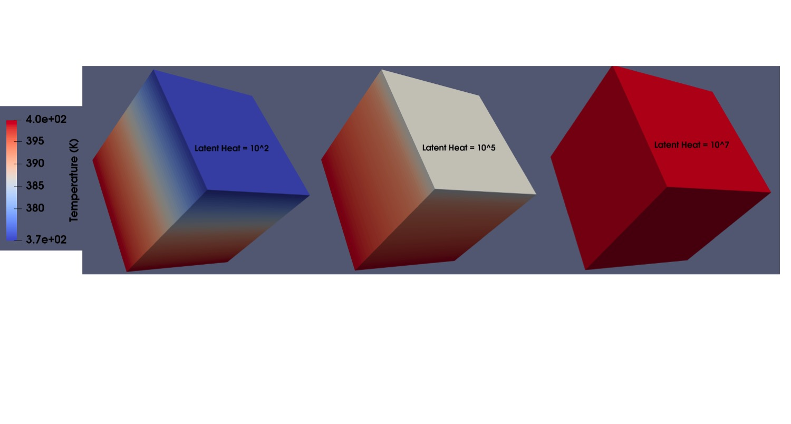

.. _um_1_2_nonisothermal_phase_change:

.. toctree::
   :maxdepth: 1

Heat Transfer with Non-Isothermal Phase Change
===============================================
This section adds another physics (phase change) to the previously descibed simple heat transfer :ref:`problem<_um_1_1_simple_heat_transfer>`. An example simulation of non-isothermal phase change in a material with latent heat of fusion is explained in this section.

.. _1_2_heat_prob_description:

Problem Description
--------------------

A three-dimensional cubic domain is used in this example. The entire domain is assigned an uniform initial thermal condition (temperature: 400 K). Four sides of the domain are insulated. The bottom surface of the domain is assigned a Dirichlet boundary condition with a fixed temperature (400 K). The top surface was exposed to ambient temperature (300 K) with a heat transfer co-efficient of :math:`100  W/(m^2.K)` (forced convection). The end time of the simulation is 10,000 seconds. As the cubic domain cools down, a non-isothermal phase change between two temperatures with latent heat release is simulated.

Input file Description
------------------------

The `CUBIT <https://cubit.sandia.gov/>`_ script used generate the mesh file for this example can be found :download:`here <1_2_cubit.jou>`. X, Y, Z dimensions are :math:`1 m` each. The edges are uniformly discretized at :math:`0.02 m` (50 discretizations along X, Y, and Z axis respectively resulting in 125,000 elements). If no mesh file is available, TRUCHAS can generate a block mesh internally, using the information presented in a namelist for the number of cells in each of three directions and the coordinate limits. Refer to :ref:`MESH<MESH_Namelist>` namelist for more information. The input file for this simulation is given in :download:`here <1_2_nonisothermal_phase_change.inp>`.

Most of the namelists are same as simple heat transfer :ref:`problem<_um_1_1_simple_heat_transfer>`. The name of the phases are added in the `MATERIAL <https://www.truchas.org/docs/reference-manual/MATERIAL_and_PHASE_Namelists/index.html>`_ namelist. The material namelist is as follows. 

::

   &MATERIAL
      name             = 'aluminum'
      phases           = 'solid', 'liquid'
      density          = 2700
   /

Specific heat capacity, thermal conductivity and other thermophysical properties can be specified for each of the phases. In this problem, solid and liquid are chosen as 2 phases. It has to be noted that the density should be same for each of the phases. `PHASE <https://www.truchas.org/docs/reference-manual/MATERIAL_and_PHASE_Namelists/index.html>`_ namelist added in the input file is shown in here. In this case, for each of the phases, specific

::

   &PHASE
      name = 'solid'
      specific_heat    = 887
      conductivity     = 200
   /

      &PHASE
      name = 'liquid'
      specific_heat    = 1000
      conductivity     = 400
   /

The temperature bounds and the latent heat of fusion of the phase change are specified in the `PHASE_CHANGE <https://www.truchas.org/docs/reference-manual/PHASE_CHANGE_Namelist/index.html>`_ namelist. The parameters **solidus_temp** and **liquidus_temp** are the low temperature and high temperature bounds respectively. The **latent_heat** parameter is used to specify the value for latent heat of fusion.

::

   &PHASE_CHANGE
      low_temp_phase = 'solid'
      high_temp_phase = 'liquid'
      solidus_temp = 390.0
      liquidus_temp = 395.0
      latent_heat = 100.0
   /

In the `BODY <https://www.truchas.org/docs/reference-manual/BODY_Namelist/index.html>`_ namelist, the initial phase has to be specified. In this case, since the initial temperature of the block is 400K, the phase is liquid. As the block cools down, the phase change starts at **liquidus_temp** (395 K) and ends at **solidus_temp** (390 K) with the latent heat of 100 :math:`J.kg^{-1}.K^{-1}`. The BODY namelist added in the input file is the following.

::

   &BODY
      material_name   = 'liquid'
      surface_name    = 'background'
      temperature     =  400.0 
   /

All the other namelists are unchanged compared to the simple heat transfer :ref:`problem<_um_1_1_simple_heat_transfer>`.

Results
------------

3 values (:math:`10^2 , 10^5, 10^7 J.kg^{-1}.K^{-1}`) of latent heat of fusion were used in 3 different simulations. The temperature at the final time (10,000 s) of the simulation is compared for three different cases. From :numref:`Figure %s <fig_1_2_temp_latentheat>`, It can be seen that, during cool down, the case with higher latent heat of fusion has higher overall temperature and vice versa. 

.. _fig_1_2_temp_latentheat:

   
   Variation in temperature distribution as a function of latent heat at the final time step.
