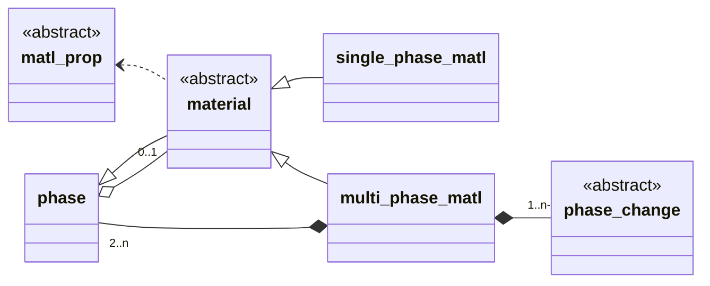

# Materials, Phases, and Properties
## Overview
The `material` and `phase` derived types comprise a recursive hierarchical
structure for storing the properties and attributes of a *material*. Materials
consist of one or more *phases*. A material consisting of one phase is
identified with that phase, and the properties and attributes of the material
are precisely those of the phase. A material consisting of more than one phase
may have properties and attributes that are shared by all its phases, but each
phase may also have its own independent properties and attributes that
supersede those. In this structure, pictured by the class diagram below, the
`phase` derived type is the basic container for property functions and
attributes, and the `material` class extends the `phase` type, with concrete
extensions `single_phase_matl` and `multi_phase_matl` to describe single and
multiphase materials. The inherited `phase` component of the `material` class
defines the properties and attributes for a single-phase material or those
shared ones for a multiphase material. A multiphase material has additional
`phase` components for storing the the properties and attributes that are
specific to the individual phases. It also has additional `phase_change` class
components that describe the transformations between phases. This is described
in more detail in the following.



## The `phase` Derived Type
The `phase` derived type is the basic container for property functions and
attributes that are associated with a material or a particular phase of a
material. The property functions are `scalar_func` class objects indexed by
character string property names, and the attributes are simply character
string names. These names are entirely the choice of the using application;
there is no predefined set of valid names at this level of the code.

When a particular `phase` object is a component of a `material` class object
it stores a reference to that material (strictly the parent `phase` component
of the material). Unless otherwise directed, queries about properties or
attributes of the phase are forwarded on to the parent material and its shared
properties and attributes if not found in the phase. This implements
hierarchical structure introduced above.

> **NOTE:** While application code may sometimes work directly with `phase`
objects, the `phase` type should be considered as an auxiliary type to the
`material` class described below. Objects of that class are intended to be
the primary objects with which application code works.

### Initialization
A `phase` type variable comes into existence possessing no properties or
attributes. The type bound subroutines `add_prop` and `add_attr`are used to
add them incrementally as desired. The public `name` component must be
defined manually.

> **NOTE:** As an auxiliary type to the `material` class, `phase` type
objects are initialized as part of the instantiation of `material` class
objects. Application code should never be initializing `phase` objects
directly.

### Public Data Components
The `phase` type has a single public data component, the allocatable
character `name`. This is a read-only component (after initialization).

### Type Bound Procedures
#### has_attr
```Fortran
type(phase) :: phi
character(*) :: name
phi%has_attr(name)
```
Returns true if the phase `phi` has the attribute `name`; otherwise it returns
false. If the phase has a parent material, it will be included in the query.

#### add_attr
```Fortran
type(phase) :: phi
character(*) :: name
call phi%add_attr(name)
```
Adds an attribute with the given `name` to the phase `phi`. If the phase
already has the attribute, `phi` is not modified.

#### has_prop
```Fortran
type(phase) :: phi
character(*) :: name
phi%has_prop(name [,only] [,strict])
```
Returns true if the phase `phi` has the property `name`; otherwise it returns
false. If the optional character argument `only` is specified, the query is
limited to the case that the phase has the attribute `only`; if not, true is
always returned. If the phase has a parent material, it will be included in
the query unless the optional logical argument `strict` is present with value
true.

#### has_const_prop
```Fortran
type(phase) :: phi
character(*) :: name
phi%has_const_prop(name)
```
Returns true if the phase `phi` has the property `name` and it is a constant;
otherwise it returns false.

#### add_prop
```Fortran
type(phase) :: phi
character(*) :: name
class(scalar_func), allocatable :: func
real(r8) :: const
call phi%add_prop(name, {func | const})
```
In the first form, adds a property with the given `name` and associated
scalar function `func` to the phase `phi`. If the property already exists,
its function is replaced by `func`. Note that the allocation for `func` is
*moved* into `phi` and `func` is returned unallocated. In the second form,
the added property is an internally-generated scalar function with constant
value `const`.

#### get_prop
```Fortran
type(phase) :: phi
class(scalar_func), allocatable :: func
real(r8) :: const
call phi%get_prop(name, {func | const})
```
In the first form, the scalar function `func` returns a copy of property
`name` of phase `phi`. If the phase has a parent material, it will be queried
if necessary. If neither the phase or its parent have the property, `func` is
returned unallocated. When the phase property `name` is constant (i.e.,
`phi%has_const_prop(name)` returns true), the second form that returns this
constant value in `const` may also be used. In this case it is an error if the
property does not exist or is not constant.

-------

## The `material` Abstract Class
The abstract derived type `material` extends the `phase` derived type. It is
intended to be the primary polymorphic container for material properties and
attributes with which application code interacts. Materials consist of one or
more phases. A material consisting of one phase is identified with that phase,
and the properties and attributes of that phase are precisely those of the
material. A multiphase material may have properties and attributes that are
shared by all its phases, but each phase may have its own specific properties
and attributes. Phase-specific property functions supersede a shared
material property function.

> **NOTE:** The class attempts to be as generic as possible when it comes to
the relationships between the phases of a multiphase material, assuming
nothing more than that the partitioning of the material among its phases is a
function of temperature alone (see [`get_phase_frac`](#get_phase_frac)).
The concrete extension `multiphase_matl` described briefly below implements
a particular model used by Truchas in which the phases are linearly ordered
from low to high temperature with separated temperature-dependent
transformations between consecutive pairs.

### Instantiation
The [`material_factory`](./material_factory.md) module defines the
[`alloc_material`](./material_factory.md#alloc_material) subroutine that
instantiates `material` class objects using a parameter list that supplies
the typically complex inputs that are required.

### Public Data Components
The `material` class has a single public data component, the allocatable
character `name` (inherited from `phase`). This is a read-only component.

### Inherited Type Bound Procedures
The following type bound procedures are inherited from the parent `phase`
derived type. Their behavior/interpretation is somewhat altered for the
present context of possibly multiphase materials, and some procedures are
overriden accordingly by concrete implementations of the `material` class.

#### has_attr
```Fortran
class(material) :: matl
character(*) :: name
matl%has_attr(name)
```
Returns true if all phases of the material `matl` have the attribute `name`;
otherwise it returns false.

#### add_attr
```Fortran
class(material) :: matl
character(*) :: name
matl%add_attr(name)
```
Adds an attribute with the given `name` to the material `matl`. This is a
shared attribute in the multiphase material case.

#### has_prop
```Fortran
class(material) :: matl
character(*) :: name
matl%has_prop(name [,only] [,strict])
```
Returns true if every phase of the material `matl` has the property `name`;
otherwise it returns false. If the optional character argument `only` is
present, the query is limited to those phases having the attribute `only`. If
no phase has that attribute, true is returned. The optional argument `strict`
is meaningless in this context and is ignored.

#### has_const_prop
```Fortran
class(material) :: matl
character(*) :: name
matl%has_const_prop(name)
```
Returns true if every phase of the material `matl` has the property `name`
and the property is constant with the same value for all phases.

#### add_prop
```Fortran
class(material) :: matl
character(*) :: name
class(scalar_func), allocatable :: func
real(r8) :: const
call matl%add_prop(name, {func | const})
```
Adds a property with the given `name` and associated scalar function `func` to
the material `matl`. If the property already exists, its function is replaced
by `func`. In the multiphase material case, this is a shared property, and
does not replace any superseding phase-specific property that may exist. Note
that the allocation for `func` is *moved* into `matl` and `func` is returned
unallocated. If the alternative `const` argument is used, the added property
is an internally generated scalar function with constant value `const`.

#### get_prop
```Fortran
class(material) :: matl
character(*) :: name
class(scalar_func), allocatable :: fun
real(r8) :: const
call matl%get_prop(name, {func | const})
```
Returns a scalar function copy `func` or constant value `const` that is
associated with property `name` of the material `matl`. In the
multiphase material case *this applies only to the shared property.*
If the material does not have the shared property, `func` is returned
unallocated. If the `const` argument is used, the property must be
constant-valued.

> **NOTE:** Due to its significant limitation with respect to multiphase
materials, application code is advised to avoid this procedure (and it should
perhaps be disabled altogether.) The issue is that a single `scalar_func`
class object is incapable of describing a multiphase material property.
Instead, there is a higher level [`matl_prop`](./matl_prop.md) class that is
designed to handle the more complex property functions of general `material`
class objects. See the [`alloc_matl_prop`](#alloc_matl_prop) procedure
described below.

### Type Bound Procedures Specific to the `material` Class

#### num_phase
```Fortran
class(material) :: matl
matl%num_phase()
```
Returns the number of phases that comprise the material `matl`. Phases are
numbered in the interval [1, `matl%num_phase()`].

> **NB:** As far as the class is concerned, the numbering of the phases is
arbitrary and carries no information. However, in the `multiphase_matl`
implementation of the `material` class -- which currently is the only such
implementation -- the phases are numbered from low to high temperature, and
for pragmatic reasons this fact is exploited by higher-level code.

#### phase_name
```Fortran
class(material) :: matl
matl%phase_name(n)
```
Returns the name of the `n`th phase of the material `matl`. For a single
phase material this will be the name of the material itself, namely
`matl%name`.

#### phase_ref
```Fortran
class(material) :: matl
matl%phase_ref(n)
```
Returns a `phase` type pointer to the `n`th phase of the material `matl`;
`n` must be a valid phase number for the material. In the case of a single
phase material, this amounts to a casting of `matl` to its parent `phase`
type.

#### get_phase_frac
```Fortran
class(material) :: matl
real(r8) :: temp, beta(:)
call matl%get_phase_frac(temp, beta)
```
Returns the phase fractions `beta` of the material `matl` at the given
temperature `temp`. The size of `beta` must equal the number of phases and
the order of the elements of beta corresponds to the numbering of the phases
of `matl`. The sum of the elements of `beta` should equal 1. This can be
called for single phase materials, with the expected result.

> **TO DO?** It might be better even now to make this more extensible by
allowing for an array of generic state variables in place of the scalar
temperature.

#### alloc_matl_prop
```Fortran
class(material) :: matl
class(matl_prop), allocatable :: prop
call matl%alloc_matl_prop(name, prop, errmsg)
```
Allocates the material property function `prop` for property `name` of
material `matl`. Every phase of the material must have the specified
property. If an error is encountered, `prop` is returned unallocated and an
explanatory error message is assigned to the deferred-length allocatable
character `errmsg`. See the documentation for the
[`matl_prop`](./matl_prop.md) class for application usage of these objects.

#### add_enthalpy_prop
```Fortran
class(material) :: matl
call matl%add_enthalpy_prop(this, stat, errmsg)
```
Attempts to adds the "enthalpy" property to each phase of the material `matl`,
building the property function from existing primitive property functions of
the phases. The enthalpy (energy per unit volume) is formed as the product of
the (constant) "density" and the "specific-enthalpy" (energy per unit mass)
properties. Where the specific enthalpy property does not exist, it too will
built by integrating the "specific-heat" property (energy per unit mass per
degree). A constant of integration is associated this integration. For a
single phase material or the lowest temperature phase of a multiphase
material, the constant of integration is determined by the optional "ref-temp"
and "ref-enthalpy" constant properties (of the material; both default to 0).
For other phases of a multiphase material, the constant of integration is
determined by the latent heat and liquidus temperature of the phase change
that connects the phase with its adjacent lower temperature phase; see the
[`phase_change`](./doc/phase-change.md) class. If the material already has the
"enthalpy" property, no action is taken. If an error is encountered, stat is
assigned a nonzero value and the deferred-length allocatable character
`errmsg` is assigned an explanatory message; otherwise `stat` is assigned the
value 0.

### Concrete Implementations of the `material` Class
There are two extensions of the `material` class:

* The [`single_phase_matl`](../single_phase_matl.F90) derived type implements
the class for a single phase material. This is really nothing more than the
inherited `phase` type together with trivial implementations of the additional
`material` class procedures.

* The [`multiphase_matl`](../multi-phase_matl.F90) derived type implements
the class for a multiphase material whose phases are linearly ordered from
low to high temperature phases, with separated temperature-dependent
transformations between consecutive pairs of phases. The type has additional
`phase` type components for storing the phase-specific properties and
attributes, and [`phase_change`](./phase-change.md) class components that
describe the transformations between phases.

These extensions should be considered private and application code should
only ever work with polymorphic `material` class objects.
