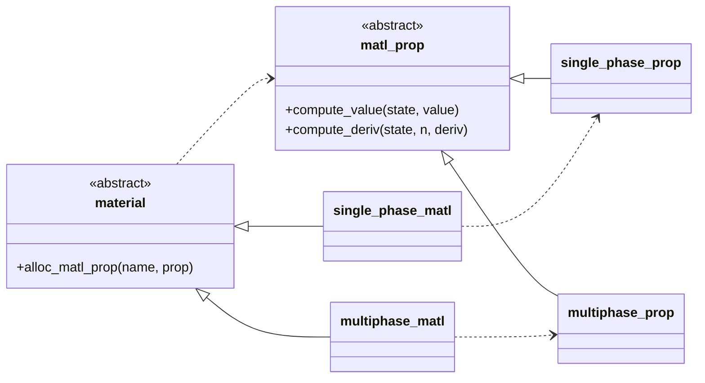

# The `matl_prop` Abstract Class

The abstract derived type `matl_prop` defines an interface for the evaluation
of a general material property and its derivatives with respect to one or more
state variables. Each implementation of the `material` class provides its own
particular implementation of the `matl_prop` class. For the single-phase
material this is little more than a wrapper around the `scalar_func` class.
For the multiphase material the implementation handles selecting the proper
state-dependent phase or phase mixture. These concrete implementations,
however, are hidden from application code, which is restricted to using
`matl_prop` class objects and methods. This structure is pictured by the
following class diagram.



## Instantiation
The `material` class provides the type bound subroutine
[`alloc_matl_prop`](./materials.md#alloc_matl_prop) for allocating
polymorphic `matl_prop` class variables having the proper dynamic type.

## Type Bound Procedures
Polymorphic `matl_prop` objects have the following type bound procedures.

#### compute_value / compute_deriv
```Fortran
class(matl_prop) :: prop
call prop%compute_value(state, value)
call prop%compute_deriv(state, n, deriv)
```
Computes the value of the material property and its derivative with respect to
the nth state variable, respectively. The value of the state is given by the
real rank-1 array argument `state`, and the computed values are returned by
the real scalar arguments `value` and `deriv`. For the purposes of computing
the temperature-dependent phase fractions of a multiphase material, the first
element of the `state` array is taken to be the temperature. Otherwise the
expected size of the `state` array and the interpretation of its elements is
entirely determined by the application code which must ensure that the actual
arguments are consistent with the expectation of the underlying
application-specified `scalar_func` phase property functions to which are
passed the `state` array.

> **Note:** The `matl_prop` class provides a default implementation of
`compute_deriv` that uses centered differencing to approximately compute the
derivative. While an effort is made to use an appropriately-sized
perturbation, this is a difficult issue and the choice may not be suitable in
all situations, especially in a neighborhood of 0. Concrete implementations
of `matl_prop` are free to override this default method, but none do so at
present.

> **Note:** The current multiphase implementation of `matl_prop` computes
the property value using a phase fraction weighted average of the phase
property values.

#### write_plotfile
```Fortran
class(matl_prop) :: prop
call prop%write_plotfile(filename, digits, state_min, state_max, npoints, iostat)
```
Writes a plot file of the material property to the given text file `filename`.
Each line is a space-separated list of values consisting of a state value and
the corresponding property value. The minimum and maximum state values
(component-wise) are given by the rank-1 arrays `state_min` and `state_max`,
and the number of equally-spaced data points to write is given by `npoints`.
The number of decimal digits to write for each value is given by `digits`.
The subroutine opens the given file and the resulting `iostat` value of that
operation is returned by `iostat`.

> **NB:** This ad hoc method, implemented by the class, is incomplete in
that it is only implemented for state variables of size 1, which mostly meets
the requirements of Truchas where properties for the most part only depend
on temperature. (An exception may be species diffusion with temperature
and concentration dependent properties.) It is unclear how this should
best work in the multi-variable case.

## Concrete Implementations of the `matl_prop` Class
There are two concrete extensions of the `matl_prop` class corresponding
to the two concrete extensions of the `material` class:

* The `single_phase_prop` derived type, defined by the
  [`single_phase_matl_type`](../single_phase_matl_type.F90) module,
  implements the class for the `single_phase_matl` derived type.

* The `multiphase_prop` derived type, defined by the
  [`multiphase_matl_type`](../multiphase_matl_type.F90) module, implements
  the class for the `multiphase_matl` derived type.

To reiterate, these concrete extensions are private and invisible to
application code, which is restricted to using polymorphic `matl_prop`
objects and their associated methods.
