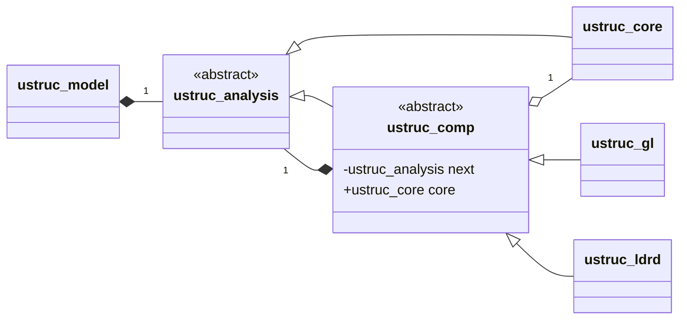
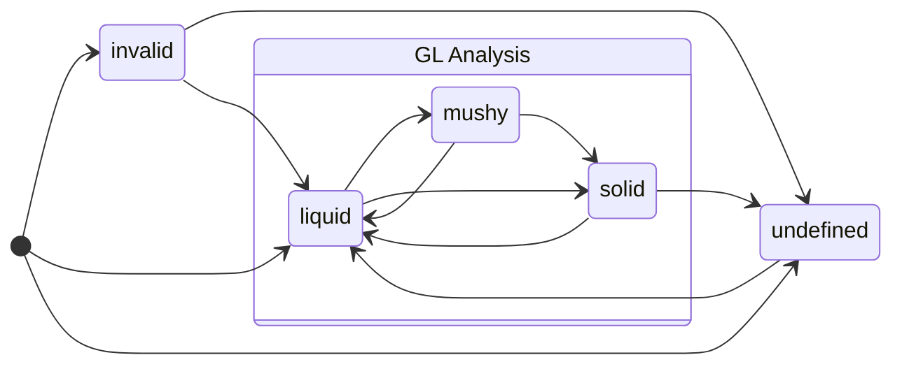

# Microstructural Analysis Framework
The abstract class [`ustruc_analysis`](../ustruc_analysis_class.F90)
encapsulates the microstructural analysis framework. It computes 0-dimensional
analysis models at each "point" of an array of independent points. For Truchas,
these "points" are mesh cells, and client code is responsible for gathering
cell-based data from those cells included in the analysis and presenting them
to a `ustruc_analysis` object as compact arrays.

For flexibility and extensibility the framework is decomposed internally into
individual computational components that can be chained dynamically at run
time. Its design uses the
[decorator pattern](https://en.wikipedia.org/wiki/Decorator_pattern),
and is depicted in the UML class diagram below.



The [`ustruc_model`](./ustruc_model.md) type holds an object of
`ustruc_analysis` class. This object is the head of what amounts to a linked
list of `ustruc_comp` class objects terminating in a `ustruc_core` type object.
The `ustruc_comp` class maintains a reference to a `ustruc_analysis` class
object. This may either be the next `ustruct_comp` class object in the list
or a terminating `ustruc_core` type object; `ustruc_comp` and `ustruc_core`
are both extensions of the `ustruc_analysis` class.
Concrete extensions of the
`ustruc_comp` class implement specific analysis components. Currently there are
two such components: `ustruc_gl` and `ustruc_ldrd`. The `ustruc_core` type
maintains shared state data that individual analysis components can access
through another reference maintained by the parent `ustruc_comp` class. In this
design the the linked-list structure of the analysis framework is largely
invisible to the individual analysis components; traversal of the structure is
implemented in the parent `ustruc_comp` class. This makes the creation of new
analysis components relatively simple.

> **Note:**
> The original thinking behind the design was that Truchas needed to be able
> to produce the ultimate analysis data desired by a user without the need for
> any post-processing, and the original implementation indeed featured a
> handful of different analysis components that could be mixed and matched.
> However in retrospect it has become clear that most analytic microstructure
> prediction models can be defined in terms of the raw data produced by the
> current GL analysis component (described below) and post-processing of that
> data can be very easily done within Paraview using its calculator tool. While
> the current usage does not greatly exploit the design (by combining multiple
> analysis components), it has been retained to allow for possible future
> extensions.

## The `ustruc_analysis` Abstract Class
The abstract derived type `ustruc_analysis` defines the interface that client
code uses to perform the microstructural analysis and retrieve the results. It
has a single public data component `%n` which is the number of points to which
the analysis is applied.

### Instantiation
The `new_ustruc_analysis` procedure is used to instantiate objects of this
class. It is described in detail by the
[`ustruc_analysis_factory.md`](./ustruc_analysis_factory.md) page.

### Type Bound Procedures
The class defines the following type bound procedures. These are implemented by
concrete exensions of the class, namely the `ustruc_core` derived type and the
extensions of the `ustruc_comp` class.

#### set_state
```Fortran
class(ustruc_analysis) :: analysis
real(r8) :: t, temp(:), temp_grad(:,:), frac(:)
logical  :: invalid(:)
call analysis%set_state(t, temp, temp_grad, frac, invalid)
```
Sets the internal state at time `t` to the specified values: `temp` and
`temp_grad` are the temperature and temperature gradient and `frac` is the
solid fraction at each of the analysis points. The logical array `invalid`
identifies those points where the data is invalid and no analysis should be
performed. It also resets all analysis data to their initial values.

#### update_state
```Fortran
class(ustruc_analysis) :: analysis
real(r8) :: t, temp(:), temp_grad(:,:), frac(:)
logical  :: invalid(:)
call analysis%update_state(t, temp, temp_grad, frac, invalid)
```
Updates the internal state at time `t` to the specified values. The interface
is identical to `set_state`. The analysis components are advanced from the
previous state to this new specified state.

#### get
```Fortran
class(ustruc_analysis) :: analysis
integer, allocatable :: list(:)
call analysis%get(name, array [,invalid])
```
Returns the value of the named analysis data item in the provided `array`. This
is a generic procedure: `array` may be a rank-1 logical or integer array, or a
rank-1 or 2 real array. Its size in the last dimension must be the number of
analysis points. A dummy value is returned for points without valid data
(typically 0). When the type of `array` is not logical, the rank-1 logical
array `invalid` may be specified. It returns true for those points without
valid data, and false otherwise, avoiding the uncertainty posed by inferring
the validity of data by its value.

#### has
```Fortran
class(ustruc_analysis) :: analysis
analysis%has(name)
```
Returns true if one of the analysis components in `analysis` produces the named
data item.

#### get_comp_list
```Fortran
class(ustruc_analysis) :: analysis
integer, allocatable :: list(:)
call analysis%get_comp_list(list)
```
Returns a `list` of analysis component IDs. Each component has a unique ID that
is used in the calls to the `serialize` and `deserialize` procedures.

#### serialize
```Fortran
class(ustruc_analysis) :: analysis
integer(int8), allocatable :: array(:,:)
call analysis%serialize(cid, array)
```
Returns the internal state of the analysis component with ID `cid` in the
allocatable byte array `array`. This serves as input to the companion
`deserialize` subroutine which restores the internal state.

#### deserialize
```Fortran
class(ustruc_analysis) :: analysis
integer(int8) :: array(:,:)
call analysis%deserialize(cid, array)
```
Restores the internal state of the analysis component with ID `cid` using the
data provided by the byte `array`. This is the companion to the `serialize`
subroutine.

#### vector_magnitude
```Fortran
class(ustruc_analysis) :: analysis
real(r8) :: v(:)
analysis%vector_magnitude(v)
```
This convenience function returns the magnitude of the vector `v` of size 2 or
3, using a numerically robust algorithm.

> **NOTE:** This may now be obsoleted by high quality implementations of the
> Fortran 2008 intrinsic `norm2` (high quality isn't guaranteed.)

## The `ustruc_core` Derived Type
The [`ustruc_core`](../ustruc_core_type.F90) derived type extends the
`ustruc_analysis` class. An object of this type is the tail of the linked list
of analysis components. It stores state data that is accessible by all the
analysis components which are extensions of the `ustruc_comp` class. Currently
it maintains a copy of the state data passed to the `set_state` and
`update_state` procedures, providing analysis components with the value of
the state data on the previous call to `update_state`.

### Initialization
A `ustruc_core` type variable is initialized using the `init` type bound
procedure:
```Fortran
type(ustruc_core) :: core
type(parameter_list) :: params
call core%init(n, params)
```
Here `n` is the number of points subject to analysis. The current version of
`ustruc_core` uses no parameters from the `params`.

## The `ustruc_comp` Abstract Class
The [`ustruc_comp`](../ustruc_comp_class.F90) abstract derived type extends the
`ustruc_analysis` class. Specific analysis components extend this class. It
adds two components:

* `%next` is a private `class(ustruc_analysis)` pointer to the next analysis
  component in the list of components.

* `%core` is a `type(ustruc_core)` pointer to the core object that terminates
  the chain of analysis components. This is public to extensions of the class,
  providing access to the shared state data maintained by the core component.

This class defines default procedures for all the deferred procedures of the
parent `ustruc_analysis` class described above. These default procedures merely
forward the operation to the next analysis component in the chain. Concrete
implementations of the `ustruc_comp` class will override these procedures with
their own that perform the operation for that component and forward the
operation back to the parent's procedure for continued processing when
appropriate.

### Class Initialization
The class defines the additional `init` type bound procedure for initializing
the class components:
```Fortran
class(ustruc_comp) :: new_comp
class(ustruc_analysis), pointer :: comp
call new_comp%init(comp)
```
This creates a linked list of analysis components with `new_comp` as the head
and existing list `comp` as the trailing part of the list. Instantiation
procedures for concrete extensions of the class will call this subroutine to
establish the linked list structure before initializing the components that
are specific to the extended type.

## Analysis Components
The following concrete extensions of the abstract `ustruc_comp` class implement
specific microstructure analysis components.

### The `ustruc_gl` Derived Type
The [`ustruc_gl`](../ustruc_gl_type.F90) type implements the basic "GL"
analysis component which records the thermal gradient $G=\nabla T$ and cooling
rate $L=-\partial{T}/\partial{t}$ at the onset of solidification, and total
time spent in the mushy zone $t_{\mathrm{sol}}$ at the completion of
solidification. There are triggers that specify when solidification is regarded
to have started and completed, and when the GL information is recorded. The
triggers are either solid fraction or temperature based thresholds. The analysis
procedure is designed to only report data for those points that have ultimately
passed monotonically from liquid to solid (or are in the process of doing so).
To that end the component maintains a *state* for each point and evolves it
according to the following state diagram:



To start, a point is placed in the *invalid* state if it is tagged as such by
the input to `set_state`, else in the *liquid* state if it is regarded as liquid
according to the thresholds, and otherwise in the *undefined* state. Note how a
point that starts as solid, for example, is in the *undefined* state, because it
has not been observed to have become solid starting from the *liquid* state.
The state is then updated with each call to `update_state`. A point transitions
from *liquid* to *mushy* when it crosses the threshold for the start of
solidification, and from *mushy* to *solid* when it crosses the threshold for
the completion of solidification. If a point that is in the *solid* state
remelts, the analysis data for it is discarded and it transitions back to
*liquid* if it has totally remelted, or to *undefined* if only partially
remelted. A point in the *undefined* state remains there until it becomes a
liquid according to the thresholds. A full description of the various thresholds
can be found in the Reference Manual documentation of the
[`MICROSTRUCTURE` namelist](https://www.truchas.org/docs/reference-manual/MICROSTRUCTURE_Namelist/index.html).

### The `ustruc_ldrd` Derived Type
The [`ustruc_ldrd`](../ustruc_ldrd_type.F90) derived type is one of the
original analysis components. It implements a higher-level model for LDRD
20140639ER "Solute and Microstructure Prediction during Processing". It is
based on the same data produced by the basic GL model, but uses that data to
categorize the microstructure into three types -- planar, cellular, and
dendritic -- and for dendritic microstructure to predict the primary and
secondary arm spacing (PDAS/SDAS).

### Custom Microstructure Analysis Components
The file [ustruc_comp.template](../ustruc_comp.template) provides a template
for creating a custom microstructure analysis component. It isn't currently
possible to dynamically load an analysis component into an existing Truchas
executable. The component must instead be compiled into a custom Truchas
executable. Besides the new code for the component, modifications must be made
to the factory procedure [`new_ustruc_analysis`](../ustruc_factory.F90) and
output procedure [`ustruc_output`](../ustruc_driver.F90) to make use of the
component. And of course the new source code must be added to the
[CMakeLists.txt](../CMakeLists.txt) file.
